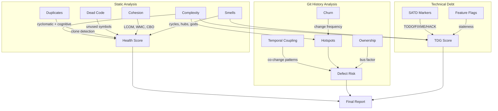
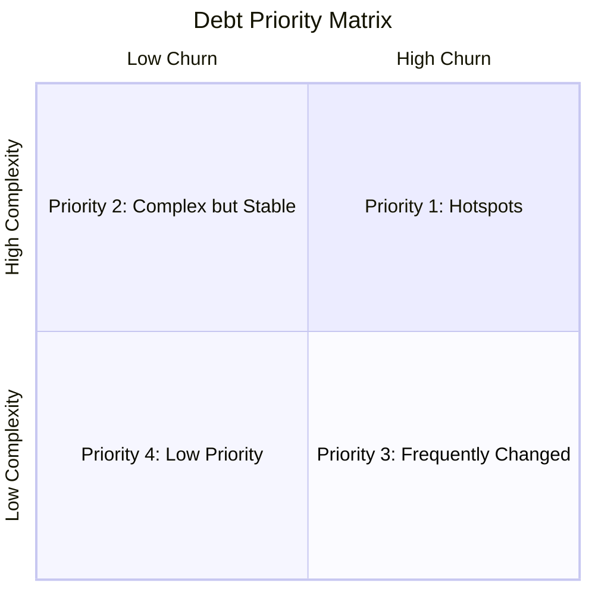
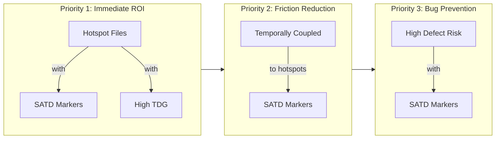
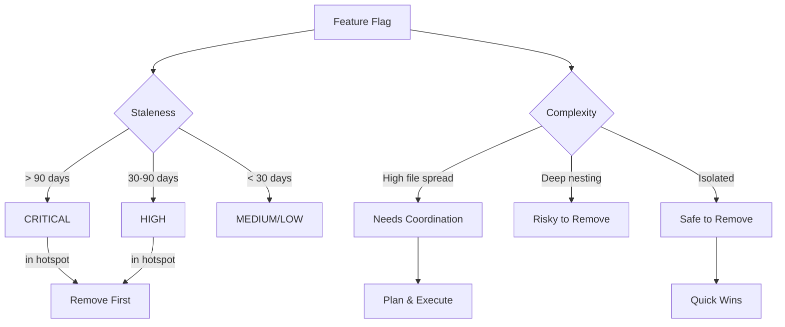
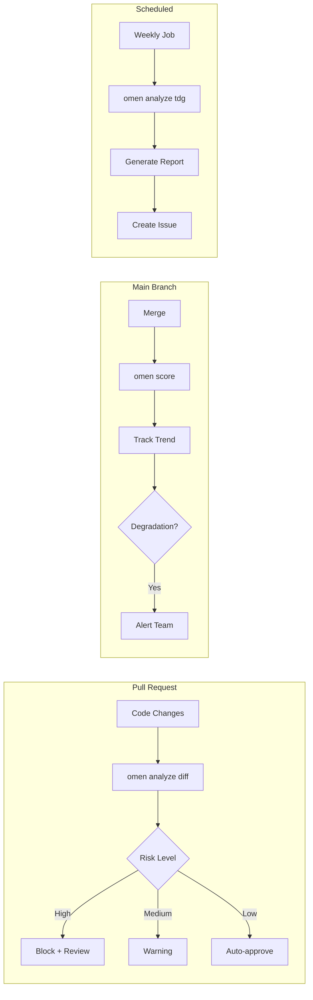

# Repository Health Report

Generate a comprehensive code health report for a GitHub repository.

## Arguments

- `$ARGUMENTS` - GitHub repository (e.g., `owner/repo`, `https://github.com/owner/repo`, or `owner/repo@branch`)

## Instructions

You are generating a repository health report using Omen code analysis tools.

### Step 1: Parse the repository argument

Extract the repository identifier from: `$ARGUMENTS`

Supported formats:
- GitHub shorthand: `owner/repo`
- Full URL: `https://github.com/owner/repo`
- With ref: `owner/repo@branch` or `owner/repo@v1.0.0`

Determine the output filename by extracting `owner` and `repo` from the argument. The report will be saved to `examples/repos/{owner}-{repo}.md`.

### Step 1.5: Initialize configuration

Before running analysis, initialize an `omen.toml` configuration file in the cloned repository to ensure proper file exclusions:

```bash
# Clone the repository first (omen does this automatically, but for config we need local access)
# After clone, initialize config in the temp directory
./omen init --force
```

Review the generated `omen.toml` and adjust exclusions if needed based on the repository's structure. Common adjustments:
- Add framework-specific generated files (e.g., `*.pb.go`, `*_generated.ts`)
- Exclude additional vendor directories
- Adjust test file patterns for the project's conventions

### Step 2: Run the analysis suite

Run these commands in sequence, capturing output for the report. **Use the `time` command to measure execution time for each analyzer:**

```bash
# Overall health score
time ./omen score "$ARGUMENTS" -f markdown

# Complexity analysis (top 20 complex functions)
time ./omen analyze complexity "$ARGUMENTS" -f markdown

# Technical debt markers
time ./omen analyze satd "$ARGUMENTS" -f markdown

# Code hotspots (high churn + high complexity)
time ./omen analyze hotspot "$ARGUMENTS" -f markdown

# Architectural smells
time ./omen analyze smells "$ARGUMENTS" -f markdown

# Code duplication
time ./omen analyze duplicates "$ARGUMENTS" -f markdown

# Defect prediction
time ./omen analyze defect "$ARGUMENTS" -f markdown

# Dead code detection
time ./omen analyze deadcode "$ARGUMENTS" -f markdown

# Technical debt gradient
time ./omen analyze tdg "$ARGUMENTS" -f markdown

# CK cohesion metrics
time ./omen analyze cohesion "$ARGUMENTS" -f markdown

# Feature flags (staleness and cleanup priority)
time ./omen analyze flags "$ARGUMENTS" -f markdown

# Temporal coupling (files that change together)
time ./omen analyze temporal-coupling "$ARGUMENTS" -f markdown

# Score trend over time (requires full git history)
time ./omen score trend "$ARGUMENTS" --period monthly --since 3m -f markdown
```

Note: Use `--shallow` flag if the repository is large and you only need static analysis (this disables git history-based analyzers like hotspot, churn, ownership, and trend).

### Step 3: Generate the report

Create a markdown report at `examples/repos/{owner}-{repo}.md` with this structure:

```markdown
# Repository Health Report: {owner}/{repo}

> Generated by [Omen](https://github.com/panbanda/omen) on {date}

## Analysis Performance

| Analyzer | Time |
|----------|------|
| Health Score | {time}s |
| Complexity | {time}s |
| SATD | {time}s |
| Hotspots | {time}s |
| Smells | {time}s |
| Duplicates | {time}s |
| Defect Prediction | {time}s |
| Dead Code | {time}s |
| TDG | {time}s |
| Cohesion | {time}s |
| Feature Flags | {time}s |
| Temporal Coupling | {time}s |
| Score Trend | {time}s |
| **Total** | **{total_time}s** |

## Executive Summary

{Write a 2-3 paragraph executive summary highlighting:
- Overall health score and what it means
- Top 3 areas of concern
- Top 3 strengths
- Recommended priority actions}

## Health Score

{Include the score output with brief interpretation}

## How Omen Analyzes Code



## Key Findings

### Areas Requiring Attention

{Summarize the most critical issues found across all analyzers. Focus on actionable insights.}

### Complexity Hotspots

{List the top 5-10 most complex functions with recommendations for refactoring}

### Technical Debt

{Summarize SATD findings and TDG scores. Highlight files accumulating debt.}

### Architectural Concerns

{Summarize any smells detected: cycles, god components, hubs, unstable dependencies}

### Code Quality

{Summarize duplication, dead code, and cohesion metrics}

## Detailed Analysis

### Complexity Analysis
{Full complexity output}

### Technical Debt Markers
{Full SATD output}

### Hotspots
{Full hotspot output}

### Architectural Smells
{Full smells output}

### Code Duplication
{Full duplicates output}

### Defect Prediction
{Full defect output}

### Dead Code
{Full deadcode output}

### Technical Debt Gradient
{Full TDG output}

### Cohesion Metrics
{Full cohesion output}

### Feature Flags
{Full feature flags output}

### Temporal Coupling
{Full temporal coupling output}

### Historical Score Trends (Past 3 Months)
{Full score trend output - monthly for past 3 months}

## Health Score Trends Over Time

{Include a summary table and interpretation of the score trend data:

| Month | Score | Complexity | Debt | Duplication | Defect Risk | Change |
|-------|-------|------------|------|-------------|-------------|--------|
| {month} | {score} | {complexity} | {debt} | {dup} | {defect} | {delta} |

Interpret the trends:
- Is code health improving or degrading?
- Which components are trending worse?
- Are there inflection points that correlate with major releases or refactoring efforts?
- What does the trajectory suggest if no action is taken?}

```mermaid
xychart-beta
    title "Health Score Trend"
    x-axis [Month1, Month2, Month3]
    y-axis "Score" 0 --> 100
    line [score1, score2, score3]
```

## Recommendations for LLM-Assisted Development

Based on this analysis, here are specific ways an LLM can add value when working with this codebase:

### High-Value Refactoring Targets

{List specific files/functions where LLM assistance would have highest impact, based on complexity and hotspot data}

### Technical Debt Cleanup

{List specific TODO/FIXME/HACK items that an LLM could help resolve}

### Code Review Focus Areas

{List areas where LLM review would be most valuable based on defect prediction}

### Architecture Improvements

{Suggest specific architectural improvements based on smells and coupling analysis}

## Strategic Debt Prioritization

### Debt Prioritization Framework



### Hotspot-Adjacent Technical Debt

Technical debt in or near hotspots has outsized impact because these files change frequently. Prioritize debt cleanup in this order:



1. **Debt IN hotspots** - SATD markers and high TDG scores in files that are also hotspots. Fixing these yields immediate ROI since developers touch this code often.

2. **Debt ADJACENT to hotspots** - Files that frequently change together with hotspots (temporal coupling). Debt here creates friction during hotspot modifications.

3. **Debt in high-defect-risk files** - Even if not hotspots, these files are likely to cause bugs. Proactive cleanup prevents future firefighting.

{Cross-reference hotspot, SATD, TDG, and temporal coupling data to identify:
- Which hotspot files have the most TODO/FIXME/HACK markers?
- Which hotspot files have the worst TDG scores?
- What files are temporally coupled to hotspots and also have debt?

List the top 5-10 files where debt cleanup would have highest impact.}

### Feature Flag Cleanup Priorities

Stale feature flags are a form of technical debt that increases code complexity and cognitive load. Omen identifies flags by:



- **Staleness**: Days since the flag was introduced or last modified
- **Complexity**: How many files reference the flag, nesting depth, decision points
- **Priority**: Combined score (CRITICAL > HIGH > MEDIUM > LOW)

{Based on the feature flags analysis, identify:
- CRITICAL/HIGH priority flags that should be removed immediately
- Flags in hotspot files (removing these simplifies frequently-changed code)
- Flags with high file spread (touching many files when removed)

Provide specific recommendations:
- Which flags to remove first
- Which flags need coordination (high file spread)
- Which flags are likely safe to remove (old, low complexity)}

## CI/CD Integration for Continuous Code Quality

Omen can be integrated into CI/CD pipelines to maintain code quality over time, track technical debt trends, and assess PR risk before merging.

### CI/CD Integration Architecture



### GitHub Actions Workflow Examples

#### 1. Health Score Quality Gate

Add this to `.github/workflows/code-quality.yml` to fail PRs that degrade code health:

\`\`\`yaml
name: Code Quality

on:
  pull_request:

jobs:
  health-check:
    runs-on: ubuntu-latest
    steps:
      - uses: actions/checkout@v4
        with:
          fetch-depth: 0  # Full history for accurate analysis

      - name: Install Omen
        run: |
          curl -sSL https://github.com/panbanda/omen/releases/latest/download/omen_linux_amd64.tar.gz | tar xz
          chmod +x omen

      - name: Check Health Score
        run: |
          ./omen score --min-score 70 --min-complexity 60 --min-debt 70
\`\`\`

#### 2. PR Risk Assessment

Automatically assess risk of incoming changes:

\`\`\`yaml
name: PR Risk Assessment

on:
  pull_request:

jobs:
  risk-assessment:
    runs-on: ubuntu-latest
    steps:
      - uses: actions/checkout@v4
        with:
          fetch-depth: 0

      - name: Install Omen
        run: |
          curl -sSL https://github.com/panbanda/omen/releases/latest/download/omen_linux_amd64.tar.gz | tar xz
          chmod +x omen

      - name: Analyze PR Risk
        run: ./omen analyze diff --target ${{ github.base_ref }} -f markdown >> $GITHUB_STEP_SUMMARY
\`\`\`

#### 3. Weekly TDG Tracking

Track technical debt trends over time:

\`\`\`yaml
name: Weekly TDG Report

on:
  schedule:
    - cron: '0 9 * * 1'  # Every Monday at 9am

jobs:
  tdg-report:
    runs-on: ubuntu-latest
    steps:
      - uses: actions/checkout@v4
        with:
          fetch-depth: 0

      - name: Install Omen
        run: |
          curl -sSL https://github.com/panbanda/omen/releases/latest/download/omen_linux_amd64.tar.gz | tar xz
          chmod +x omen

      - name: Generate TDG Report
        run: |
          echo "# Weekly Technical Debt Report" >> $GITHUB_STEP_SUMMARY
          ./omen analyze tdg -f markdown >> $GITHUB_STEP_SUMMARY
          ./omen score trend --period weekly --since 3m -f markdown >> $GITHUB_STEP_SUMMARY
\`\`\`

### Example PR Risk Analysis

{Include analysis of a sample PR from the repository. Show the diff risk output and explain:
- Which files in the PR have highest risk scores
- What the JIT (Just-in-Time) defect prediction factors indicate
- Whether this PR touches hotspot files
- Recommendations for reviewers based on the risk analysis}

**Sample PR: #{pr_number} - {pr_title}**

\`\`\`
{Output from: ./omen analyze diff --target main}
\`\`\`

**Risk Assessment:**
- Files changed: X
- High-risk files: {list any with risk > 0.7}
- Hotspot overlap: {does this PR touch known hotspots?}
- Recommendation: {e.g., "Extra review recommended for file X due to high complexity and frequent changes"}

### Maintaining Code Quality Over Time

Based on the current analysis, here's a recommended CI/CD strategy for this repository:

> [!TIP]
> **Quick Wins**: Start with PR risk assessment - it requires no threshold configuration and immediately provides value to reviewers.

> [!IMPORTANT]
> **Quality Gates**: Set minimum thresholds based on current scores (don't block on existing debt, but prevent regression)

1. **Quality Gates**: Set minimum thresholds based on current scores (don't block on existing debt, but prevent regression)
2. **PR Risk**: Flag PRs touching high-complexity or high-churn files for extra review
3. **Trend Monitoring**: Track TDG and health score weekly to catch debt accumulation early
4. **Hotspot Focus**: Prioritize refactoring files that appear in both hotspot and high-defect-risk lists

---

*This report was generated using Omen's suite of code analyzers. For more information, visit [github.com/panbanda/omen](https://github.com/panbanda/omen).*
```

### Step 4: Fetch a sample PR for risk analysis

Use the GitHub CLI to find a recent merged PR on the repository:

```bash
# Get recent merged PRs
gh pr list --repo {owner}/{repo} --state merged --limit 5 --json number,title,headRefName,baseRefName
```

Pick one PR and note its details for the CI/CD section. If you can check out the PR branch locally, run:

```bash
# Analyze the PR diff risk (if branch still exists)
./omen analyze diff --target main
```

### Important Notes

1. If any analyzer fails or times out, note it in the report but continue with others
2. For very large repositories, consider using `--shallow` to skip git history analysis
3. Interpret the data - don't just paste raw output. Provide context and actionable recommendations.
4. Focus on value-add: what can an LLM help with based on this analysis?
5. Use Mermaid diagrams to visualize relationships and workflows where helpful
