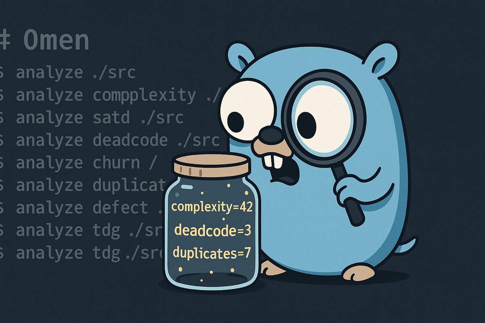

<div align="center">
# Omen



[](https://go.dev/)
[](https://github.com/panbanda/omen/blob/main/LICENSE)
[](https://github.com/panbanda/omen/actions/workflows/ci.yml)
[](https://codecov.io/gh/panbanda/omen)
[](https://goreportcard.com/report/github.com/panbanda/omen)
[](https://github.com/panbanda/omen/releases)
[](https://pkg.go.dev/github.com/panbanda/omen)
[](https://snyk.io/test/github/panbanda/omen)

**Your AI writes code without knowing where the landmines are.**

Omen gives AI assistants the context they need: complexity hotspots, hidden dependencies, defect-prone files, and self-admitted debt. One command surfaces what's invisible.

**Why "Omen"?** An omen is a sign of things to come - good or bad. Your codebase is full of omens: low complexity and clean architecture signal smooth sailing ahead, while high churn, technical debt, and code clones warn of trouble brewing. Omen surfaces these signals so you can act before that "temporary fix" celebrates its third anniversary in production.

</div>

---

## Features

<details>
<summary><strong>Complexity Analysis</strong> - How hard your code is to understand and test</summary>

There are two types of complexity:

- **Cyclomatic Complexity** counts the number of different paths through your code. Every `if`, `for`, `while`, or `switch` creates a new path. A function with cyclomatic complexity of 10 means there are 10 different ways to run through it. The higher the number, the more test cases you need to cover all scenarios.

- **Cognitive Complexity** measures how hard code is for a human to read. It penalizes deeply nested code (like an `if` inside a `for` inside another `if`) more than flat code. Two functions can have the same cyclomatic complexity, but the one with deeper nesting will have higher cognitive complexity because it's harder to keep track of.

**Why it matters:** Research shows that complex code has more bugs and takes longer to fix. [McCabe's original 1976 paper](https://ieeexplore.ieee.org/document/1702388) found that functions with complexity over 10 are significantly harder to maintain. [SonarSource's cognitive complexity](https://www.sonarsource.com/docs/CognitiveComplexity.pdf) builds on this by measuring what actually confuses developers.

> [!TIP]
> Keep cyclomatic complexity under 10 and cognitive complexity under 15 per function.

</details>

<details>
<summary><strong>Self-Admitted Technical Debt (SATD)</strong> - Comments where developers admit they took shortcuts</summary>

When developers write `TODO: fix this later` or `HACK: this is terrible but works`, they're creating technical debt and admitting it. Omen finds these comments and groups them by type:

| Category    | Markers                 | What it means                                  |
| ----------- | ----------------------- | ---------------------------------------------- |
| Design      | HACK, KLUDGE, SMELL     | Architecture shortcuts that need rethinking    |
| Defect      | BUG, FIXME, BROKEN      | Known bugs that haven't been fixed             |
| Requirement | TODO, FEAT              | Missing features or incomplete implementations |
| Test        | FAILING, SKIP, DISABLED | Tests that are broken or turned off            |
| Performance | SLOW, OPTIMIZE, PERF    | Code that works but needs to be faster         |
| Security    | SECURITY, VULN, UNSAFE  | Known security issues                          |

**Why it matters:** [Potdar and Shihab's 2014 study](https://ieeexplore.ieee.org/document/6976075) found that SATD comments often stay in codebases for years. The longer they stay, the harder they are to fix because people forget the context. [Maldonado and Shihab (2015)](https://ieeexplore.ieee.org/document/7332619) showed that design debt is the most common and most dangerous type.

> [!TIP]
> Review SATD weekly. If a TODO is older than 6 months, either fix it or delete it.

</details>

<details>
<summary><strong>Dead Code Detection</strong> - Code that exists but never runs</summary>

Dead code includes:

- Functions that are never called
- Variables that are assigned but never used
- Classes that are never instantiated
- Code after a `return` statement that can never execute

**Why it matters:** Dead code isn't just clutter. It confuses new developers who think it must be important. It increases build times and binary sizes. Worst of all, it can hide bugs - if someone "fixes" dead code thinking it runs, they've wasted time. [Romano et al. (2020)](https://ieeexplore.ieee.org/document/8370748) found that dead code is a strong predictor of other code quality problems.

> [!TIP]
> Delete dead code. Version control means you can always get it back if needed.

</details>

<details>
<summary><strong>Git Churn Analysis</strong> - How often files change over time</summary>

Churn looks at your git history and counts:

- How many times each file was modified
- How many lines were added and deleted
- Which files change together

Files with high churn are "hotspots" - they're constantly being touched, which could mean they're:

- Central to the system (everyone needs to modify them)
- Poorly designed (constant bug fixes)
- Missing good abstractions (features keep getting bolted on)

**Why it matters:** [Nagappan and Ball's 2005 research at Microsoft](https://www.microsoft.com/en-us/research/publication/use-of-relative-code-churn-measures-to-predict-system-defect-density/) found that code churn is one of the best predictors of bugs. Files that change a lot tend to have more defects. Combined with complexity data, churn helps you find the files that are both complicated AND frequently modified - your highest-risk code.

> [!TIP]
> If a file has high churn AND high complexity, prioritize refactoring it.

</details>

<details>
<summary><strong>Code Clone Detection</strong> - Duplicated code that appears in multiple places</summary>

There are three types of clones:

| Type   | Description                                        | Example                                 |
| ------ | -------------------------------------------------- | --------------------------------------- |
| Type-1 | Exact copies (maybe different whitespace/comments) | Copy-pasted code                        |
| Type-2 | Same structure, different names                    | Same function with renamed variables    |
| Type-3 | Similar code with some modifications               | Functions that do almost the same thing |

**Why it matters:** When you fix a bug in one copy, you have to remember to fix all the other copies too. [Juergens et al. (2009)](https://ieeexplore.ieee.org/document/5070547) found that cloned code has significantly more bugs because fixes don't get applied consistently. The more clones you have, the more likely you'll miss one during updates.

> [!TIP]
> Anything copied more than twice should probably be a shared function. Aim for duplication ratio under 5%.

</details>

<details>
<summary><strong>Defect Prediction</strong> - The likelihood that a file contains bugs</summary>

Omen combines multiple signals to predict defect probability using PMAT-weighted metrics:

- **Process** metrics (churn frequency, ownership diffusion)
- **Metrics** (cyclomatic/cognitive complexity)
- **Age** (code age and stability)
- **Total** size (lines of code)

Each file gets a risk score from 0% to 100%.

**Why it matters:** You can't review everything equally. [Menzies et al. (2007)](https://ieeexplore.ieee.org/document/4027145) showed that defect prediction helps teams focus testing and code review on the files most likely to have problems. [Rahman et al. (2014)](https://dl.acm.org/doi/10.1145/2568225.2568269) found that even simple models outperform random file selection for finding bugs.

> [!TIP]
> Prioritize code review for files with >70% defect probability.

</details>

<details>
<summary><strong>Change Risk Analysis (JIT)</strong> - Predict which commits are likely to introduce bugs</summary>

Just-in-Time (JIT) defect prediction analyzes recent commits to identify risky changes before they cause problems. Unlike file-level prediction, JIT operates at the commit level using factors from [Kamei et al. (2013)](https://ieeexplore.ieee.org/document/6341763):

| Factor | Name                   | What it measures                           |
| ------ | ---------------------- | ------------------------------------------ |
| LA     | Lines Added            | More additions = more risk                 |
| LD     | Lines Deleted          | Deletions are generally safer              |
| LT     | Lines in Touched Files | Larger files = more risk                   |
| FIX    | Bug Fix                | Bug fix commits indicate problematic areas |
| NDEV   | Number of Developers   | More developers on files = more risk       |
| AGE    | Average File Age       | File stability indicator                   |
| NUC    | Unique Changes         | Change entropy = higher risk               |
| EXP    | Developer Experience   | Less experience = more risk                |

Each commit gets a risk score from 0.0 to 1.0:

- **High risk (>0.7)**: Prioritize careful review
- **Medium risk (0.4-0.7)**: Worth extra attention
- **Low risk (<0.4)**: Standard review process

**Why it matters:** [Kamei et al. (2013)](https://ieeexplore.ieee.org/document/6341763) demonstrated that JIT prediction catches risky changes at commit time, before bugs propagate. [Zeng et al. (2021)](https://ieeexplore.ieee.org/document/9463091) showed that simple JIT models match deep learning accuracy (~65%) with better interpretability.

> [!TIP]
> Run `omen analyze changes` before merging PRs to identify commits needing extra review.

</details>

<details>
<summary><strong>Technical Debt Gradient (TDG)</strong> - A composite "health score" for each file</summary>

TDG combines multiple metrics into a single score (0-100 scale, higher is better):

| Component             | Weight | What it measures                        |
| --------------------- | ------ | --------------------------------------- |
| Structural Complexity | 20%    | Cyclomatic complexity and nesting depth |
| Semantic Complexity   | 15%    | Cognitive complexity                    |
| Duplication           | 15%    | Amount of cloned code                   |
| Coupling              | 15%    | Dependencies on other modules           |
| Hotspot               | 10%    | Churn x complexity interaction          |
| Temporal Coupling     | 10%    | Co-change patterns with other files     |
| Consistency           | 10%    | Code style and pattern adherence        |
| Documentation         | 5%     | Comment coverage                        |

Scores are classified into letter grades (A+ to F), where:

- **A/A+** (90-100): Excellent - well-maintained code
- **B** (75-89): Good - minor improvements possible
- **C** (60-74): Needs attention - technical debt accumulating
- **D** (50-59): Poor - significant refactoring needed
- **F** (<50): Critical - immediate action required

**Why it matters:** Technical debt is like financial debt - a little is fine, too much kills you. [Cunningham coined the term in 1992](http://c2.com/doc/oopsla92.html), and [Kruchten et al. (2012)](https://ieeexplore.ieee.org/document/6336722) formalized how to measure and manage it. TDG gives you a single number to track over time and compare across files.

> [!TIP]
> Fix files with grade C or lower before adding new features. Track average TDG over time - it should go up, not down.

</details>

<details>
<summary><strong>Dependency Graph</strong> - How your modules connect to each other</summary>

Omen builds a graph showing which files import which other files, then calculates:

- **PageRank**: Which files are most "central" (many things depend on them)
- **Betweenness**: Which files are "bridges" between different parts of the codebase
- **Coupling**: How interconnected modules are

**Why it matters:** Highly coupled code is fragile - changing one file breaks many others. [Parnas's 1972 paper on modularity](https://dl.acm.org/doi/10.1145/361598.361623) established that good software design minimizes dependencies between modules. The dependency graph shows you where your architecture is clean and where it's tangled.

> [!TIP]
> Files with high PageRank should be especially stable and well-tested. Consider breaking up files that appear as "bridges" everywhere.

</details>

<details>
<summary><strong>Hotspot Analysis</strong> - High-risk files where complexity meets frequent changes</summary>

Hotspots are files that are both complex AND frequently modified. A simple file that changes often is probably fine - it's easy to work with. A complex file that rarely changes is also manageable - you can leave it alone. But a complex file that changes constantly? That's where bugs breed.

Omen calculates hotspot scores using the **geometric mean** of normalized churn and complexity:

```
hotspot = sqrt(churn_percentile * complexity_percentile)
```

Both factors are normalized against industry benchmarks using empirical CDFs, so scores are comparable across projects:

- **Churn percentile** - Where this file's commit count ranks against typical OSS projects
- **Complexity percentile** - Where the average cognitive complexity ranks against industry benchmarks

| Hotspot Score | Severity | Action                 |
| ------------- | -------- | ---------------------- |
| >= 0.6        | Critical | Prioritize immediately |
| >= 0.4        | High     | Schedule for review    |
| >= 0.25       | Moderate | Monitor                |
| < 0.25        | Low      | Healthy                |

**Why it matters:** [Adam Tornhill's "Your Code as a Crime Scene"](https://pragprog.com/titles/atcrime/your-code-as-a-crime-scene/) introduced hotspot analysis as a way to find the most impactful refactoring targets. His research shows that a small percentage of files (typically 4-8%) contain most of the bugs. [Graves et al. (2000)](https://ieeexplore.ieee.org/document/859533) and [Nagappan et al. (2005)](https://www.microsoft.com/en-us/research/publication/use-of-relative-code-churn-measures-to-predict-system-defect-density/) demonstrated that relative code churn is a strong defect predictor.

> [!TIP]
> Start refactoring with your top 3 hotspots. Reducing complexity in high-churn files has the highest ROI.

</details>

<details>
<summary><strong>Temporal Coupling</strong> - Files that change together reveal hidden dependencies</summary>

When two files consistently change in the same commits, they're temporally coupled. This often reveals:

- **Hidden dependencies** not visible in import statements
- **Logical coupling** where a change in one file requires a change in another
- **Accidental coupling** from copy-paste or inconsistent abstractions

Omen analyzes your git history to find file pairs that change together:

| Coupling Strength | Meaning                                                 |
| ----------------- | ------------------------------------------------------- |
| > 80%             | Almost always change together - likely tight dependency |
| 50-80%            | Frequently coupled - investigate the relationship       |
| 20-50%            | Moderately coupled - may be coincidental                |
| < 20%             | Weakly coupled - probably independent                   |

**Why it matters:** [Ball et al. (1997)](https://www.researchgate.net/publication/2791666_If_Your_Version_Control_System_Could_Talk) first studied co-change patterns at AT&T and found they reveal architectural violations invisible to static analysis. [Beyer and Noack (2005)](https://www.semanticscholar.org/paper/Clustering-software-artifacts-based-on-frequent-Beyer-Noack/1afc4eeb182d92631c3ce400e6999eebbca71c12) showed that temporal coupling predicts future changes - if files changed together before, they'll likely change together again.

> [!TIP]
> If two files have >50% temporal coupling but no import relationship, consider extracting a shared module or merging them.

</details>

<details>
<summary><strong>Code Ownership/Bus Factor</strong> - Knowledge concentration and team risk</summary>

Bus factor asks: "How many people would need to be hit by a bus before this code becomes unmaintainable?" Low bus factor means knowledge is concentrated in too few people.

Omen uses git blame to calculate:

- **Primary owner** - Who wrote most of the code
- **Ownership ratio** - What percentage one person owns
- **Contributor count** - How many people have touched the file
- **Bus factor** - Number of major contributors (>5% of code)

| Ownership Ratio | Risk Level  | What it means             |
| --------------- | ----------- | ------------------------- |
| > 90%           | High risk   | Single point of failure   |
| 70-90%          | Medium risk | Limited knowledge sharing |
| 50-70%          | Low risk    | Healthy distribution      |
| < 50%           | Very low    | Broad ownership           |

**Why it matters:** [Bird et al. (2011)](https://ieeexplore.ieee.org/document/6032488) found that code with many minor contributors has more bugs than code with clear ownership, but code owned by a single person creates organizational risk. The sweet spot is 2-4 significant contributors per module. [Nagappan et al. (2008)](https://www.microsoft.com/en-us/research/publication/the-influence-of-organizational-structure-on-software-quality/) showed that organizational metrics (like ownership) predict defects better than code metrics alone.

> [!TIP]
> Files with >80% single ownership should have documented knowledge transfer. Critical files should have at least 2 people who understand them.

</details>

<details>
<summary><strong>CK Metrics</strong> - Object-oriented design quality measurements</summary>

The Chidamber-Kemerer (CK) metrics suite measures object-oriented design quality:

| Metric | Name                        | What it measures             | Threshold |
| ------ | --------------------------- | ---------------------------- | --------- |
| WMC    | Weighted Methods per Class  | Sum of method complexities   | < 20      |
| CBO    | Coupling Between Objects    | Number of other classes used | < 10      |
| RFC    | Response for Class          | Methods that can be invoked  | < 50      |
| LCOM   | Lack of Cohesion in Methods | Methods not sharing fields   | < 3       |
| DIT    | Depth of Inheritance Tree   | Inheritance chain length     | < 5       |
| NOC    | Number of Children          | Direct subclasses            | < 6       |

**LCOM (Lack of Cohesion)** is particularly important. Low LCOM means methods in a class use similar instance variables - the class is focused. High LCOM means the class is doing unrelated things and should probably be split.

**Why it matters:** [Chidamber and Kemerer's 1994 paper](https://ieeexplore.ieee.org/document/295895) established these metrics as the foundation of OO quality measurement. [Basili et al. (1996)](https://ieeexplore.ieee.org/document/544352) validated them empirically, finding that WMC and CBO strongly correlate with fault-proneness. These metrics have been cited thousands of times and remain the standard for OO design analysis.

> [!TIP]
> Classes violating multiple CK thresholds are candidates for refactoring. High WMC + high LCOM often indicates a "god class" that should be split.

</details>

<details>
<summary><strong>Repository Map</strong> - PageRank-ranked symbol index for LLM context</summary>

Repository maps provide a compact summary of your codebase's important symbols, ranked by structural importance using PageRank. This is designed for LLM context windows - you get the most important functions and types first.

For each symbol, the map includes:

- **Name and kind** (function, class, method, interface)
- **File location** and line number
- **Signature** for quick understanding
- **PageRank score** based on how many other symbols depend on it
- **In/out degree** showing dependency connections

**Why it matters:** LLMs have limited context windows. Stuffing them with entire files wastes tokens on less important code. PageRank, [developed by Brin and Page (1998)](https://snap.stanford.edu/class/cs224w-readings/Brin98Anatomy.pdf), identifies structurally important nodes in a graph. Applied to code, it surfaces the symbols that are most central to understanding the codebase.

**Scalability:** Omen uses a sparse power iteration algorithm for PageRank computation, scaling linearly with the number of edges O(E) rather than quadratically with nodes O(V^2). This enables fast analysis of large monorepos with 25,000+ symbols in under 30 seconds.

**Example output:**

```
# Repository Map (Top 20 symbols by PageRank)

## parser.ParseFile (function) - pkg/parser/parser.go:45
  PageRank: 0.0823 | In: 12 | Out: 5
  func ParseFile(path string) (*Result, error)

## models.TdgScore (struct) - pkg/models/tdg.go:28
  PageRank: 0.0651 | In: 8 | Out: 3
  type TdgScore struct
```

> [!TIP]
> Use `omen context --repo-map --top 50` to generate context for LLM prompts. The top 50 symbols usually capture the essential architecture.

</details>

<details>
<summary><strong>Feature Flag Detection</strong> - Find and track feature flags across your codebase</summary>

Feature flags are powerful but dangerous. They let you ship code without enabling it, run A/B tests, and roll out features gradually. But they accumulate. That "temporary" flag from 2019 is still in production. The flag you added for a one-week experiment is now load-bearing infrastructure.

Omen detects feature flag usage across popular providers:

| Provider     | Languages                     | What it finds                                  |
| ------------ | ----------------------------- | ---------------------------------------------- |
| LaunchDarkly | JS/TS, Python, Go, Java, Ruby | `variation()`, `boolVariation()` calls         |
| Split        | JS/TS, Python, Go, Java, Ruby | `getTreatment()` calls                         |
| Unleash      | JS/TS, Python, Go, Java, Ruby | `isEnabled()`, `getVariant()` calls            |
| PostHog      | JS/TS, Python, Go, Ruby       | `isFeatureEnabled()`, `getFeatureFlag()` calls |
| Flipper      | Ruby                          | `enabled?()`, `Flipper.enabled?()` calls       |

For each flag, Omen reports:

- **Flag key** - The identifier used in code
- **Provider** - Which SDK is being used
- **References** - All locations where the flag is checked
- **Staleness** - When the flag was first and last modified (with git history)

**Custom providers:** For in-house feature flag systems, define custom tree-sitter queries in your `omen.toml`:

```toml
[[feature_flags.custom_providers]]
name = "feature"
languages = ["ruby"]
query = '''
(call
  receiver: (constant) @receiver
  (#eq? @receiver "Feature")
  method: (identifier) @method
  (#match? @method "^(enabled\\?|get_feature_flag)$")
  arguments: (argument_list
    .
    (simple_symbol) @flag_key))
'''
```

**Why it matters:** [Meinicke et al. (2020)](https://dl.acm.org/doi/10.1145/3379597.3387463) studied feature flags across open-source projects and found that flag ownership (the developer who introduces a flag also removes it) correlates with shorter flag lifespans, helping keep technical debt in check. [Rahman et al. (2018)](https://link.springer.com/article/10.1007/s10664-018-9639-0) studied Google Chrome's 12,000+ feature toggles and found that while they enable rapid releases and flexible deployment, they also introduce technical debt and additional maintenance burden. Regular flag audits prevent your codebase from becoming a maze of unused toggles.

> [!TIP]
> Audit feature flags monthly. Remove flags older than 90 days for experiments, 14 days for release flags. Track flag staleness in your CI pipeline.

</details>

<details>
<summary><strong>MCP Server</strong> - LLM tool integration via Model Context Protocol</summary>

Omen includes a Model Context Protocol (MCP) server that exposes all analyzers as tools for LLMs like Claude. This enables AI assistants to analyze codebases directly through standardized tool calls.

**Available tools:**

- `analyze_complexity` - Cyclomatic and cognitive complexity
- `analyze_satd` - Self-admitted technical debt detection
- `analyze_deadcode` - Unused functions and variables
- `analyze_churn` - Git file change frequency
- `analyze_duplicates` - Code clones detection
- `analyze_defect` - File-level defect probability (PMAT)
- `analyze_changes` - Commit-level change risk (JIT)
- `analyze_tdg` - Technical Debt Gradient scores
- `analyze_graph` - Dependency graph generation
- `analyze_hotspot` - High churn + complexity files
- `analyze_temporal_coupling` - Files that change together
- `analyze_ownership` - Code ownership and bus factor
- `analyze_cohesion` - CK OO metrics
- `analyze_repo_map` - PageRank-ranked symbol map
- `analyze_smells` - Architectural smell detection
- `analyze_flags` - Feature flag detection and staleness

Each tool includes detailed descriptions with interpretation guidance, helping LLMs understand what metrics mean and when to use each analyzer.

Tool outputs default to [TOON (Token-Oriented Object Notation)](https://github.com/toon-format/toon) format, a compact serialization designed for LLM workflows that reduces token usage by 30-60% compared to JSON while maintaining high comprehension accuracy. JSON and Markdown formats are also available.

**Why it matters:** LLMs work best when they have access to structured tools rather than parsing unstructured output. MCP is the emerging standard for LLM tool integration, supported by Claude Desktop and other AI assistants. TOON output maximizes the information density within context windows.

> [!TIP]
> Configure omen as an MCP server in your AI assistant to enable natural language queries like "find the most complex functions" or "show me technical debt hotspots."

</details>

## Supported Languages

Go, Rust, Python, TypeScript, JavaScript, TSX/JSX, Java, C, C++, C#, Ruby, PHP, Bash

## Installation

### Homebrew (macOS/Linux)

```bash
brew install panbanda/omen/omen
```

### Go Install

```bash
go install github.com/panbanda/omen/cmd/omen@latest
```

### Download Binary

Download pre-built binaries from the [releases page](https://github.com/panbanda/omen/releases).

### Build from Source

```bash
git clone https://github.com/panbanda/omen.git
cd omen
go build -o omen ./cmd/omen
```

## Quick Start

```bash
# Run all analyzers
omen analyze ./src

# Analyze complexity
omen analyze complexity ./src

# Detect technical debt
omen analyze satd ./src

# Find dead code
omen analyze deadcode ./src

# Analyze git churn (last 30 days)
omen analyze churn ./

# Detect code clones
omen analyze duplicates ./src

# Predict file-level defect probability (PMAT)
omen analyze defect ./src

# Analyze recent commits for risk (JIT)
omen analyze changes ./

# Calculate TDG scores
omen analyze tdg ./src

# Generate dependency graph
omen analyze graph ./src --metrics

# Find hotspots (high churn + complexity)
omen analyze hotspot ./src

# Detect temporal coupling
omen analyze temporal ./

# Analyze code ownership
omen analyze ownership ./src

# Calculate CK cohesion metrics
omen analyze cohesion ./src

# Detect feature flags
omen analyze flags ./src
```

## Commands

### Top-level Commands

| Command   | Alias | Description                                           |
| --------- | ----- | ----------------------------------------------------- |
| `analyze` | `a`   | Run analyzers (all if no subcommand, or specific one) |
| `context` | `ctx` | Deep context generation for LLMs                      |
| `mcp`     | -     | Start MCP server for LLM tool integration             |

### Analyzer Subcommands (`omen analyze <subcommand>`)

| Subcommand          | Alias               | Description                                      |
| ------------------- | ------------------- | ------------------------------------------------ |
| `complexity`        | `cx`                | Cyclomatic and cognitive complexity analysis     |
| `satd`              | `debt`              | Self-admitted technical debt detection           |
| `deadcode`          | `dc`                | Unused code detection                            |
| `churn`             | -                   | Git history analysis for file churn              |
| `duplicates`        | `dup`               | Code clone detection                             |
| `defect`            | `predict`           | File-level defect probability (PMAT)             |
| `changes`           | `jit`               | Commit-level change risk analysis (Kamei et al.) |
| `tdg`               | -                   | Technical Debt Gradient scores                   |
| `graph`             | `dag`               | Dependency graph (Mermaid output)                |
| `hotspot`           | `hs`                | Churn x complexity risk analysis                 |
| `smells`            | -                   | Architectural smell detection                    |
| `temporal-coupling` | `tc`                | Temporal coupling detection                      |
| `ownership`         | `own`, `bus-factor` | Code ownership and bus factor                    |
| `cohesion`          | `ck`                | CK object-oriented metrics                       |
| `lint-hotspot`      | `lh`                | Lint violation density                           |
| `flags`             | `ff`                | Feature flag detection and staleness analysis    |

## Output Formats

All commands support multiple output formats:

```bash
omen analyze complexity ./src -f text      # Default, colored terminal output
omen analyze complexity ./src -f json      # JSON for programmatic use
omen analyze complexity ./src -f markdown  # Markdown tables
omen analyze complexity ./src -f toon      # TOON format
```

Write output to a file:

```bash
omen analyze ./src -f json -o report.json
```

## Configuration

Create `omen.toml`, `.omen.toml`, or `.omen/omen.toml`:

```toml
[exclude]
patterns = ["vendor/**", "node_modules/**", "**/*_test.go"]
dirs = [".git", "dist", "build"]

[thresholds]
cyclomatic_complexity = 10
cognitive_complexity = 15
duplicate_min_lines = 6
duplicate_similarity = 0.8
dead_code_confidence = 0.8

[analysis]
churn_days = 30
```

See [`omen.example.toml`](omen.example.toml) for all options.

## Examples

### Find Complex Functions

```bash
omen analyze complexity ./pkg --functions-only --cyclomatic-threshold 15
```

### High-Risk Files Only

```bash
omen analyze defect ./src --high-risk-only
```

### Top 5 TDG Hotspots

```bash
omen analyze tdg ./src --hotspots 5
```

### Generate LLM Context

```bash
omen context ./src --include-metrics --include-graph
```

### Repository Map for LLM Context

```bash
omen context ./src --repo-map --top 50
```

### Find Hotspots (High-Risk Files)

```bash
omen analyze hotspot ./src --top 10
```

### Analyze Temporal Coupling

```bash
omen analyze temporal-coupling ./ --min-cochanges 5 --days 90
```

### Check Bus Factor Risk

```bash
omen analyze ownership ./src --top 20
```

### CK Metrics for Classes

```bash
omen analyze cohesion ./src --sort lcom
```

### Find Stale Feature Flags

```bash
omen analyze flags ./src --provider launchdarkly
```

### Feature Flags with Custom Provider

```bash
omen analyze flags ./src --config omen.toml --provider feature
```

## MCP Server

Omen includes a Model Context Protocol (MCP) server that exposes all analyzers as tools for LLMs like Claude. This enables AI assistants to analyze codebases directly.

### Claude Desktop

Add to your Claude Desktop config (`~/Library/Application Support/Claude/claude_desktop_config.json` on macOS):

```json
{
  "mcpServers": {
    "omen": {
      "command": "omen",
      "args": ["mcp"]
    }
  }
}
```

### Claude Code

Add to your Claude Code settings (`.claude/settings.json` in your project or `~/.claude/settings.json` globally):

```json
{
  "mcpServers": {
    "omen": {
      "command": "omen",
      "args": ["mcp"]
    }
  }
}
```

Or use the CLI:

```bash
claude mcp add omen -- omen mcp
```

### Available Tools

| Tool                        | Description                                    |
| --------------------------- | ---------------------------------------------- |
| `analyze_complexity`        | Cyclomatic and cognitive complexity analysis   |
| `analyze_satd`              | Self-admitted technical debt detection         |
| `analyze_deadcode`          | Unused functions and variables                 |
| `analyze_churn`             | Git file change frequency                      |
| `analyze_duplicates`        | Code clones and copy-paste detection           |
| `analyze_defect`            | File-level defect probability (PMAT)           |
| `analyze_changes`           | Commit-level change risk (JIT/Kamei et al.)    |
| `analyze_tdg`               | Technical Debt Gradient scores                 |
| `analyze_graph`             | Dependency graph generation                    |
| `analyze_hotspot`           | High churn + high complexity files             |
| `analyze_smells`            | Architectural smells (cycles, hubs, god comps) |
| `analyze_temporal_coupling` | Files that change together                     |
| `analyze_ownership`         | Code ownership and bus factor                  |
| `analyze_cohesion`          | CK OO metrics (LCOM, WMC, CBO, DIT)            |
| `analyze_repo_map`          | PageRank-ranked symbol map                     |
| `analyze_flags`             | Feature flag detection and staleness analysis  |

Each tool includes detailed descriptions with interpretation guidance, helping LLMs understand what metrics mean and when to use each analyzer.

### Example Usage

Once configured, you can ask Claude:

- "Analyze the complexity of this codebase"
- "Find technical debt in the src directory"
- "What are the hotspot files that need refactoring?"
- "Show me the bus factor risk for this project"
- "Find stale feature flags that should be removed"

## Claude Code Skills

Omen includes a collection of skills that guide Claude through code analysis workflows. Skills provide structured prompts that combine multiple Omen tools to accomplish higher-level tasks.

### Installing as a Plugin

Install the Omen plugin in Claude Code:

```bash
/plugin install panbanda/omen
```

Verify installation with `/skills` to see available Omen skills.

### Available Skills

| Skill                       | Description                                                         |
| --------------------------- | ------------------------------------------------------------------- |
| `omen:context-compression`  | Generate compressed context summaries using PageRank-ranked symbols |
| `omen:refactoring-priority` | Identify highest-priority refactoring targets                       |
| `omen:bug-hunt`             | Find likely bug locations using defect prediction and hotspots      |
| `omen:change-impact`        | Analyze blast radius before making changes                          |
| `omen:codebase-onboarding`  | Generate onboarding guides for new developers                       |
| `omen:code-review-focus`    | Identify what to focus on when reviewing PRs                        |
| `omen:architecture-review`  | Analyze architectural health and design smells                      |
| `omen:tech-debt-report`     | Generate comprehensive technical debt assessments                   |
| `omen:test-targeting`       | Identify files most needing test coverage                           |
| `omen:quality-gate`         | Run pass/fail quality checks against thresholds                     |

### Using Skills

Invoke a skill by name:

```
/skill omen:bug-hunt
```

Or reference in conversation:

```
Use the omen:refactoring-priority skill to analyze this codebase
```

Skills require the Omen MCP server to be configured (see MCP Server section above).

## Contributing

1. Fork the repository
2. Create your feature branch (`git checkout -b feature/amazing-feature`)
3. Commit your changes (`git commit -am 'Add amazing feature'`)
4. Push to the branch (`git push origin feature/amazing-feature`)
5. Create a Pull Request

## Acknowledgments

Omen draws heavy inspiration from [paiml-mcp-agent-toolkit](https://github.com/paiml/paiml-mcp-agent-toolkit/) - a fantastic CLI and comprehensive suite of code analysis tools for LLM workflows. If you're doing serious AI-assisted development, it's worth checking out. Omen exists as a streamlined alternative for teams who want a focused subset of analyzers without the additional dependencies. If you're looking for a Rust-focused MCP/agent generator as an alternative to Python, it's definitely worth checking out.

## License

MIT License - see [LICENSE](LICENSE) for details.
