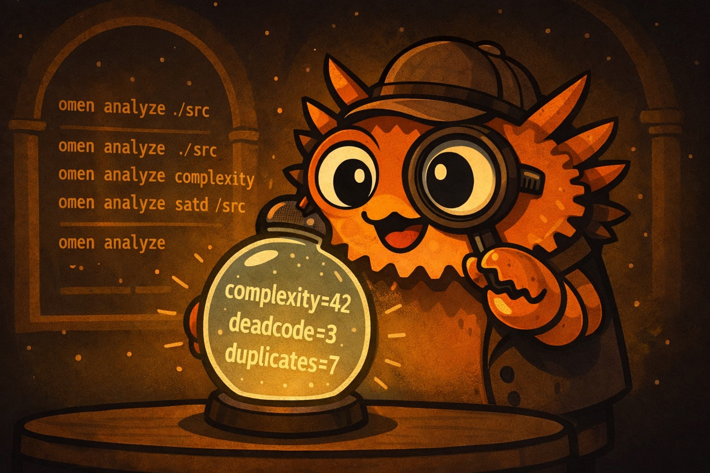
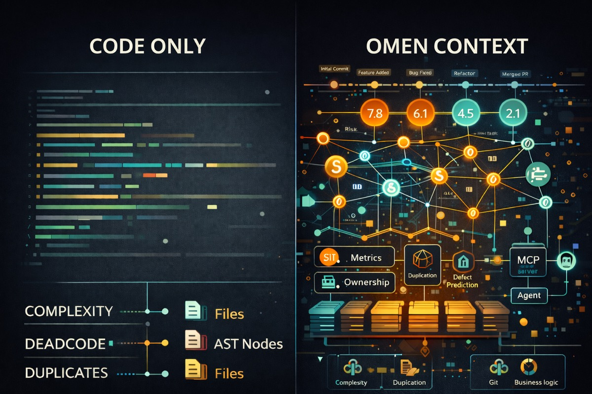

<div align="center">

# Omen



[](https://www.rust-lang.org/)
[](https://github.com/panbanda/omen/blob/main/LICENSE)
[](https://github.com/panbanda/omen/actions/workflows/ci.yml)
[](https://github.com/panbanda/omen/releases)
[](https://crates.io/crates/omen-cli)

**Your AI writes code without knowing where the landmines are.**

Omen gives AI assistants the context they need: complexity hotspots, hidden dependencies, defect-prone files, and self-admitted debt. One command surfaces what's invisible.

**Why "Omen"?** An omen is a sign of things to come - good or bad. Your codebase is full of omens: low complexity and clean architecture signal smooth sailing ahead, while high churn, technical debt, and code clones warn of trouble brewing. Omen surfaces these signals so you can act before that "temporary fix" celebrates its third anniversary in production.

</div>

---

## Features

<details>
<summary><strong>Complexity Analysis</strong> - How hard your code is to understand and test</summary>

There are two types of complexity:

- **Cyclomatic Complexity** counts the number of different paths through your code. Every `if`, `for`, `while`, or `switch` creates a new path. A function with cyclomatic complexity of 10 means there are 10 different ways to run through it. The higher the number, the more test cases you need to cover all scenarios.

- **Cognitive Complexity** measures how hard code is for a human to read. It penalizes deeply nested code (like an `if` inside a `for` inside another `if`) more than flat code. Two functions can have the same cyclomatic complexity, but the one with deeper nesting will have higher cognitive complexity because it's harder to keep track of.

**Why it matters:** Research shows that complex code has more bugs and takes longer to fix. [McCabe's original 1976 paper](https://ieeexplore.ieee.org/document/1702388) found that functions with complexity over 10 are significantly harder to maintain. [SonarSource's cognitive complexity](https://www.sonarsource.com/docs/CognitiveComplexity.pdf) builds on this by measuring what actually confuses developers.

> [!TIP]
> Keep cyclomatic complexity under 10 and cognitive complexity under 15 per function.

</details>

<details>
<summary><strong>Self-Admitted Technical Debt (SATD)</strong> - Comments where developers admit they took shortcuts</summary>

When developers write `TODO: fix this later` or `HACK: this is terrible but works`, they're creating technical debt and admitting it. Omen finds these comments and groups them by type:

| Category    | Markers                 | What it means                                  |
| ----------- | ----------------------- | ---------------------------------------------- |
| Design      | HACK, KLUDGE, SMELL     | Architecture shortcuts that need rethinking    |
| Defect      | BUG, FIXME, BROKEN      | Known bugs that haven't been fixed             |
| Requirement | TODO, FEAT              | Missing features or incomplete implementations |
| Test        | FAILING, SKIP, DISABLED | Tests that are broken or turned off            |
| Performance | SLOW, OPTIMIZE, PERF    | Code that works but needs to be faster         |
| Security    | SECURITY, VULN, UNSAFE  | Known security issues                          |

**Why it matters:** [Potdar and Shihab's 2014 study](https://ieeexplore.ieee.org/document/6976075) found that SATD comments often stay in codebases for years. The longer they stay, the harder they are to fix because people forget the context. [Maldonado and Shihab (2015)](https://ieeexplore.ieee.org/document/7332619) showed that design debt is the most common and most dangerous type.

> [!TIP]
> Review SATD weekly. If a TODO is older than 6 months, either fix it or delete it.

</details>

<details>
<summary><strong>Dead Code Detection</strong> - Code that exists but never runs</summary>

Dead code includes:

- Functions that are never called
- Variables that are assigned but never used
- Classes that are never instantiated
- Code after a `return` statement that can never execute

**Why it matters:** Dead code isn't just clutter. It confuses new developers who think it must be important. It increases build times and binary sizes. Worst of all, it can hide bugs - if someone "fixes" dead code thinking it runs, they've wasted time. [Romano et al. (2020)](https://ieeexplore.ieee.org/document/8370748) found that dead code is a strong predictor of other code quality problems.

> [!TIP]
> Delete dead code. Version control means you can always get it back if needed.

</details>

<details>
<summary><strong>Git Churn Analysis</strong> - How often files change over time</summary>

Churn looks at your git history and counts:

- How many times each file was modified
- How many lines were added and deleted
- Which files change together

Files with high churn are "hotspots" - they're constantly being touched, which could mean they're:

- Central to the system (everyone needs to modify them)
- Poorly designed (constant bug fixes)
- Missing good abstractions (features keep getting bolted on)

**Why it matters:** [Nagappan and Ball's 2005 research at Microsoft](https://www.microsoft.com/en-us/research/publication/use-of-relative-code-churn-measures-to-predict-system-defect-density/) found that code churn is one of the best predictors of bugs. Files that change a lot tend to have more defects. Combined with complexity data, churn helps you find the files that are both complicated AND frequently modified - your highest-risk code.

> [!TIP]
> If a file has high churn AND high complexity, prioritize refactoring it.

</details>

<details>
<summary><strong>Code Clone Detection</strong> - Duplicated code that appears in multiple places</summary>

There are three types of clones:

| Type   | Description                                        | Example                                 |
| ------ | -------------------------------------------------- | --------------------------------------- |
| Type-1 | Exact copies (maybe different whitespace/comments) | Copy-pasted code                        |
| Type-2 | Same structure, different names                    | Same function with renamed variables    |
| Type-3 | Similar code with some modifications               | Functions that do almost the same thing |

**Why it matters:** When you fix a bug in one copy, you have to remember to fix all the other copies too. [Juergens et al. (2009)](https://ieeexplore.ieee.org/document/5070547) found that cloned code has significantly more bugs because fixes don't get applied consistently. The more clones you have, the more likely you'll miss one during updates.

> [!TIP]
> Anything copied more than twice should probably be a shared function. Aim for duplication ratio under 5%.

</details>

<details>
<summary><strong>Defect Prediction</strong> - The likelihood that a file contains bugs</summary>

Omen combines multiple signals to predict defect probability using PMAT-weighted metrics:

- **Process** metrics (churn frequency, ownership diffusion)
- **Metrics** (cyclomatic/cognitive complexity)
- **Age** (code age and stability)
- **Total** size (lines of code)

Each file gets a risk score from 0% to 100%.

**Why it matters:** You can't review everything equally. [Menzies et al. (2007)](https://ieeexplore.ieee.org/document/4027145) showed that defect prediction helps teams focus testing and code review on the files most likely to have problems. [Rahman et al. (2014)](https://dl.acm.org/doi/10.1145/2568225.2568269) found that even simple models outperform random file selection for finding bugs.

> [!TIP]
> Prioritize code review for files with >70% defect probability.

</details>

<details>
<summary><strong>Change Risk Analysis (JIT)</strong> - Predict which commits are likely to introduce bugs</summary>

Just-in-Time (JIT) defect prediction analyzes recent commits to identify risky changes before they cause problems. Unlike file-level prediction, JIT operates at the commit level using factors from [Kamei et al. (2013)](https://ieeexplore.ieee.org/document/6341763):

| Factor | Name                   | What it measures                           |
| ------ | ---------------------- | ------------------------------------------ |
| LA     | Lines Added            | More additions = more risk                 |
| LD     | Lines Deleted          | Deletions are generally safer              |
| LT     | Lines in Touched Files | Larger files = more risk                   |
| FIX    | Bug Fix                | Bug fix commits indicate problematic areas |
| NDEV   | Number of Developers   | More developers on files = more risk       |
| AGE    | Average File Age       | File stability indicator                   |
| NUC    | Unique Changes         | Change entropy = higher risk               |
| EXP    | Developer Experience   | Less experience = more risk                |

**Percentile-based risk classification:**

Risk levels use percentile-based thresholds following JIT defect prediction best practices. Rather than fixed thresholds, commits are ranked relative to the repository's own distribution:

| Level  | Percentile | Meaning                                    |
| ------ | ---------- | ------------------------------------------ |
| High   | Top 5%     | P95+ - Deserve extra scrutiny              |
| Medium | Top 20%    | P80-P95 - Worth additional attention       |
| Low    | Bottom 80% | Below P80 - Standard review process        |

This approach aligns with the 80/20 rule from defect prediction research: ~20% of code changes contain ~80% of defects. It ensures actionable results regardless of repository characteristics - well-disciplined repos will have lower thresholds, while high-churn repos will have higher ones.

**Why it matters:** [Kamei et al. (2013)](https://ieeexplore.ieee.org/document/6341763) demonstrated that JIT prediction catches risky changes at commit time, before bugs propagate. Their effort-aware approach uses ranking rather than fixed thresholds, focusing limited review resources on the riskiest ~20% of commits. [Zeng et al. (2021)](https://ieeexplore.ieee.org/document/9463091) showed that simple JIT models match deep learning accuracy (~65%) with better interpretability.

> [!TIP]
> Run `omen changes` before merging PRs to identify commits needing extra review.

</details>

<details>
<summary><strong>PR/Branch Diff Risk Analysis</strong> - Assess overall risk of a branch before merging</summary>

While JIT analysis examines individual commits, diff analysis evaluates an entire branch's cumulative changes against a target branch. This gives reviewers a quick risk assessment before diving into code review.

**Usage:**

```bash
# Compare current branch against main
omen diff --target main

# Compare against a specific commit
omen diff --target abc123

# Output as markdown for PR comments
omen diff --target main -f markdown
```

**Risk Factors:**

| Factor | What it measures | Risk contribution |
| ------ | ---------------- | ----------------- |
| Lines Added | Total new code introduced | More code = more potential bugs |
| Lines Deleted | Code removed | Generally reduces risk (less code) |
| Files Modified | Spread of changes | More files = more potential for cascading issues |
| Commits | Number of commits in branch | Many commits may indicate scope creep |
| Entropy | How scattered changes are | High entropy = changes everywhere |

**Risk Score Interpretation:**

| Score | Level | Recommended Action |
| ----- | ----- | ------------------ |
| < 0.2 | LOW | Standard review process |
| 0.2 - 0.5 | MEDIUM | Careful review, consider extra testing |
| > 0.5 | HIGH | Thorough review, ensure comprehensive test coverage |

**Example Output:**

```
Branch Diff Risk Analysis
==========================

Source:   feature/new-api
Target:   main
Base:     abc123def

Risk Score: 0.31 (MEDIUM)

Changes:
  Lines Added:    63
  Lines Deleted:  2
  Files Modified: 2
  Commits:        1

Risk Factors:
  entropy:        0.084
  lines_added:    0.118
  lines_deleted:  0.003
  num_files:      0.050
  commits:        0.005
```

**What to Look For:**

- **High lines added, low deleted** - New feature, needs thorough review
- **Balanced add/delete** - Refactoring, verify behavior unchanged
- **Net code reduction** - Cleanup/simplification, generally positive
- **High entropy** - Scattered changes, check for unrelated modifications
- **Many files** - Wide impact, ensure integration testing

**CI/CD Integration:**

```yaml
# Add to GitHub Actions workflow
- name: PR Risk Assessment
  run: |
    omen diff --target ${{ github.base_ref }} -f markdown >> $GITHUB_STEP_SUMMARY
```

**Why it matters:** Code review time is limited. Diff analysis helps reviewers prioritize their attention - a LOW risk PR with 10 lines changed needs less scrutiny than a MEDIUM risk PR touching 17 files. The entropy metric is particularly useful for catching PRs that bundle unrelated changes, which are harder to review and more likely to introduce bugs.

> [!TIP]
> Run `omen diff` before creating a PR to understand how reviewers will perceive your changes. Consider splitting HIGH risk PRs into smaller, focused changes.

</details>

<details>
<summary><strong>Technical Debt Gradient (TDG)</strong> - A composite "health score" for each file</summary>

TDG combines multiple metrics into a single score (0-100 scale, higher is better):

| Component             | Max Points | What it measures                        |
| --------------------- | ---------- | --------------------------------------- |
| Structural Complexity | 20         | Cyclomatic complexity and nesting depth |
| Semantic Complexity   | 15         | Cognitive complexity                    |
| Duplication           | 15         | Amount of cloned code                   |
| Coupling              | 15         | Dependencies on other modules           |
| Hotspot               | 10         | Churn x complexity interaction          |
| Temporal Coupling     | 10         | Co-change patterns with other files     |
| Consistency           | 10         | Code style and pattern adherence        |
| Entropy               | 10         | Pattern entropy and code uniformity     |
| Documentation         | 5          | Comment coverage                        |

**Why it matters:** Technical debt is like financial debt - a little is fine, too much kills you. [Cunningham coined the term in 1992](http://c2.com/doc/oopsla92.html), and [Kruchten et al. (2012)](https://ieeexplore.ieee.org/document/6336722) formalized how to measure and manage it. TDG gives you a single number to track over time and compare across files.

> [!TIP]
> Fix files with scores below 70 before adding new features. Track average TDG over time - it should go up, not down.

</details>

<details>
<summary><strong>Dependency Graph</strong> - How your modules connect to each other</summary>

Omen builds a graph showing which files import which other files, then calculates:

- **PageRank**: Which files are most "central" (many things depend on them)
- **Betweenness**: Which files are "bridges" between different parts of the codebase
- **Coupling**: How interconnected modules are

**Why it matters:** Highly coupled code is fragile - changing one file breaks many others. [Parnas's 1972 paper on modularity](https://dl.acm.org/doi/10.1145/361598.361623) established that good software design minimizes dependencies between modules. The dependency graph shows you where your architecture is clean and where it's tangled.

> [!TIP]
> Files with high PageRank should be especially stable and well-tested. Consider breaking up files that appear as "bridges" everywhere.

</details>

<details>
<summary><strong>Hotspot Analysis</strong> - High-risk files where complexity meets frequent changes</summary>

Hotspots are files that are both complex AND frequently modified. A simple file that changes often is probably fine - it's easy to work with. A complex file that rarely changes is also manageable - you can leave it alone. But a complex file that changes constantly? That's where bugs breed.

Omen calculates hotspot scores using the **geometric mean** of normalized churn and complexity:

```
hotspot = sqrt(churn_percentile * complexity_percentile)
```

Both factors are normalized against industry benchmarks using empirical CDFs, so scores are comparable across projects:

- **Churn percentile** - Where this file's commit count ranks against typical OSS projects
- **Complexity percentile** - Where the average cognitive complexity ranks against industry benchmarks

| Hotspot Score | Severity | Action                 |
| ------------- | -------- | ---------------------- |
| >= 0.6        | Critical | Prioritize immediately |
| >= 0.4        | High     | Schedule for review    |
| >= 0.25       | Moderate | Monitor                |
| < 0.25        | Low      | Healthy                |

**Why it matters:** [Adam Tornhill's "Your Code as a Crime Scene"](https://pragprog.com/titles/atcrime/your-code-as-a-crime-scene/) introduced hotspot analysis as a way to find the most impactful refactoring targets. His research shows that a small percentage of files (typically 4-8%) contain most of the bugs. [Graves et al. (2000)](https://ieeexplore.ieee.org/document/859533) and [Nagappan et al. (2005)](https://www.microsoft.com/en-us/research/publication/use-of-relative-code-churn-measures-to-predict-system-defect-density/) demonstrated that relative code churn is a strong defect predictor.

> [!TIP]
> Start refactoring with your top 3 hotspots. Reducing complexity in high-churn files has the highest ROI.

</details>

<details>
<summary><strong>Temporal Coupling</strong> - Files that change together reveal hidden dependencies</summary>

When two files consistently change in the same commits, they're temporally coupled. This often reveals:

- **Hidden dependencies** not visible in import statements
- **Logical coupling** where a change in one file requires a change in another
- **Accidental coupling** from copy-paste or inconsistent abstractions

Omen analyzes your git history to find file pairs that change together:

| Coupling Strength | Meaning                                                 |
| ----------------- | ------------------------------------------------------- |
| > 80%             | Almost always change together - likely tight dependency |
| 50-80%            | Frequently coupled - investigate the relationship       |
| 20-50%            | Moderately coupled - may be coincidental                |
| < 20%             | Weakly coupled - probably independent                   |

**Why it matters:** [Ball et al. (1997)](https://www.researchgate.net/publication/2791666_If_Your_Version_Control_System_Could_Talk) first studied co-change patterns at AT&T and found they reveal architectural violations invisible to static analysis. [Beyer and Noack (2005)](https://www.semanticscholar.org/paper/Clustering-software-artifacts-based-on-frequent-Beyer-Noack/1afc4eeb182d92631c3ce400e6999eebbca71c12) showed that temporal coupling predicts future changes - if files changed together before, they'll likely change together again.

> [!TIP]
> If two files have >50% temporal coupling but no import relationship, consider extracting a shared module or merging them.

</details>

<details>
<summary><strong>Code Ownership/Bus Factor</strong> - Knowledge concentration and team risk</summary>

Bus factor asks: "How many people would need to be hit by a bus before this code becomes unmaintainable?" Low bus factor means knowledge is concentrated in too few people.

Omen uses git blame to calculate:

- **Primary owner** - Who wrote most of the code
- **Ownership ratio** - What percentage one person owns
- **Contributor count** - How many people have touched the file
- **Bus factor** - Number of major contributors (>5% of code)

| Ownership Ratio | Risk Level  | What it means             |
| --------------- | ----------- | ------------------------- |
| > 90%           | High risk   | Single point of failure   |
| 70-90%          | Medium risk | Limited knowledge sharing |
| 50-70%          | Low risk    | Healthy distribution      |
| < 50%           | Very low    | Broad ownership           |

**Why it matters:** [Bird et al. (2011)](https://ieeexplore.ieee.org/document/6032488) found that code with many minor contributors has more bugs than code with clear ownership, but code owned by a single person creates organizational risk. The sweet spot is 2-4 significant contributors per module. [Nagappan et al. (2008)](https://www.microsoft.com/en-us/research/publication/the-influence-of-organizational-structure-on-software-quality/) showed that organizational metrics (like ownership) predict defects better than code metrics alone.

> [!TIP]
> Files with >80% single ownership should have documented knowledge transfer. Critical files should have at least 2 people who understand them.

</details>

<details>
<summary><strong>CK Metrics</strong> - Object-oriented design quality measurements</summary>

The Chidamber-Kemerer (CK) metrics suite measures object-oriented design quality:

| Metric | Name                        | What it measures             | Threshold |
| ------ | --------------------------- | ---------------------------- | --------- |
| WMC    | Weighted Methods per Class  | Sum of method complexities   | < 20      |
| CBO    | Coupling Between Objects    | Number of other classes used | < 10      |
| RFC    | Response for Class          | Methods that can be invoked  | < 50      |
| LCOM   | Lack of Cohesion in Methods | Methods not sharing fields   | < 3       |
| DIT    | Depth of Inheritance Tree   | Inheritance chain length     | < 5       |
| NOC    | Number of Children          | Direct subclasses            | < 6       |

**LCOM (Lack of Cohesion)** is particularly important. Low LCOM means methods in a class use similar instance variables - the class is focused. High LCOM means the class is doing unrelated things and should probably be split.

**Why it matters:** [Chidamber and Kemerer's 1994 paper](https://ieeexplore.ieee.org/document/295895) established these metrics as the foundation of OO quality measurement. [Basili et al. (1996)](https://ieeexplore.ieee.org/document/544352) validated them empirically, finding that WMC and CBO strongly correlate with fault-proneness. These metrics have been cited thousands of times and remain the standard for OO design analysis.

> [!TIP]
> Classes violating multiple CK thresholds are candidates for refactoring. High WMC + high LCOM often indicates a "god class" that should be split.

</details>

<details>
<summary><strong>Repository Map</strong> - PageRank-ranked symbol index for LLM context</summary>

Repository maps provide a compact summary of your codebase's important symbols, ranked by structural importance using PageRank. This is designed for LLM context windows - you get the most important functions and types first.

For each symbol, the map includes:

- **Name and kind** (function, class, method, interface)
- **File location** and line number
- **Signature** for quick understanding
- **PageRank score** based on how many other symbols depend on it
- **In/out degree** showing dependency connections

**Why it matters:** LLMs have limited context windows. Stuffing them with entire files wastes tokens on less important code. PageRank, [developed by Brin and Page (1998)](https://snap.stanford.edu/class/cs224w-readings/Brin98Anatomy.pdf), identifies structurally important nodes in a graph. Applied to code, it surfaces the symbols that are most central to understanding the codebase.

**Scalability:** Omen uses a sparse power iteration algorithm for PageRank computation, scaling linearly with the number of edges O(E) rather than quadratically with nodes O(V^2). This enables fast analysis of large monorepos with 25,000+ symbols in under 30 seconds.

**Example output:**

```
# Repository Map (Top 20 symbols by PageRank)

## parser.ParseFile (function) - pkg/parser/parser.go:45
  PageRank: 0.0823 | In: 12 | Out: 5
  func ParseFile(path string) (*Result, error)

## models.TdgScore (struct) - pkg/models/tdg.go:28
  PageRank: 0.0651 | In: 8 | Out: 3
  type TdgScore struct
```

> [!TIP]
> Use `omen context --repo-map --top 50` to generate context for LLM prompts. The top 50 symbols usually capture the essential architecture.

</details>

<details>
<summary><strong>Feature Flag Detection</strong> - Find and track feature flags across your codebase</summary>

Feature flags are powerful but dangerous. They let you ship code without enabling it, run A/B tests, and roll out features gradually. But they accumulate. That "temporary" flag from 2019 is still in production. The flag you added for a one-week experiment is now load-bearing infrastructure.

Omen detects feature flag usage across popular providers:

| Provider     | Languages                | What it finds                                  |
| ------------ | ------------------------ | ---------------------------------------------- |
| LaunchDarkly | JS/TS                    | `variation()`, `boolVariation()` calls         |
| Split        | JS/TS                    | `getTreatment()` calls                         |
| Unleash      | JS/TS, Python            | `isEnabled()`, `is_enabled()` calls            |
| Flipper      | Ruby                     | `Flipper[:flag]`, `enabled?()` calls           |
| ENV-based    | Ruby, JS/TS, Python      | `ENV["FEATURE_*"]`, `process.env.FEATURE_*`    |

Additional providers can be added via custom tree-sitter queries in your `omen.toml` configuration.

For each flag, Omen reports:

- **Flag key** - The identifier used in code
- **Provider** - Which SDK is being used
- **References** - All locations where the flag is checked
- **Staleness** - When the flag was first and last modified (with git history)

**Custom providers:** For in-house feature flag systems, define custom tree-sitter queries in your `omen.toml`:

```toml
[[feature_flags.custom_providers]]
name = "feature"
languages = ["ruby"]
query = '''
(call
  receiver: (constant) @receiver
  (#eq? @receiver "Feature")
  method: (identifier) @method
  (#match? @method "^(enabled\\?|get_feature_flag)$")
  arguments: (argument_list
    .
    (simple_symbol) @flag_key))
'''
```

**Why it matters:** [Meinicke et al. (2020)](https://dl.acm.org/doi/10.1145/3379597.3387463) studied feature flags across open-source projects and found that flag ownership (the developer who introduces a flag also removes it) correlates with shorter flag lifespans, helping keep technical debt in check. [Rahman et al. (2018)](https://link.springer.com/article/10.1007/s10664-018-9639-0) studied Google Chrome's 12,000+ feature toggles and found that while they enable rapid releases and flexible deployment, they also introduce technical debt and additional maintenance burden. Regular flag audits prevent your codebase from becoming a maze of unused toggles.

> [!TIP]
> Audit feature flags monthly. Remove flags older than 90 days for experiments, 14 days for release flags. Track flag staleness in your CI pipeline.

</details>

<details>
<summary><strong>Repository Score</strong> - Composite health score (0-100)</summary>

Omen computes a composite repository health score (0-100) that combines multiple analysis dimensions. This provides a quick overview of codebase quality and enables quality gates in CI/CD.

**Score Components:**

| Component       | Weight | What it measures                                   |
| --------------- | ------ | -------------------------------------------------- |
| Complexity      | 25%    | % of functions exceeding complexity thresholds     |
| Duplication     | 20%    | Code clone ratio with non-linear penalty curve     |
| SATD            | 10%    | Severity-weighted TODO/FIXME density per 1K LOC    |
| TDG             | 15%    | Technical Debt Gradient composite score            |
| Coupling        | 10%    | Cyclic deps, SDP violations, and instability       |
| Smells          | 5%     | Architectural smells relative to codebase size     |
| Cohesion        | 15%    | Class cohesion (LCOM) for OO codebases             |

**Normalization Philosophy:**

Each component metric is normalized to a 0-100 scale where higher is always better. The normalization functions are designed to be:

1. **Fair** - Different metrics with similar severity produce similar scores
2. **Calibrated** - Based on industry benchmarks from SonarQube, CodeClimate, and CISQ
3. **Non-linear** - Gentle penalties for minor issues, steep for severe ones
4. **Severity-aware** - Weight items by impact, not just count

For example, SATD (Self-Admitted Technical Debt) uses severity-weighted scoring:
- Critical (SECURITY, VULN): 4x weight
- High (FIXME, BUG): 2x weight
- Medium (HACK, REFACTOR): 1x weight
- Low (TODO, NOTE): 0.25x weight

This prevents low-severity items (like documentation TODOs) from unfairly dragging down scores.

TDG (Technical Debt Gradient) provides a complementary view by analyzing structural complexity, semantic complexity, duplication patterns, and coupling within each file.

**Usage:**

```bash
# Compute repository score
omen score

# JSON output for CI integration
omen -f json score
```

**Adjusting thresholds:**

Achieving a score of 100 is nearly impossible for real-world codebases. Set realistic thresholds in `omen.toml` based on your codebase:

```toml
[score.thresholds]
score = 80        # Overall score minimum
complexity = 85   # Function complexity
duplication = 65  # Code clone ratio (often the hardest to improve)
defect = 80       # Defect probability
debt = 75         # Technical debt density
coupling = 70     # Module coupling
smells = 90       # Architectural smells
```

Run `omen score` to see your current scores, then set thresholds slightly below those values. Gradually increase them over time.

**Enforcing on commit with [Lefthook](https://github.com/evilmartians/lefthook):**

Add to `lefthook.yml`:

```yaml
pre-push:
  commands:
    omen-score:
      run: omen score
```

This prevents pushing code that fails your quality thresholds.

**Why it matters:** A single health score enables quality gates, tracks trends over time, and provides quick codebase assessment. The weighted composite ensures that critical issues (defects, complexity) have more impact than cosmetic ones.

> [!TIP]
> Start with achievable thresholds and increase them as you improve your codebase. Duplication is often the hardest metric to improve in legacy code.

</details>

<details>
<summary><strong>Semantic Search</strong> - Natural language code discovery</summary>

Search your codebase by meaning, not just keywords. Omen uses vector embeddings to find semantically similar code based on natural language queries.

```bash
# Build the search index (first time)
omen search index

# Search for code
omen search query "database connection pooling"
omen search query "error handling middleware" --top-k 20
omen search query "authentication" --files src/auth/,src/middleware/
```

**How it works:**

1. **Symbol extraction** - Extracts functions from your codebase using tree-sitter
2. **Embedding generation** - Generates 384-dimensional embeddings using all-MiniLM-L6-v2 via candle (local inference, no API keys)
3. **Incremental indexing** - Only re-embeds files that changed since last index
4. **Similarity search** - Ranks results by cosine similarity to your query

**Performance:**

- Index stored in `.omen/search.db` (SQLite)
- Parallel file parsing with rayon
- Batch embedding generation (64 symbols per batch)
- Typical indexing: ~3.5 symbols/second on CPU

**Why it matters:** Traditional grep/ripgrep finds exact matches. Semantic search finds code that *means* the same thing even with different naming. Ask "how do we validate user input" and find functions named `sanitize_params`, `check_request`, or `validate_form`.

> [!TIP]
> Run `omen search index` after major refactors or when onboarding to a new codebase. The index updates incrementally on subsequent runs.

</details>

<details>
<summary><strong>MCP Server</strong> - LLM tool integration via Model Context Protocol</summary>

Omen includes a Model Context Protocol (MCP) server that exposes all analyzers as tools for LLMs like Claude. This enables AI assistants to analyze codebases directly through standardized tool calls.

**Available tools:**

- `analyze_complexity` - Cyclomatic and cognitive complexity
- `analyze_satd` - Self-admitted technical debt detection
- `analyze_deadcode` - Unused functions and variables
- `analyze_churn` - Git file change frequency
- `analyze_duplicates` - Code clones detection
- `analyze_defect` - File-level defect probability (PMAT)
- `analyze_changes` - Commit-level change risk (JIT)
- `analyze_tdg` - Technical Debt Gradient scores
- `analyze_graph` - Dependency graph generation
- `analyze_hotspot` - High churn + complexity files
- `analyze_temporal_coupling` - Files that change together
- `analyze_ownership` - Code ownership and bus factor
- `analyze_cohesion` - CK OO metrics
- `analyze_repo_map` - PageRank-ranked symbol map
- `analyze_smells` - Architectural smell detection
- `analyze_flags` - Feature flag detection and staleness
- `score_repository` - Composite health score (0-100)
- `get_context` - Deep context for a specific file or symbol
- `semantic_search` - Natural language code search

Each tool includes detailed descriptions with interpretation guidance, helping LLMs understand what metrics mean and when to use each analyzer.

Tool outputs default to [TOON (Token-Oriented Object Notation)](https://github.com/toon-format/toon) format, a compact serialization designed for LLM workflows that reduces token usage by 30-60% compared to JSON while maintaining high comprehension accuracy. JSON and Markdown formats are also available.

**Why it matters:** LLMs work best when they have access to structured tools rather than parsing unstructured output. MCP is the emerging standard for LLM tool integration, supported by Claude Desktop and other AI assistants. TOON output maximizes the information density within context windows.

> [!TIP]
> Configure omen as an MCP server in your AI assistant to enable natural language queries like "find the most complex functions" or "show me technical debt hotspots."

</details>

<div align="center">

</div>

## Supported Languages

Go, Rust, Python, TypeScript, JavaScript, TSX/JSX, Java, C, C++, C#, Ruby, PHP, Bash (and other languages supported by tree-sitter)

## Installation

### Homebrew (macOS/Linux)

```bash
brew install panbanda/omen/omen
```

### Cargo Install

```bash
cargo install omen-cli
```

### Docker

```bash
# Pull the latest image
docker pull ghcr.io/panbanda/omen:latest

# Run analysis on current directory
docker run --rm -v "$(pwd):/repo" ghcr.io/panbanda/omen:latest analyze /repo

# Run specific analyzer
docker run --rm -v "$(pwd):/repo" ghcr.io/panbanda/omen:latest complexity /repo

# Get repository score
docker run --rm -v "$(pwd):/repo" ghcr.io/panbanda/omen:latest score /repo
```

Multi-arch images are available for `linux/amd64` and `linux/arm64`.

### Download Binary

Download pre-built binaries from the [releases page](https://github.com/panbanda/omen/releases).

### Build from Source

```bash
git clone https://github.com/panbanda/omen.git
cd omen
cargo build --release
# Binary at target/release/omen
```

## Quick Start

```bash
# Run all analyzers
omen all

# Check out the analyzers
omen --help
```

## Remote Repository Scanning

Analyze any public GitHub repository without cloning it manually:

```bash
# GitHub shorthand
omen -p facebook/react complexity
omen -p kubernetes/kubernetes satd

# With specific ref (branch, tag, or commit SHA)
omen -p agentgateway/agentgateway --ref v0.1.0 all
omen -p owner/repo --ref feature-branch all

# Full URLs
omen -p github.com/golang/go all
omen -p https://github.com/vercel/next.js all

# Shallow clone for faster analysis (static analyzers only)
omen -p facebook/react --shallow all
```

Omen clones to a temp directory, runs analysis, and cleans up automatically. The `--shallow` flag uses `git clone --depth 1` for faster clones but disables git-history-based analyzers (churn, ownership, hotspot, temporal coupling, changes).

## Configuration

Create `omen.toml` or `.omen/omen.toml` (supports `yaml`, `json` and `toml`):

```bash
omen init
```

See [`omen.example.toml`](omen.example.toml) for all options.

> [!TIP]
> Using Claude Code? Run the `setup-config` skill to analyze your repository and generate an `omen.toml` with intelligent defaults for your tech stack, including detected feature flag providers and language-specific exclude patterns.

## MCP Server

Omen includes a Model Context Protocol (MCP) server that exposes all analyzers as tools for LLMs like Claude. This enables AI assistants to analyze codebases directly.

### Claude Desktop

Add to your Claude Desktop config (`~/Library/Application Support/Claude/claude_desktop_config.json` on macOS):

```json
{
  "mcpServers": {
    "omen": {
      "command": "omen",
      "args": ["mcp"]
    }
  }
}
```

### Claude Code

```bash
claude mcp add omen -- omen mcp
```

### Example Usage

Once configured, you can ask Claude:

- "Analyze the complexity of this codebase"
- "Find technical debt in the src directory"
- "What are the hotspot files that need refactoring?"
- "Show me the bus factor risk for this project"
- "Find stale feature flags that should be removed"

## Claude Code Plugin

Omen is available as a Claude Code plugin, providing analysis-driven skills that guide Claude through code analysis workflows.

### Installation

```bash
/plugin install panbanda/omen
```

Verify installation with `/skills` to see available Omen skills.

### Prerequisites

Skills require the Omen MCP server to be configured (see MCP Server section above).

## Real-World Repository Analysis Examples

The [`examples/repos/`](examples/repos/) directory contains comprehensive health reports for popular open-source projects, demonstrating Omen's capabilities across different languages and project types.

### Analyzed Repositories

| Repository | Language | Health Score | Key Insights |
|------------|----------|--------------|--------------|
| [gin-gonic/gin](examples/repos/gin-gonic-gin.md) | Go | 95/100 | Exceptionally healthy web framework with zero duplication and clean architecture |
| [excalidraw/excalidraw](examples/repos/excalidraw-excalidraw.md) | TypeScript | 86/100 | Highest-scoring repo with 100% coupling score; App.tsx needs refactoring |
| [BurntSushi/ripgrep](examples/repos/burntSushi-ripgrep.md) | Rust | 76/100 | Mature codebase with excellent architecture; duplication in tests is intentional |
| [tiangolo/fastapi](examples/repos/tiangolo-fastapi.md) | Python | 74/100 | Great complexity scores (98/100); duplication from versioned examples in docs |
| [discourse/discourse](examples/repos/discourse-discourse.md) | Ruby | 69/100 | Largest codebase (10K+ files); excellent defect management despite size |

### What the Reports Demonstrate

**1. Health Score Breakdown**
Each report shows how the composite score is calculated from individual components (complexity, duplication, SATD, coupling, etc.) and explains why certain scores are what they are.

**2. Hotspot Analysis**
Reports identify files with high churn AND high complexity - the most impactful refactoring targets. For example, gin's `tree.go` has a hotspot score of 0.54 due to its radix tree routing complexity.

**3. Technical Debt Gradient (TDG)**
Files are graded A-F based on accumulated technical debt. The reports explain what drives low grades and prioritize cleanup efforts.

**4. PR Risk Analysis**
Each report includes a real PR analysis demonstrating `omen diff`:

```bash
omen diff --target main -f markdown
```

Example from gin-gonic/gin (#4420 - add escaped path option):
```
Risk Score: 0.31 (MEDIUM)
Lines Added:    63
Lines Deleted:  2
Files Modified: 2

Risk Factors:
  entropy:        0.084
  lines_added:    0.118
  num_files:      0.050
```

**Understanding Risk Factors:**
- **Risk Score** - LOW (< 0.2), MEDIUM (0.2-0.5), HIGH (> 0.5)
- **Entropy** - How scattered changes are (0 = concentrated, 1 = everywhere)
- **Lines Added/Deleted Ratio** - Net code reduction is often a good sign
- **Files Modified** - More files = more potential for cascading issues

**5. CI/CD Integration**
Reports include GitHub Actions workflow examples for quality gates and PR risk assessment.

### Generating Your Own Reports

Run a comprehensive analysis on any repository:

```bash
# Local repository
omen score
omen hotspot
omen tdg

# Remote repository
omen -p facebook/react score
omen -p kubernetes/kubernetes hotspot

# PR risk before merging
omen diff --target main

# Track score trends over time
omen score trend --period monthly --since 6m
```

## Contributing

1. Fork the repository
2. Create your feature branch (`git checkout -b feature/amazing-feature`)
3. Commit your changes (`git commit -am 'Add amazing feature'`)
4. Push to the branch (`git push origin feature/amazing-feature`)
5. Create a Pull Request

## Acknowledgments

Omen draws heavy inspiration from [paiml-mcp-agent-toolkit](https://github.com/paiml/paiml-mcp-agent-toolkit/) - a fantastic CLI and comprehensive suite of code analysis tools for LLM workflows. If you're doing serious AI-assisted development, it's worth checking out. Omen exists as a streamlined alternative for teams who want a focused subset of analyzers without the additional dependencies. If you're looking for a Rust-focused MCP/agent generator as an alternative to Python, it's definitely worth checking out.

## License

Apache License 2.0 - see [LICENSE](LICENSE) for details.
