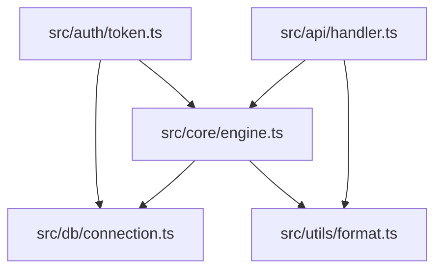

# Dependency Graph

The dependency graph analyzer builds a directed graph of file-level import relationships and applies graph algorithms to identify structurally important files, detect circular dependencies, and measure coupling between modules.

## How It Works

Omen parses each source file with tree-sitter, extracts import and require statements, and resolves them to file paths within the repository. The result is a directed graph where nodes are files and edges represent "file A imports file B."

From this graph, Omen computes:

- **PageRank**: A measure of each file's structural importance based on how many other files depend on it, weighted by the importance of those dependents. Files with high PageRank are central to the system.
- **Betweenness centrality**: Identifies files that act as bridges between otherwise disconnected parts of the codebase. A file with high betweenness centrality is a bottleneck -- if it breaks or changes, many communication paths through the system are disrupted.
- **Coupling analysis**: Measures the density of interconnections between modules, identifying tightly coupled clusters.
- **Circular dependency detection**: Finds cycles in the import graph where A imports B imports C imports A.

## Command

```bash
omen graph
```

### Common Options

```bash
# Analyze a specific directory
omen -p ./src graph

# JSON output
omen -f json graph

# Filter by language
omen graph --language typescript

# Remote repository
omen -p expressjs/express graph
```

## Language Support

Omen resolves imports for the following languages, each with language-specific resolution rules:

| Language | Import Syntax | Resolution |
|----------|--------------|------------|
| Go | `import "path/to/pkg"` | Package path mapping |
| Python | `import module`, `from module import name` | Module path resolution, package `__init__.py` |
| TypeScript | `import { x } from './module'` | Relative and absolute paths, index files, `.ts`/`.tsx` extensions |
| JavaScript | `import`, `require()` | Same as TypeScript plus CommonJS `require` |
| Rust | `use crate::module`, `mod module` | Crate-relative paths, `mod.rs` resolution |
| Java | `import com.example.Class` | Package-to-directory mapping |
| Ruby | `require`, `require_relative` | Relative paths with CamelCase-to-snake_case resolution |

Ruby import resolution includes CamelCase-to-snake_case conversion. For example, `require "MyModule"` resolves to `my_module.rb`. This handles the Ruby convention where class names are CamelCase but file names are snake_case.

## Graph Algorithms

### PageRank

PageRank, originally developed for ranking web pages (Brin and Page, 1998), works equally well for ranking code files by structural importance. The intuition: a file is important if it is imported by many other important files.

Omen uses a sparse power iteration algorithm with O(E) complexity per iteration (where E is the number of edges), rather than the naive O(V^2) matrix multiplication approach. This allows it to handle large codebases with 25,000+ files and symbols without excessive memory or compute.

The algorithm iterates until convergence (rank values stabilize) or a maximum iteration count is reached. The damping factor defaults to 0.85, matching the standard PageRank parameterization.

Files with the highest PageRank scores are the most structurally important -- changes to these files are likely to have the widest impact.

### Betweenness Centrality

Betweenness centrality measures how often a file lies on the shortest path between two other files in the dependency graph. High betweenness indicates a file that serves as a bridge or connector.

These files are architecturally significant even if they are not heavily imported directly. They are the "glue" between subsystems. Common examples:

- Adapter layers between internal modules and external libraries.
- Shared utility modules imported by multiple subsystems.
- Interface definition files that decouple producers from consumers.

A file with high betweenness centrality and high complexity is a significant risk: it is both critical to the system's structure and difficult to modify safely.

### Coupling Analysis

Coupling is measured as the ratio of actual connections between two modules to the maximum possible connections:

```
coupling(A, B) = actual_edges(A, B) / (files_in_A * files_in_B)
```

Low coupling between modules indicates good separation of concerns. High coupling suggests the modules are deeply intertwined and may be difficult to change independently.

## Circular Dependencies

Circular dependencies (A imports B imports C imports A) create several problems:

- **Build ordering issues.** Compilers and bundlers may fail or produce unexpected results.
- **Reasoning difficulty.** Circular dependencies make it impossible to understand a module in isolation.
- **Testing difficulty.** Mocking or stubbing one module requires understanding and potentially loading the entire cycle.

Omen detects cycles in the import graph and reports them. Each cycle is listed with its constituent files.

### Stable Dependencies Principle

The Stable Dependencies Principle (SDP), from Robert C. Martin's work on package design, states that dependencies should flow in the direction of stability. A module that many others depend on (stable) should not depend on a module that few others depend on (unstable).

Omen detects SDP violations by comparing the stability of each node (measured by the ratio of incoming to total connections) with the stability of its dependencies. When a stable module depends on an unstable one, it reports a violation.

## Output

### Mermaid Diagram

Omen can produce dependency graphs in Mermaid format, which can be rendered in Markdown documents, GitHub, or any Mermaid-compatible viewer.



### Table Output

```
Dependency Graph Analysis
=========================

Top Files by PageRank:
  File                        PageRank   In-Degree   Out-Degree
  src/core/engine.ts          0.142      12          3
  src/db/connection.ts        0.098      8           1
  src/utils/format.ts         0.087      9           0
  src/auth/token.ts           0.065      5           4
  src/api/handler.ts          0.052      2           6

Circular Dependencies:
  Cycle 1: src/a.ts -> src/b.ts -> src/c.ts -> src/a.ts

SDP Violations:
  src/core/engine.ts (stable, 0.80) depends on src/utils/experimental.ts (unstable, 0.20)
```

### JSON Output

```json
{
  "nodes": [
    {
      "path": "src/core/engine.ts",
      "pagerank": 0.142,
      "betweenness": 0.35,
      "in_degree": 12,
      "out_degree": 3
    }
  ],
  "edges": [
    {
      "from": "src/api/handler.ts",
      "to": "src/core/engine.ts"
    }
  ],
  "cycles": [
    ["src/a.ts", "src/b.ts", "src/c.ts"]
  ],
  "sdp_violations": []
}
```

## Practical Applications

### Identifying high-impact files

Files with high PageRank should receive the most scrutiny during code review. A bug in a file imported by half the codebase has a larger blast radius than a bug in a leaf node.

### Breaking circular dependencies

Omen's cycle detection identifies the specific files involved. Common resolution strategies:

- Extract the shared dependency into a separate module that both sides import.
- Introduce an interface or trait that breaks the direct dependency.
- Merge the tightly coupled files if they represent a single concern.

### Planning refactors

Betweenness centrality identifies the files whose movement or restructuring would affect the most dependency paths. Refactoring these files requires careful coordination.

### Architecture validation

Compare the actual dependency graph against the intended architecture. If your design says "the API layer should not import from the database layer directly," the graph will show whether that constraint holds.

## Research Background

**Parnas (1972).** "On the Criteria to Be Used in Decomposing Systems into Modules" -- The foundational paper on modular design, published in Communications of the ACM. Parnas argued that module boundaries should be drawn to hide design decisions likely to change, rather than following the steps of a processing pipeline. The dependency graph is the primary tool for evaluating whether a codebase achieves this goal: well-drawn modules have few incoming dependencies and stable interfaces.

**Brin and Page (1998).** "The Anatomy of a Large-Scale Hypertextual Web Search Engine" -- Introduced the PageRank algorithm for ranking web pages by link structure. The same algorithm applies to any directed graph, including code dependency graphs. Files that are "linked to" (imported by) many other important files receive higher ranks, providing a principled measure of structural importance.

**Martin (2003).** *Agile Software Development: Principles, Patterns, and Practices* -- Formalized the Stable Dependencies Principle and the Stable Abstractions Principle, providing metrics for evaluating package-level dependency health. Omen's SDP violation detection implements Martin's instability metric.
