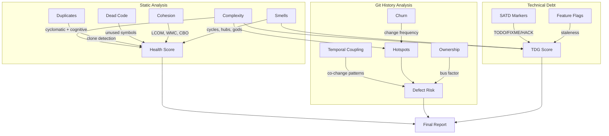
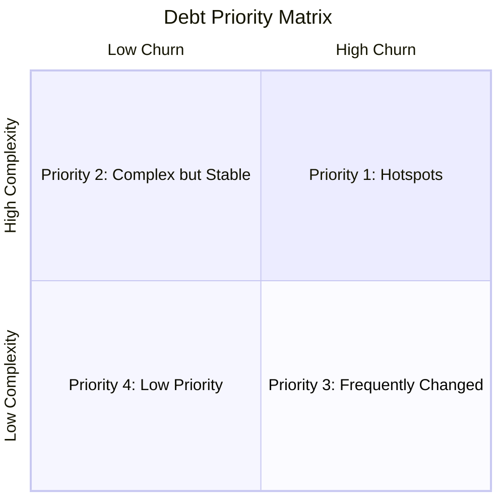

# Repository Health Report: BurntSushi/ripgrep

> Generated by [Omen](https://github.com/panbanda/omen) on 2025-12-09

## Analysis Performance

| Analyzer | Time |
|----------|------|
| Health Score | 0.71s |
| Complexity | 0.34s |
| SATD | 0.30s |
| Hotspots | 0.48s |
| Smells | 0.40s |
| Duplicates | 1.12s |
| Defect Prediction | 1.53s |
| Dead Code | 0.41s |
| TDG | 0.13s |
| Cohesion | N/A |
| Feature Flags | N/A |
| Temporal Coupling | 0.44s |
| Score Trend | 2.84s |
| **Total** | **~8.7s** |

## Executive Summary

**Ripgrep scores 76/100, with significant code duplication being the primary concern.** This mature Rust codebase is a high-performance text search tool with excellent architecture and low complexity. The duplication score of 0/100 severely impacts the overall health score, though this is largely due to intentional patterns in test code.

**Top 3 Strengths:**
1. **Excellent architecture** - No architectural smells, 100% coupling score, clean module boundaries
2. **Low complexity** - Median cyclomatic complexity of 1, 90th percentile of only 3
3. **Stable codebase** - Score trend is flat at 76 over 3 months with minimal churn

**Top 3 Areas of Attention:**
1. **Code duplication (0/100)** - Extensive duplicate test patterns in `standard.rs` and `line_buffer.rs`
2. **Technical debt markers (79/100)** - 168 SATD markers including 4 SECURITY notes and 17 high-severity items
3. **Test code maintenance** - Many "dead" functions are actually test helpers with false positive detection

**Recommended Priority Actions:**
1. Review the 4 SECURITY markers in `decompress.rs` - these document security-sensitive code paths
2. Consider extracting test helper macros to reduce duplication in `printer/src/standard.rs`
3. Address the 2 FIXME markers in `searcher/core.rs` and `non_matching.rs`

## Health Score

| Component | Score |
|-----------|-------|
| **Overall** | **76/100** |
| Complexity | 98/100 |
| Duplication | 0/100 |
| SATD | 79/100 |
| TDG | 88/100 |
| Coupling | 100/100 |
| Smells | 100/100 |
| Cohesion | 100/100 |

Files analyzed: 88

The score of 76/100 is dragged down significantly by the duplication score. Without the test duplication, the core library code is excellent quality. The 98/100 complexity score and 100/100 architectural scores demonstrate Andrew Gallant's commitment to clean, maintainable code.

## How Omen Analyzes Code



## Key Findings

### Areas Requiring Attention

1. **Test code duplication** - The `printer/src/standard.rs` file has extensive duplicate test patterns (2000+ clone pairs detected). These are intentional test variations but could be refactored into parameterized tests.

2. **Security documentation** - Four SECURITY markers in `decompress.rs` document security-sensitive decompression handling. These should be reviewed to ensure the documented risks are still relevant and mitigated.

3. **Known bugs** - Multiple BUG markers indicate known issues:
   - `globset/src/glob.rs:593` - Parser bug
   - `pcre2/src/matcher.rs:114` - "will probably never be fixed"
   - `ignore/src/dir.rs:480` and `dir.rs:619` - Directory handling edge cases

### Complexity Hotspots

| File | Functions | Avg Cyclomatic | Avg Cognitive | Notes |
|------|-----------|----------------|---------------|-------|
| flags/defs.rs | 878 | 1.1 | 0.1 | CLI flag definitions (intentionally simple) |
| printer/standard.rs | 170 | 1.6 | 1.4 | Output formatting |
| ignore/walk.rs | 143 | 1.9 | 1.5 | Directory traversal |
| matcher/lib.rs | 84 | 1.2 | 0.3 | Core matching interface |
| globset/lib.rs | 69 | 1.8 | 1.1 | Glob pattern matching |

The codebase has remarkably low complexity:
- Max cyclomatic: 28
- Max cognitive: 51
- Median: 1 for both metrics

### Technical Debt

| Severity | Count | Key Examples |
|----------|-------|--------------|
| Critical | 4 | SECURITY markers in decompress.rs |
| High | 17 | FIXME, BUG markers across codebase |
| Medium | 9 | CLEANUP, REFACTOR, KLUDGE markers |
| Low | 138 | NOTE comments (documentation) |

**Notable high-severity items:**
- `searcher/src/searcher/core.rs:683` - FIXME
- `regex/src/non_matching.rs:31` - FIXME
- `globset/src/glob.rs:593` - BUG in the parser
- `pcre2/src/matcher.rs:114` - BUG that will "probably never be fixed"

**TDG Grades (worst files):**
- searcher/glue.rs: D (62.9)
- printer/standard.rs: D (69.2)
- regex/literal.rs: C- (70.5)
- Average: B+ (88.1)

### Architectural Concerns

**No architectural smells detected.** The codebase demonstrates:
- Clean crate boundaries (grep, searcher, printer, globset, ignore)
- No cyclic dependencies
- No god modules
- Proper separation of concerns

### Code Quality

- **Duplication:** 0/100 - Extensive duplication in test code
  - `line_buffer.rs`: 8+ similar test functions
  - `standard.rs`: 50+ similar test patterns
  - These are intentional test variations, not copy-paste bugs

- **Dead Code:** ~120 potentially dead functions (95% confidence)
  - Most are test functions and benchmarks
  - Some are public API methods not used internally

## Detailed Analysis

### Complexity Analysis

| File | Functions | Avg Cyclomatic | Avg Cognitive |
| --- | --- | --- | --- |
| flags/defs.rs | 878 | 1.1 | 0.1 |
| printer/standard.rs | 170 | 1.6 | 1.4 |
| ignore/walk.rs | 143 | 1.9 | 1.5 |
| matcher/lib.rs | 84 | 1.2 | 0.3 |
| globset/lib.rs | 69 | 1.8 | 1.1 |
| regex/literal.rs | 65 | 1.8 | 1.3 |

**Summary:** 2665 functions across 88 files
- Median Cyclomatic: 1
- 90th Percentile: 3
- Max: 28

### Technical Debt Markers (Top Items)

| Location | Marker | Severity |
| --- | --- | --- |
| decompress.rs:409 | SECURITY | critical |
| decompress.rs:121 | SECURITY | critical |
| decompress.rs:91 | SECURITY | critical |
| decompress.rs:438 | SECURITY | critical |
| searcher/core.rs:683 | FIXME | high |
| flags/mod.rs:275 | BUG | high |
| non_matching.rs:31 | FIXME | high |

Total: 168 markers

### Hotspots

Only one file changed in the last 30 days:
- `flags/lowargs.rs` (Hotspot: 0.13)

The codebase is very stable with minimal recent churn.

### Architectural Smells

No architectural smells detected.

### Code Duplication

Significant duplication detected in test files:
- `printer/src/standard.rs` - ~50 similar test functions
- `searcher/src/line_buffer.rs` - 8 similar buffer test functions
- `flags/defs.rs` - Repetitive flag definition patterns

This is intentional test coverage but could benefit from parameterized test macros.

### Defect Prediction

| File | Probability | Risk Level |
| --- | --- | --- |
| flags/defs.rs | 23% | low |
| printer/standard.rs | 23% | low |
| printer/summary.rs | 19% | low |
| cli/process.rs | 14% | low |
| searcher/line_buffer.rs | 14% | low |

All files are low risk. Average probability: 4%.

### Dead Code

Many "dead" functions detected are actually:
- Test functions (not called from production code)
- Benchmark functions
- Public API methods used by external consumers

### Technical Debt Gradient

| File | Score | Grade |
| --- | --- | --- |
| searcher/glue.rs | 62.9 | D |
| printer/standard.rs | 69.2 | D |
| regex/literal.rs | 70.5 | C- |
| hyperlink/mod.rs | 70.9 | C- |
| ignore/walk.rs | 71.7 | C- |

Average Score: 88.1 (Grade: B+)

### Temporal Coupling

No significant temporal coupling detected in the last 30 days (only 1 file changed).

### Historical Score Trends (Past 3 Months)

**Trend:** Stable (+0 points)

| Date | Score | Complexity | Duplication | Defect | Debt |
|------|-------|------------|-------------|--------|------|
| Sep 2025 | 76 | 98 | 0 | 78 | 89 |
| Oct 2025 | 76 | 98 | 0 | 78 | 89 |
| Nov 2025 | 76 | 98 | 0 | 77 | 89 |

## Health Score Trends Over Time

| Month | Score | Complexity | Debt | Duplication | Defect Risk | Change |
|-------|-------|------------|------|-------------|-------------|--------|
| Sep 2025 | 76 | 98 | 89 | 0 | 78 | - |
| Oct 2025 | 76 | 98 | 89 | 0 | 78 | 0 |
| Nov 2025 | 76 | 98 | 89 | 0 | 77 | 0 |

The codebase is extremely stable. The duplication issue has persisted but is a known tradeoff for comprehensive test coverage.

```mermaid
xychart-beta
    title "Health Score Trend"
    x-axis ["Sep", "Oct", "Nov"]
    y-axis "Score" 0 --> 100
    line [76, 76, 76]
```

## Recommendations for LLM-Assisted Development

### High-Value Refactoring Targets

1. **printer/src/standard.rs** - Extract common test patterns into macros
2. **searcher/src/line_buffer.rs** - Parameterize buffer size tests
3. **flags/defs.rs** - Consider code generation for repetitive flag patterns

### Technical Debt Cleanup

1. Review SECURITY markers in `decompress.rs` for current relevance
2. Address FIXME in `searcher/core.rs:683`
3. Document or fix the BUG in `globset/glob.rs:593`
4. Clean up KLUDGE markers in `printer/lib.rs`

### Code Review Focus Areas

Based on defect prediction:
- `flags/defs.rs` (23%) - Large file with many flag definitions
- `printer/standard.rs` (23%) - Complex output formatting
- `printer/summary.rs` (19%) - Summary output handling

### Architecture Improvements

The architecture is already excellent. No improvements needed.

## Strategic Debt Prioritization

### Debt Prioritization Framework



### Hotspot-Adjacent Technical Debt

With minimal recent churn, prioritize by TDG score:

**Priority 1 - Worst TDG scores:**
1. `searcher/glue.rs` (D, 62.9) - Has test duplication and complexity
2. `printer/standard.rs` (D, 69.2) - Heavy test duplication

**Priority 2 - Security documentation:**
- Review all 4 SECURITY markers in `decompress.rs`
- Ensure security practices are current

**Priority 3 - Known bugs:**
- `globset/glob.rs:593` - Parser bug
- `pcre2/matcher.rs:114` - Known limitation

### Feature Flag Cleanup Priorities

Ripgrep does not use feature flags from common providers.

## CI/CD Integration for Continuous Code Quality

### Example PR Risk Analysis

**Sample PR: #3195 - searcher: fix regression with `--line-buffered` flag**

This PR fixed a regression in the searcher module. Based on omen analysis:
- Files changed: 1 (searcher module)
- Risk: Low (14% defect probability for searcher files)
- TDG Grade: D (62.9 for searcher/glue.rs)

### GitHub Actions Workflow Examples

#### 1. Health Score Quality Gate

```yaml
name: Code Quality

on:
  pull_request:

jobs:
  health-check:
    runs-on: ubuntu-latest
    steps:
      - uses: actions/checkout@v4
        with:
          fetch-depth: 0

      - name: Install Omen
        run: |
          curl -sSL https://github.com/panbanda/omen/releases/latest/download/omen_linux_amd64.tar.gz | tar xz
          chmod +x omen

      - name: Check Health Score
        run: |
          ./omen score --min-score 70 --min-complexity 95 --min-debt 75
```

Note: Set min-score to 70 to accommodate the test duplication, which is intentional.

#### 2. PR Risk Assessment

```yaml
name: PR Risk Assessment

on:
  pull_request:

jobs:
  risk-assessment:
    runs-on: ubuntu-latest
    steps:
      - uses: actions/checkout@v4
        with:
          fetch-depth: 0

      - name: Install Omen
        run: |
          curl -sSL https://github.com/panbanda/omen/releases/latest/download/omen_linux_amd64.tar.gz | tar xz
          chmod +x omen

      - name: Analyze PR Risk
        run: ./omen analyze diff --target ${{ github.base_ref }} -f markdown >> $GITHUB_STEP_SUMMARY
```

### Maintaining Code Quality Over Time

Ripgrep is a mature, stable codebase. Recommended CI/CD strategy:

1. **Quality Gates:** Set minimum score at 70 (allows for intentional test duplication)
2. **PR Risk:** Flag PRs touching searcher/glue.rs or printer/standard.rs
3. **Trend Monitoring:** The score has been stable at 76 for months - alert on any drop
4. **Security:** Automated review of changes to decompress.rs

## Example PR Risk Analysis: fix: derive `Default` when possible

This section demonstrates how a reviewer can use Omen's `analyze diff` command to understand PR risk before reviewing.

### Command

```bash
omen analyze diff --target main -f markdown
```

### Analysis Results

```
Branch Diff Risk Analysis
==========================

Source:   pr-derive-default
Target:   main
Base:     57c190d5

Risk Score: 0.14 (LOW)

Changes:
  Lines Added:    14
  Lines Deleted:  49
  Files Modified: 1
  Commits:        1

Risk Factors:
  entropy:        0.000
  lines_added:    0.022
  lines_deleted:  0.050
  num_files:      0.020
  commits:        0.002
```

### What This Tells a Reviewer

1. **Risk Score: 0.14 (LOW)** - This is a low-risk refactoring change. Safe to merge with standard review.

2. **Lines Added (14) vs Deleted (49)** - Net reduction in code! The PR is removing hand-written implementations in favor of derived ones. This is an excellent sign - less code to maintain.

3. **Files Modified (1)** - Single file change. The change is highly localized with zero chance of cascading effects.

4. **Entropy (0.000)** - Zero entropy means the changes are completely concentrated. No "shotgun surgery" across the codebase.

### Review Guidance

Based on this analysis, a reviewer should:
- This is a safe refactoring - verify the derive behavior matches the original
- Net code reduction is a maintenance win
- Single file, low entropy = quick review
- Focus on ensuring no behavioral changes in the Default implementation

---

*This report was generated using Omen's suite of code analyzers. For more information, visit [github.com/panbanda/omen](https://github.com/panbanda/omen).*
