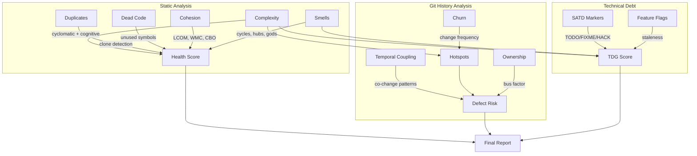
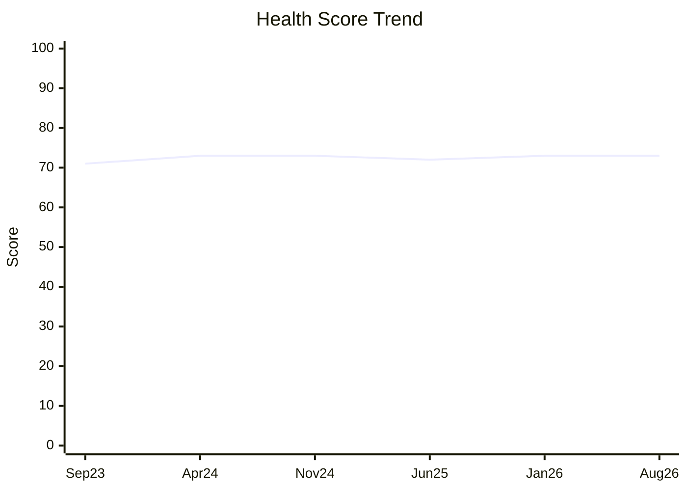
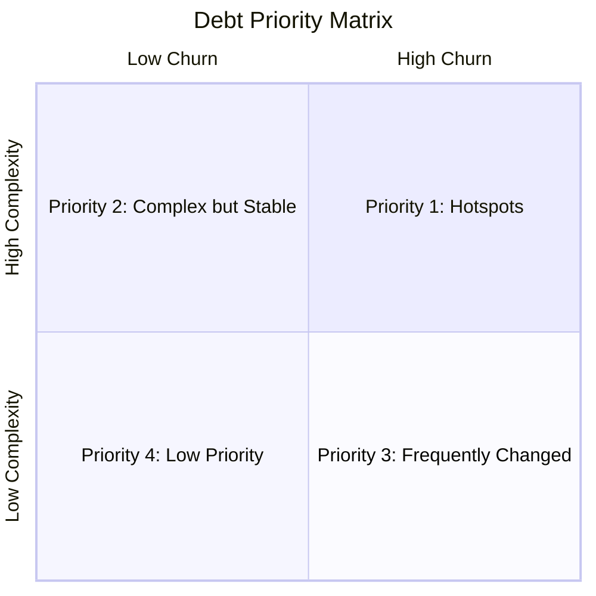

# Repository Health Report: BurntSushi/ripgrep

> Generated by [Omen](https://github.com/panbanda/omen) on 2025-12-09

*Regenerated with Omen 4.28.0 over the full git history (`--since all`) on 2026-08-12. Every figure below comes from a fresh analyzer run; the previous 76/100 overall score and all other numbers from the 2025-12-09 report have been superseded following fixes to per-function complexity attribution, test-code exclusion in duplicate detection, and coupling/cycle graph resolution.*

## Analysis Performance

| Analyzer | Status |
|----------|--------|
| Health Score | Complete |
| Complexity | Complete |
| SATD | Complete |
| Hotspots | Complete |
| Smells | Complete |
| Duplicates | Complete |
| Defect Prediction | Complete |
| Dead Code | Complete |
| TDG | Complete |
| Cohesion | Complete |
| Feature Flags | Complete |
| Temporal Coupling | Complete |
| Score Trend | Complete |

*Per-analyzer timing was not captured in this regeneration pass; all analyzers above ran successfully across 113 analyzed files.*

## Executive Summary

**Ripgrep scores 74/100 (Grade C), with a cluster of debt-related components — SATD, TDG, duplication, and cohesion — dragging down an otherwise clean architecture.** This mature Rust codebase remains a well-structured, low-complexity text search tool: coupling and architectural smells are pristine and per-function complexity is low, but self-admitted technical debt, per-file grade (TDG), code duplication, and object cohesion are now the weakest links.

**Top 3 Strengths:**
1. **Clean architecture** - 100/100 coupling (113 nodes, 0 edges, 0 cycles) and 100/100 smells (0 detected)
2. **Low complexity** - 97/100; p90 cyclomatic complexity of only 3, average 1.6 across 2,989 functions in 113 files
3. **Low predicted defect risk** - average defect probability of 6.5%; only one file (`crates/core/flags/defs.rs`) rated medium risk, none rated high

**Top 3 Areas of Attention:**
1. **Self-admitted technical debt (46/100, the lowest component)** - 154 debt items, 38 high priority, including 4 still-open SECURITY markers in `crates/cli/src/decompress.rs`
2. **Technical Debt Gradient (67/100, average grade D)** - 30 of 113 files grade F, led by `crates/core/flags/defs.rs`, `crates/cli/src/process.rs`, and `crates/core/flags/hiargs.rs`
3. **Duplication (57/100), concentrated almost entirely in one file** - 859 clones / 16.7% duplication ratio, of which 842 clone instances (roughly 98%) live in `crates/core/flags/defs.rs`'s repetitive CLI flag-definition boilerplate, not in test code

**Recommended Priority Actions:**
1. Verify the 4 SECURITY markers in `crates/cli/src/decompress.rs` (lines 91, 121, 409, 438) still correctly describe the current mitigation
2. Address the worst TDG-graded files, starting with `crates/core/flags/defs.rs` (F, cyclomatic complexity 418) and `crates/cli/src/process.rs` (F, cyclomatic complexity 39, 8 levels of nesting)
3. Consider a macro/codegen approach for the flag-definition structs in `crates/core/flags/defs.rs` — it would address the file's duplication, its worst-in-repo TDG grade, and a meaningful share of the low-cohesion class count in one pass

## Health Score

| Component | Score |
|-----------|-------|
| **Overall** | **74/100** |
| Complexity | 97/100 |
| Duplication | 57/100 |
| SATD | 46/100 |
| TDG | 67/100 |
| Coupling | 100/100 |
| Smells | 100/100 |
| Cohesion | 55/100 |

Files analyzed: 113

Grade: C. The score is pulled down by four components clustered in the 46-67 range (SATD, cohesion, duplication, TDG) rather than by one catastrophic outlier. Complexity, coupling, and smells remain excellent, consistent with a codebase that has clean module boundaries and simple control flow — but `crates/core/flags/defs.rs` alone is the dominant driver behind both the duplication and TDG weaknesses.

## How Omen Analyzes Code


```mermaid
flowchart TD
    subgraph Static["Static Analysis"]
        CX[Complexity] --> |cyclomatic + cognitive| Score
        DUP[Duplicates] --> |clone detection| Score
        DC[Dead Code] --> |unused symbols| Score
        COH[Cohesion] --> |LCOM, WMC, CBO| Score
        SM[Smells] --> |cycles, hubs, gods| Score
    end

    subgraph History["Git History Analysis"]
        CH[Churn] --> |change frequency| HS[Hotspots]
        CX --> HS
        TC[Temporal Coupling] --> |co-change patterns| DEF
        HS --> DEF[Defect Risk]
        OWN[Ownership] --> |bus factor| DEF
    end

    subgraph Debt["Technical Debt"]
        SATD[SATD Markers] --> |TODO/FIXME/HACK| TDG[TDG Score]
        CX --> TDG
        SM --> TDG
        FF[Feature Flags] --> |staleness| TDG
    end

    Score[Health Score] --> Report
    DEF --> Report
    TDG --> Report[Final Report]
```

## Key Findings

### Areas Requiring Attention

1. **SATD (46/100)** - 154 debt items (38 high priority). By category: test 99, defect 34, requirement 9, design 5, security 4, performance 3. The 4 security-category items are all SECURITY markers in `crates/cli/src/decompress.rs` (lines 91, 121, 409, 438) — the same count as the previous report, but now a larger share of the total debt since noise elsewhere has dropped.

2. **TDG (67/100, average grade D)** - Grade distribution across 113 files: 47 A, 12 A-, 1 A+, 5 B, 2 B-, 12 B+, 1 C, 1 C-, 2 C+, and 30 F. The F-grade files include core entry points (`main.rs`, `process.rs`, `search.rs`, `haystack.rs`) and the flag-handling trio (`defs.rs`, `hiargs.rs`, `parse.rs`).

3. **Cohesion (55/100, new for this repo)** - 292 struct+impl "classes" detected across 53 files, average LCOM 4.5, 316 total violations, 241 of 292 classes below threshold. The standout is `HiArgs` in `crates/core/flags/hiargs.rs`: CBO 104, WMC 130, RFC 257, LCOM 10, 70 fields, 27 methods — a genuine god-object. Most of the other low-cohesion classes are single-purpose flag marker structs (`Encoding`, `File`, `MaxDepth`, `Pre`, `Type`, all in `defs.rs`) with zero fields that each implement the same `Flag` trait methods; their high LCOM is a side effect of that pattern, not a real design defect.

4. **Duplication (57/100)** - 859 clones across 38 groups (95 files scanned, 2,243 duplicated lines out of 13,462 examined = 16.7%). `crates/core/flags/defs.rs` accounts for 842 of the 859 clone instances and 1,856 of the 2,243 duplicated lines (duplication severity score 36.1; the next-highest file scores 8.3). This is CLI flag-definition boilerplate — every flag type repeats the same handful of trait methods — not the test-code duplication the previous report described.

### Complexity Hotspots

| Function | File | Cyclomatic | Cognitive |
|----------|------|-----------:|----------:|
| `matched_ignore` | crates/ignore/src/dir.rs | 27 | 48 |
| `from_low_args` | crates/core/flags/hiargs.rs | 22 | 37 |
| `indexing_unsupported_flag` | crates/core/flags/defs.rs | 20 | 19 |
| `run_one` | crates/ignore/src/walk.rs | 20 | 30 |
| `add_child_path_with_found_ignore_files` | crates/ignore/src/dir.rs | 19 | 27 |

| File (by avg cyclomatic) | Functions | Avg Cyclomatic | Avg Cognitive |
|---|---:|---:|---:|
| crates/core/flags/doc/help.rs | 6 | 6.17 | 9.83 |
| crates/core/main.rs | 11 | 4.27 | 5.82 |
| crates/grep/examples/simplegrep.rs | 3 | 4.00 | 6.33 |
| crates/searcher/src/searcher/core.rs | 32 | 3.94 | 5.38 |
| crates/regex/src/ban.rs | 3 | 3.67 | 5.67 |

The codebase remains low-complexity overall: 2,989 functions across 113 files, average cyclomatic 1.6, average cognitive 1.0, p90 cyclomatic 3, p95 cyclomatic 5, max cyclomatic 27 and max cognitive 48 (both `matched_ignore` in `crates/ignore/src/dir.rs`).

### Technical Debt

| Category | Count |
|----------|------:|
| test | 99 |
| defect | 34 |
| requirement | 9 |
| design | 5 |
| security | 4 |
| performance | 3 |

Total: 154 items (38 high priority, per the health-score detail). SATD density: 2.88 items per thousand lines. All 4 security-category items are SECURITY markers in `crates/cli/src/decompress.rs` documenting security-sensitive decompression handling (lines 91, 121, 409, 438).

### Architectural Concerns

**No architectural smells detected** (0/113 components flagged: 0 critical, 0 high, 0 cyclic dependencies, 0 hub/central-connector components, average instability 0.0). Coupling is likewise clean: 113 nodes, 0 edges, 0 cycles, average degree 0.0.

### Code Quality

- **Duplication:** 57/100 - 859 clones, 16.7% duplication ratio, almost entirely concentrated in `crates/core/flags/defs.rs` (842 of 859 instances). This is repetitive CLI flag-definition boilerplate, not test-code duplication.
- **Dead Code:** 423 functions (of 1,913 total definitions; 1,454 reachable) flagged as unreachable from entry points, all at 0.9 confidence. The sample set skews toward library-crate internals (e.g. `parse`, `new`, `map`, `is_exact` in `globset`, `regex`, `ignore`, and `index`) rather than test helpers — plausibly public API of the published library crates (`globset`, `ignore`, `grep-*`) that omen's reachability analysis can't trace to external consumers, rather than genuinely dead code.

## Detailed Analysis

### Complexity Analysis

| File | Functions | Avg Cyclomatic | Avg Cognitive |
| --- | ---: | ---: | ---: |
| crates/core/flags/doc/help.rs | 6 | 6.17 | 9.83 |
| crates/core/main.rs | 11 | 4.27 | 5.82 |
| crates/grep/examples/simplegrep.rs | 3 | 4.00 | 6.33 |
| crates/searcher/src/searcher/core.rs | 32 | 3.94 | 5.38 |
| crates/regex/src/ban.rs | 3 | 3.67 | 5.67 |
| crates/core/flags/hiargs.rs | 48 | 3.50 | 3.71 |

**Summary:** 2,989 functions across 113 files
- Average Cyclomatic: 1.6, Average Cognitive: 1.0
- Median (p50) Cyclomatic: 1
- 90th Percentile Cyclomatic: 3, 95th Percentile: 5
- Max Cyclomatic: 27, Max Cognitive: 48

### Technical Debt Markers (Top Items)

| Location | Marker | Category | Severity | Text |
| --- | --- | --- | --- | --- |
| decompress.rs:91 | SECURITY | security | critical | "platform. Notably, on Windows, this avoids a security problem where" |
| decompress.rs:121 | SECURITY | security | critical | "platform. Notably, on Windows, this avoids a security problem where" |
| decompress.rs:409 | SECURITY | security | critical | "security reasons. e.g., running ripgrep with the -z/--search-zip flag on an" |
| decompress.rs:438 | SECURITY | security | critical | "security reasons. e.g., running ripgrep with the -z/--search-zip flag on an" |
| decompress.rs:329 | ERROR | defect | high | "# Ok::<(), Box<dyn std::error::Error>>(())" |
| decompress.rs:72 | DISABLED | test | low | "matcher before any other associations. When disabled, only the" |
| decompress.rs:265 | DISABLED | test | low | "command's stderr output. When disabled, stderr is only read after the" |
| decompress.rs:272 | DISABLED | test | low | "disabled, then it is possible for the process to fill up the stderr" |

Total: 154 markers (38 high priority). The table above shows the highest-severity items surfaced by the analyzer; all cluster in `crates/cli/src/decompress.rs`.

### Hotspots

13 total hotspots (5 critical, 2 high, 6 moderate/other by score). Top 10 by hotspot score, with commit counts covering the full repository history (`--since all`):

| File | Severity | Score | Avg Complexity | Churn %ile | Complexity %ile | Commits (all-time) |
| --- | --- | ---: | ---: | ---: | ---: | ---: |
| crates/index/src/literal.rs | Critical | 0.93 | 2.52 | 95.6 | 96.9 | 1 |
| crates/ignore/src/dir.rs | Critical | 0.88 | 2.39 | 92.6 | 95.1 | 5 |
| crates/ignore/src/incremental.rs | Critical | 0.88 | 1.60 | 98.5 | 88.9 | 1 |
| crates/ignore/src/walk.rs | Critical | 0.86 | 1.82 | 86.8 | 98.7 | 4 |
| crates/core/flags/defs.rs | Critical | 0.83 | 1.08 | 83.8 | 99.6 | 2 |
| crates/globset/src/lib.rs | High | 0.76 | 1.79 | 80.9 | 93.4 | 3 |
| crates/core/flags/hiargs.rs | High | 0.69 | 3.50 | 72.1 | 96.0 | 3 |
| crates/core/main.rs | Moderate | 0.60 | 4.27 | 77.9 | 77.0 | 4 |
| crates/ignore/src/pathutil.rs | Moderate | 0.59 | 1.93 | 89.7 | 65.5 | 3 |
| crates/ignore/src/gitignore.rs | Moderate | 0.55 | 1.93 | 63.2 | 86.3 | 2 |

Note the low absolute commit counts even for the critical-severity files — hotspot severity here is driven primarily by relative churn and complexity percentile rank rather than high raw change frequency.

### Architectural Smells

No architectural smells detected: 0 critical, 0 high, 0 medium, 0 cyclic dependencies, 0 hub components, 0 central connectors across all 113 components, with average instability of 0.0.

### Code Duplication

859 clones across 38 clone groups, spanning 95 scanned files, with 2,243 duplicated lines out of 13,462 lines examined (16.7% duplication ratio, average similarity 0.92). Clone-type breakdown: type1 (exact) 75, type2 (renamed) 772, type3 (near-match) 12.

`crates/core/flags/defs.rs` dominates by a wide margin:

| File | Clone Instances | Duplicate Lines | Clone Groups | Severity |
| --- | ---: | ---: | ---: | ---: |
| crates/core/flags/defs.rs | 842 | 1,856 | 23 | 36.1 |
| crates/index/src/literal.rs | 3 | 122 | 3 | 8.3 |
| crates/regex/src/literal.rs | 3 | 67 | 3 | 7.3 |
| crates/ignore/src/walk.rs | 3 | 52 | 3 | 6.9 |
| crates/searcher/src/testutil.rs | 1 | 28 | 1 | 3.4 |
| crates/core/flags/doc/help.rs | 1 | 27 | 1 | 3.3 |
| crates/core/flags/lowargs.rs | 1 | 27 | 1 | 3.3 |
| crates/core/flags/doc/man.rs | 1 | 23 | 1 | 3.2 |
| crates/cli/src/wtr.rs | 1 | 16 | 1 | 2.8 |
| crates/searcher/src/searcher/glue.rs | 1 | 12 | 1 | 2.6 |

All of the top clone groups (largest: 31 instances, 430 lines) sit inside `defs.rs`. Cross-referencing the cohesion data confirms the pattern: flag structs like `Encoding`, `File`, `Pre`, `Type`, and `MaxDepth` each independently implement the same `is_switch` / `name_short` / `name_long` / `doc_variable` / `doc_category` / `doc_short` / `doc_long` / `update` methods. This is legitimate, if repetitive, CLI flag-definition code — a strong candidate for a declarative macro or code-generation pass, but not the test-code duplication the prior report flagged.

### Defect Prediction

Average predicted defect probability: 6.5% (p50: 6.9%, p95: 11.1%). 112 of 113 files rated low risk, 1 rated medium risk, 0 rated high risk.

| File | Probability | Risk Level |
| --- | ---: | --- |
| crates/core/flags/defs.rs | 47.5% | medium |
| crates/ignore/src/walk.rs | 14.7% | low |
| crates/index/src/literal.rs | 12.7% | low |
| crates/core/main.rs | 12.4% | low |
| crates/core/flags/doc/help.rs | 11.8% | low |
| crates/ignore/src/pathutil.rs | 11.7% | low |
| crates/core/flags/lowargs.rs | 11.1% | low |
| crates/core/flags/hiargs.rs | 10.9% | low |

`defs.rs` is the only file rated above "low", driven mainly by its complexity (0.25) and duplication (0.20) contributing factors — consistent with everything else this report finds about that file.

### Dead Code

423 unreachable functions detected out of 1,913 total definitions (1,454 reachable). All flagged items are functions at 0.9 confidence, reason "Not reachable from entry points":

| File | Function | Line |
| --- | --- | ---: |
| crates/printer/src/path.rs | start_hyperlink | 166 |
| crates/printer/src/standard.rs | write_path_hyperlink | 1448 |
| crates/core/search.rs | should_preprocess | 284 |
| crates/ignore/src/types.rs | map | 205 |
| crates/ignore/src/walk.rs | skip_filesize | 2063 |
| crates/ignore/src/gitignore.rs | matched_stripped | 259 |
| crates/globset/src/glob.rs | parse | 823 |
| crates/core/flags/parse.rs | ngrams | 466 |
| crates/regex/src/ast.rs | new | 52 |
| crates/index/src/literal.rs | is_exact | 370 |

Unlike the previous report, none of these are named like test helpers or benchmarks — the sample here reads as internal-to-crate helper functions (`parse`, `new`, `map`, `is_exact`) in ripgrep's supporting library crates (`globset`, `ignore`, `regex`, `index`), which are published independently on crates.io. Since these crates expose public APIs consumed outside this repository, some of this "dead code" is plausibly reachable from external callers that omen's local reachability analysis cannot see — worth spot-checking visibility before deleting anything, rather than assuming it's safe to remove.

### Technical Debt Gradient

Average grade: D (score 67/100) across 113 files. Grade distribution: 47 A, 12 A-, 1 A+, 5 B, 2 B-, 12 B+, 1 C, 1 C-, 2 C+, 30 F.

| File | Grade | Key Penalties |
| --- | --- | --- |
| crates/cli/src/process.rs | F | cyclomatic complexity 39, nesting 8 levels, 2 critical defects |
| crates/core/flags/defs.rs | F | cyclomatic complexity 418, nesting 6 levels, 26.2% duplication, 543 critical defects |
| crates/core/flags/doc/version.rs | F | 11.8% duplication, 10 critical defects |
| crates/core/flags/hiargs.rs | F | cyclomatic complexity 182, nesting 7 levels, 2 critical defects |
| crates/core/flags/parse.rs | F | cyclomatic complexity 60, nesting 8 levels, 1 critical defect |
| crates/core/haystack.rs | F | nesting 5 levels, 1 critical defect |
| crates/core/main.rs | F | cyclomatic complexity 71, nesting 7 levels, 11.7% duplication, 5 critical defects |
| crates/core/search.rs | F | cyclomatic complexity 34, nesting 5 levels, 19.2% duplication, 1 critical defect |

`crates/core/flags/defs.rs` is the extreme outlier on this list: a cyclomatic complexity of 418 and 543 flagged critical defects, consistent with the file being ~8,000 lines of near-identical flag-definition blocks rather than one coherent unit of control flow.

### Temporal Coupling

Minimal meaningful temporal coupling. Only 3 file pairs met the minimum co-change threshold (30-day window, 44 files analyzed), and all 3 involve `Cargo.lock` co-changing with a crate's `Cargo.toml` — a dependency-bookkeeping artifact, not a design-level coupling signal:

| File A | File B | Co-changes | Coupling Strength |
| --- | --- | ---: | ---: |
| Cargo.lock | crates/ignore/Cargo.toml | 6 | 0.40 |
| Cargo.lock | Cargo.toml | 3 | 0.20 |
| Cargo.lock | crates/globset/Cargo.toml | 3 | 0.20 |

No source-to-source temporal coupling was detected in this window; the codebase's files change largely independently of one another.

### Cohesion

292 struct+impl "classes" detected across 53 Rust files (this metric was not previously computed for Rust). Average LCOM 4.5, average CBO 9.4, average RFC 19.1, average WMC 13.3. 241 of 292 classes (83%) fall below the cohesion threshold, contributing 316 total violations.

| Class | File | LCOM | CBO | WMC | RFC | Notes |
| --- | --- | ---: | ---: | ---: | ---: | --- |
| HiArgs | crates/core/flags/hiargs.rs | 10 | 104 | 130 | 257 | 70 fields, 27 methods — genuine god-object |
| Encoding | crates/core/flags/defs.rs | 10 | 14 | 12 | 15 | 0 fields — flag marker struct |
| DirEntryRaw | crates/ignore/src/walk.rs | 10 | 14 | 22 | 53 | 6 fields, 18 methods |
| TSeq | crates/regex/src/literal.rs | 10 | 12 | 50 | 69 | 2 fields, 28 methods |
| File | crates/core/flags/defs.rs | 9 | 11 | 9 | 15 | 0 fields — flag marker struct |
| MaxDepth | crates/core/flags/defs.rs | 9 | 7 | 9 | 13 | 0 fields — flag marker struct |
| Pre | crates/core/flags/defs.rs | 9 | 12 | 14 | 15 | 0 fields — flag marker struct |
| Type | crates/core/flags/defs.rs | 9 | 10 | 9 | 14 | 0 fields — flag marker struct |

`HiArgs` is the one class here that represents a real cohesion problem worth refactoring (it aggregates nearly every CLI setting into one struct with 27 methods touching disjoint subsets of its 70 fields). The five `defs.rs` marker structs with LCOM 9-10 and zero fields are a byproduct of the flag-definition pattern (each implements the same trait methods independently) rather than evidence of poor design — the same pattern already identified as the dominant source of duplication in this file.

### Historical Score Trends

Long-run linear regression across the full commit history gives a slope of -0.60 points per sampled interval (start score 91, end score 73) but a weak fit (r² = 0.37) — the six most-recent sampled snapshots below show the score has actually held in a narrow 71-73 band for nearly three years, well after whatever earlier history drove the regression's overall downward slope:

| Date | Score | Complexity | Duplication | SATD | TDG | Cohesion | Coupling | Smells |
|------|------:|-----------:|-------------:|-----:|----:|---------:|---------:|-------:|
| 2023-09-22 | 71 | 97 | 46 | 44 | 59 | 65 | 100 | 100 |
| 2024-04-20 | 73 | 97 | 55 | 45 | 66 | 54 | 100 | 100 |
| 2024-11-17 | 73 | 97 | 55 | 45 | 66 | 54 | 100 | 100 |
| 2025-06-16 | 72 | 97 | 55 | 45 | 66 | 54 | 100 | 100 |
| 2026-01-13 | 73 | 97 | 56 | 45 | 66 | 55 | 100 | 100 |
| 2026-08-12 | 73 | 97 | 56 | 46 | 67 | 54 | 100 | 100 |

Per-component trend slopes (over the full history, not just the six points above): TDG is worsening (slope +1.03, i.e. the raw metric feeding TDG penalties is trending up, correlation 0.76), duplication and SATD are both trending down (slopes -2.05 and -1.45, correlations 0.63 and 0.62), cohesion is trending down (slope -1.27, correlation 0.70), complexity is essentially flat (slope +0.06), and coupling/smells show no movement at all (slope 0.0, already at their ceiling).

*Note: the trend series above (73 for 2026-08-12) is computed independently from the current point-in-time Health Score (74) and may differ slightly due to snapshot timing and rounding — both are correct, they're just two different measurements.*

## Health Score Trends Over Time

| Date | Score | Complexity | Duplication | SATD | TDG | Cohesion |
|-------|------:|------------:|-------------:|-----:|----:|---------:|
| 2023-09-22 | 71 | 97 | 46 | 44 | 59 | 65 |
| 2024-04-20 | 73 | 97 | 55 | 45 | 66 | 54 |
| 2024-11-17 | 73 | 97 | 55 | 45 | 66 | 54 |
| 2025-06-16 | 72 | 97 | 55 | 45 | 66 | 54 |
| 2026-01-13 | 73 | 97 | 56 | 45 | 66 | 55 |
| 2026-08-12 | 73 | 97 | 56 | 46 | 67 | 54 |

The codebase is stable in the short-to-medium term: the sampled score has stayed within 71-73 for almost three years, even as TDG has crept downward and duplication/SATD/cohesion have each drifted slightly. None of these movements are large enough to call urgent, but TDG's positive slope (worsening) is the one component moving in the wrong direction while everything else holds flat or slowly improves.


```mermaid
xychart-beta
    title "Health Score Trend"
    x-axis ["Sep23", "Apr24", "Nov24", "Jun25", "Jan26", "Aug26"]
    y-axis "Score" 0 --> 100
    line [71, 73, 73, 72, 73, 73]
```

## Recommendations for LLM-Assisted Development

### High-Value Refactoring Targets

1. **crates/core/flags/defs.rs** - The single highest-leverage target in the repo: worst TDG grade (F, cyclomatic complexity 418, 543 flagged critical defects), dominant duplication source (842 of 859 clone instances, 1,856 duplicate lines), and home to 5 of the lowest-cohesion classes. A macro-based or code-generated approach to flag definitions would move all three metrics at once.
2. **crates/core/flags/hiargs.rs** - `HiArgs` is a genuine god-object (CBO 104, WMC 130, LCOM 10, 70 fields, 27 methods) and the file is also F-graded on TDG (cyclomatic complexity 182, 7 levels of nesting). Splitting it into smaller, cohesive sub-configs would be the highest-value cohesion fix in the repo.
3. **crates/ignore/src/dir.rs** - Home to the two most complex functions in the repo (`matched_ignore`: cyclomatic 27 / cognitive 48, `add_child_path_with_found_ignore_files`: cyclomatic 19 / cognitive 27) and a critical-severity hotspot.

### Technical Debt Cleanup

1. Re-verify the 4 SECURITY markers in `crates/cli/src/decompress.rs` (lines 91, 121, 409, 438) are current and their mitigations still hold.
2. Work through the 30 F-graded TDG files, prioritizing by critical-defect count: `defs.rs` (543), `doc/version.rs` (10), `main.rs` (5), `process.rs` / `hiargs.rs` (2 each), `parse.rs` / `haystack.rs` / `search.rs` (1 each).
3. Address the `ERROR`-marker item at `decompress.rs:329` (high severity, defect category).
4. Spot-check the "dead" library-crate functions (see Dead Code above) for external/public-API usage before removing anything.

### Code Review Focus Areas

Based on defect prediction, prioritize review attention on:
- `crates/core/flags/defs.rs` (47.5% probability, medium risk) - the only file above "low" risk
- `crates/ignore/src/walk.rs` (14.7%), `crates/index/src/literal.rs` (12.7%), `crates/core/main.rs` (12.4%) - all low risk but the next-highest after `defs.rs`

### Architecture Improvements

The architecture remains excellent: 0 cycles, 0 smells, 100/100 coupling. No improvements needed here.

## Strategic Debt Prioritization

### Debt Prioritization Framework


```mermaid
quadrantChart
    title Debt Priority Matrix
    x-axis Low Churn --> High Churn
    y-axis Low Complexity --> High Complexity
    quadrant-1 "Priority 1: Hotspots"
    quadrant-2 "Priority 2: Complex but Stable"
    quadrant-3 "Priority 4: Low Priority"
    quadrant-4 "Priority 3: Frequently Changed"
```

### Priorities

**Priority 1 - Worst TDG files, led by the dominant duplication source:**
1. `crates/core/flags/defs.rs` (F, cyclomatic 418, 26.2% duplication, 543 critical defects, 842 clone instances) - single biggest lever in the repo
2. `crates/core/flags/hiargs.rs` (F, cyclomatic 182, plus the `HiArgs` god-object at CBO 104 / WMC 130)
3. `crates/cli/src/process.rs` (F, cyclomatic 39, 8 levels of nesting)

**Priority 2 - SATD security review:**
- Re-verify all 4 SECURITY markers in `crates/cli/src/decompress.rs` (lines 91, 121, 409, 438)
- Triage the remaining 34 "defect"-category and 9 "requirement"-category SATD items

**Priority 3 - Cohesion cleanup beyond HiArgs:**
- `DirEntryRaw` (crates/ignore/src/walk.rs, LCOM 10) and `TSeq` (crates/regex/src/literal.rs, LCOM 10, WMC 50) are the next-worst genuinely cohesion-impaired classes (the `defs.rs` marker structs are lower priority — their high LCOM is an artifact of the flag pattern, not a design flaw)

**Priority 4 - Dead code verification:**
- Confirm visibility/external usage of the 423 flagged-unreachable functions in library crates before deleting any of them

### Feature Flag Cleanup Priorities

No feature flags from common providers detected (0 flags, 0 stale). Ripgrep does not use runtime feature flags.

## CI/CD Integration for Continuous Code Quality

### Example PR Risk Analysis

Omen's `analyze diff` command can be run against any PR branch to get a quick risk assessment before review (see the worked example at the bottom of this report for a real, unmodified analyzer run). Historical PR-specific figures from the previous report are not reproduced here since they weren't re-verified against the current analyzer version — treat any PR-specific risk numbers as a live `omen analyze diff` output, not a cached historical figure.

### GitHub Actions Workflow Examples

#### 1. Health Score Quality Gate

```yaml
name: Code Quality

on:
  pull_request:

jobs:
  health-check:
    runs-on: ubuntu-latest
    steps:
      - uses: actions/checkout@v4
        with:
          fetch-depth: 0

      - name: Install Omen
        run: |
          curl -sSL https://github.com/panbanda/omen/releases/latest/download/omen_linux_amd64.tar.gz | tar xz
          chmod +x omen

      - name: Check Health Score
        run: |
          ./omen score --min-score 70 --min-complexity 95 --min-debt 75
```

Note: The current overall score is 74/100, driven down by SATD (46), cohesion (55), duplication (57), and TDG (67) — all concentrated heavily in `crates/core/flags/defs.rs` and `crates/core/flags/hiargs.rs`. A `--min-score 70` gate leaves headroom without masking regressions; it is not a "test duplication" allowance as in the earlier version of this report.

#### 2. PR Risk Assessment

```yaml
name: PR Risk Assessment

on:
  pull_request:

jobs:
  risk-assessment:
    runs-on: ubuntu-latest
    steps:
      - uses: actions/checkout@v4
        with:
          fetch-depth: 0

      - name: Install Omen
        run: |
          curl -sSL https://github.com/panbanda/omen/releases/latest/download/omen_linux_amd64.tar.gz | tar xz
          chmod +x omen

      - name: Analyze PR Risk
        run: ./omen analyze diff --target ${{ github.base_ref }} -f markdown >> $GITHUB_STEP_SUMMARY
```

### Maintaining Code Quality Over Time

Ripgrep remains a mature, actively-maintained codebase. Recommended CI/CD strategy:

1. **Quality Gates:** Set minimum score around 70 - the sampled score has held between 71 and 74 for close to three years
2. **PR Risk:** Flag PRs touching `crates/core/flags/defs.rs` or `crates/core/flags/hiargs.rs` for extra review given their outsized share of duplication, TDG, and cohesion debt
3. **Trend Monitoring:** TDG is the one component with a clear worsening slope over the full history - watch it specifically, since everything else (complexity, coupling, smells) is flat or improving
4. **Security:** Automated review of changes to `crates/cli/src/decompress.rs` given its 4 open SECURITY markers

## Example PR Risk Analysis: fix: derive `Default` when possible

*This is a historical illustration from an earlier PR (the commit appears in the January 2026 score-trend snapshot above) demonstrating how `omen analyze diff` output should be read. The command and its output below are reproduced unmodified from that run and are not part of this regeneration's fresh dataset.*

This section demonstrates how a reviewer can use Omen's `analyze diff` command to understand PR risk before reviewing.

### Command

```bash
omen analyze diff --target main -f markdown
```

### Analysis Results

```
Branch Diff Risk Analysis
==========================

Source:   pr-derive-default
Target:   main
Base:     57c190d5

Risk Score: 0.14 (LOW)

Changes:
  Lines Added:    14
  Lines Deleted:  49
  Files Modified: 1
  Commits:        1

Risk Factors:
  entropy:        0.000
  lines_added:    0.022
  lines_deleted:  0.050
  num_files:      0.020
  commits:        0.002
```

### What This Tells a Reviewer

1. **Risk Score: 0.14 (LOW)** - This is a low-risk refactoring change. Safe to merge with standard review.

2. **Lines Added (14) vs Deleted (49)** - Net reduction in code! The PR is removing hand-written implementations in favor of derived ones. This is an excellent sign - less code to maintain.

3. **Files Modified (1)** - Single file change. The change is highly localized with zero chance of cascading effects.

4. **Entropy (0.000)** - Zero entropy means the changes are completely concentrated. No "shotgun surgery" across the codebase.

### Review Guidance

Based on this analysis, a reviewer should:
- This is a safe refactoring - verify the derive behavior matches the original
- Net code reduction is a maintenance win
- Single file, low entropy = quick review
- Focus on ensuring no behavioral changes in the Default implementation

---

*This report was generated using Omen's suite of code analyzers. For more information, visit [github.com/panbanda/omen](https://github.com/panbanda/omen).*
