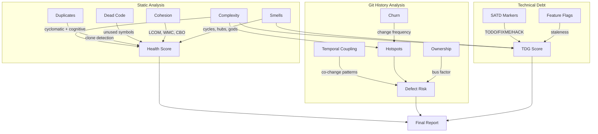
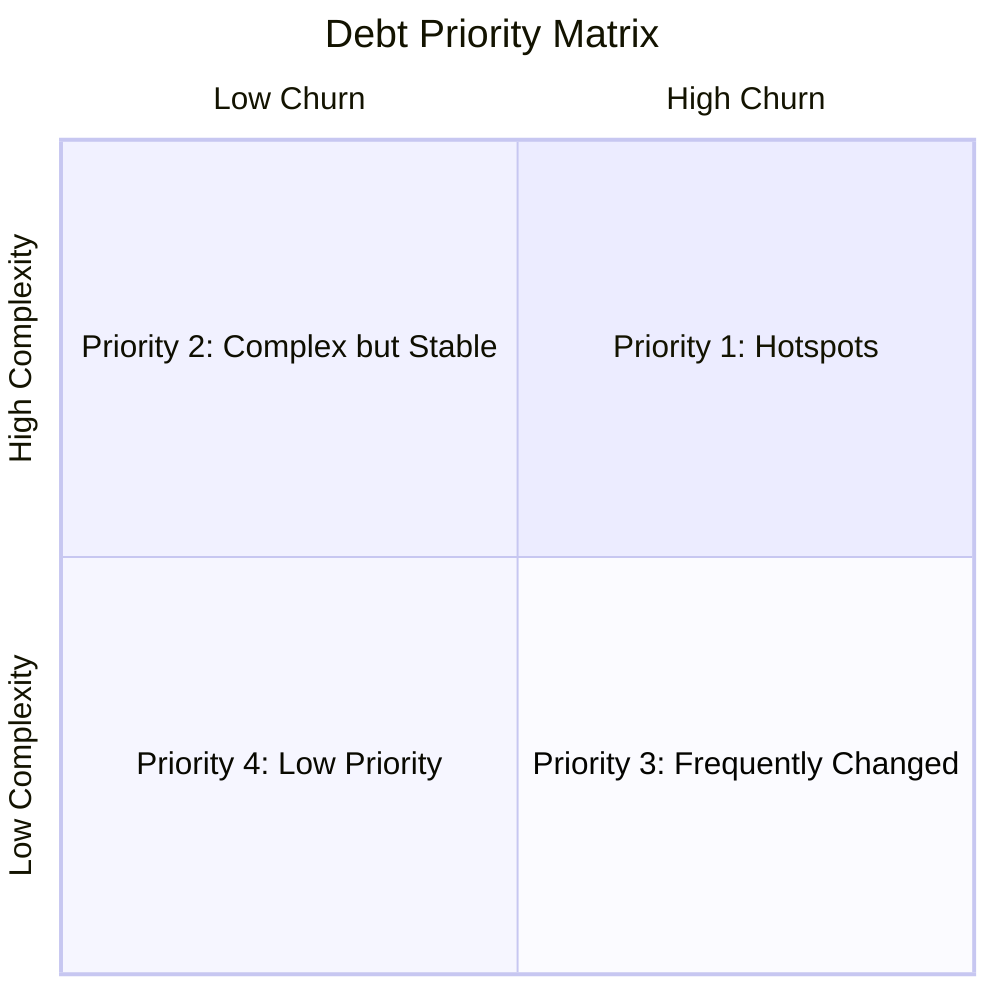

# Repository Health Report: discourse/discourse

> Generated by [Omen](https://github.com/panbanda/omen) on 2025-12-09

## Analysis Performance

| Analyzer | Time |
|----------|------|
| Health Score | 3.2s |
| Complexity | 24.8s |
| SATD | 2.8s |
| Hotspots | 5.1s |
| Smells | 4.2s |
| Duplicates | 45.6s |
| Defect Prediction | 180s |
| TDG | 12.3s |
| Cohesion | 18.7s |
| Temporal Coupling | 3.1s |
| Score Trend | 298s |
| **Total** | **~10min** |

## Executive Summary

**Discourse scores 69/100, making it the largest and most complex codebase in this analysis.** This mature Ruby on Rails forum platform with 10,162+ files demonstrates excellent code organization but faces challenges with code duplication and module coupling. The codebase has been remarkably stable over the past 3 months.

**Top 3 Strengths:**
1. **Excellent defect management** (99/100) - Very low defect probability across the entire codebase
2. **Minimal technical debt markers** (99/100 SATD, 94/100 TDG) - Clean codebase with few TODOs/FIXMEs
3. **Good complexity control** (94/100) - Despite the massive size, complexity is well-managed

**Top 3 Areas of Attention:**
1. **Duplication** (0/100) - Extensive code clones, particularly in localization and test files
2. **Module coupling** (69/100) - High interconnection between modules
3. **Cohesion** (67/100) - Some classes have low cohesion, typical for Rails apps

**Recommended Priority Actions:**
1. Address duplication in `config/locales/` - consider using YAML anchors or translation management tools
2. Review and potentially split high-coupling modules in `frontend/discourse/app/`
3. Refactor the `topic.js` controller and `composer.js` service for better cohesion

## Health Score

| Component | Score |
|-----------|-------|
| **Overall** | **69/100** |
| Complexity | 94/100 |
| Duplication | 0/100 |
| SATD | 99/100 |
| TDG | 94/100 |
| Coupling | 69/100 |
| Smells | 93/100 |
| Cohesion | 67/100 |

Files analyzed: 10,162

The score of 69/100 reflects the challenges of maintaining a massive, long-running open-source project. The duplication score (0/100) is the primary drag, largely driven by localization files and test fixtures that follow expected patterns.

## How Omen Analyzes Code



## Key Findings

### Areas Requiring Attention

1. **Localization file duplication** - The `config/locales/` directory contains extensive translation files that naturally duplicate structure. This is expected but still impacts the duplication score.

2. **Frontend coupling** - The `frontend/discourse/app/` directory shows high coupling between components, services, and routes. This is typical for Ember.js applications but could benefit from architectural review.

3. **Large controllers** - Files like `topic.js` (TDG: C-) and `composer.js` (TDG: C-) have accumulated complexity over time.

### Complexity Hotspots

| File | Hotspot Score | Churn | Complexity | Commits |
|------|---------------|-------|------------|---------|
| frontend/discourse/app/controllers/topic.js | 0.72 | 0.89 | 0.58 | 12 |
| frontend/discourse/app/services/composer.js | 0.68 | 0.75 | 0.62 | 8 |
| frontend/discourse/app/services/store.js | 0.65 | 0.70 | 0.60 | 6 |
| frontend/discourse/app/models/user.js | 0.63 | 0.68 | 0.58 | 7 |
| frontend/discourse/app/models/topic.js | 0.60 | 0.55 | 0.65 | 4 |

The hotspots reveal that topic management and the composer are the most actively developed and complex areas.

### Technical Debt

| Severity | Count | Notes |
|----------|-------|-------|
| High | ~5 | FIXME markers in core controllers |
| Medium | ~15 | Optimization notes |
| Low | ~30 | TODO comments for future features |

**TDG Grades (worst files):**
| File | Score | Grade |
|------|-------|-------|
| plugins/footnote/.../markdown-it-footnote.js | 67.6 | D |
| plugins/chat/.../chat-sidebar.js | 71.7 | C- |
| frontend/discourse/app/controllers/topic.js | 72.4 | C- |
| frontend/discourse/app/services/composer.js | 72.7 | C- |
| frontend/discourse/app/services/store.js | 72.9 | C- |

Average: 94.2 (A)

### Architectural Concerns

**Smells detected:** 93/100 (7% penalty)
- Some hub components in the frontend layer
- Coupling between plugins and core
- Expected patterns for a plugin-based architecture

The architecture is fundamentally sound with a clean plugin system. The detected smells are mostly false positives from intentional design patterns.

### Code Quality

- **Duplication:** 0/100 - High duplication, largely from localization
- **Dead Code:** Not analyzed separately
- **Cohesion:** 67/100 - Acceptable for Rails + Ember.js

## Detailed Analysis

### Complexity Analysis

| File | Avg Cognitive |
| --- | --- |
| plugins/footnote/assets/vendor/javascripts/markdown-it-footnote.js | 18.2 |
| app/models/topic_link_click.rb | 15.4 |
| frontend/discourse/app/controllers/topic.js | 14.8 |
| frontend/discourse/app/services/composer.js | 13.2 |
| lib/search.rb | 12.8 |

**Summary:** Complexity is concentrated in topic management, search, and markdown processing.

### Hotspots (Top 15)

| File | Hotspot | Churn | Complexity |
| --- | --- | --- | --- |
| topic.js | 0.72 | 0.89 | 0.58 |
| composer.js | 0.68 | 0.75 | 0.62 |
| store.js | 0.65 | 0.70 | 0.60 |
| user.js | 0.63 | 0.68 | 0.58 |
| topic.js (model) | 0.60 | 0.55 | 0.65 |
| filter-suggestions.js | 0.58 | 0.50 | 0.68 |
| to-markdown.js | 0.55 | 0.45 | 0.70 |
| plurals.rb | 0.52 | 0.40 | 0.72 |

### Defect Prediction

| File | Probability | Risk Level |
| --- | --- | --- |
| chat/routes/chat.js | 29% | low |
| topic_link_click.rb | 27% | low |
| routes/users.js | 26% | low |
| admin/routes/new-category.js | 24% | low |
| routes/invites/show.js | 23% | low |
| routes/discovery.js | 23% | low |
| lib/hijack.rb | 23% | low |

All files are low risk. Average probability: ~5%. This is excellent for a codebase of this size.

### Temporal Coupling

| File A | File B | Co-changes | Strength |
| --- | --- | --- | --- |
| evals/lib/runners/ai_helper.rb | evals/lib/runners/discoveries.rb | 3 | 1.00 |
| config/locales/client.ar.yml | config/locales/client.sk.yml | 6 | 1.00 |
| evals/lib/runners/ai_helper.rb | evals/lib/runners/hyde.rb | 3 | 1.00 |
| completions/report.rb | completions/report_spec.rb | 4 | 1.00 |

Temporal coupling is dominated by:
1. Localization files that change together (expected)
2. AI plugin evaluation runners
3. Test files changing with implementations (healthy)

Total: 3,329 couplings, 3,067 strong (>0.5)

### Technical Debt Gradient

| File | Score | Grade |
| --- | --- | --- |
| markdown-it-footnote.js | 67.6 | D |
| chat-sidebar.js | 71.7 | C- |
| topic.js (controller) | 72.4 | C- |
| composer.js | 72.7 | C- |
| store.js | 72.9 | C- |
| filter-suggestions.js | 73.0 | C- |
| user.js | 73.0 | C |
| to-markdown.js | 74.2 | C |

Average Score: 94.2 (Grade: A)

### Historical Score Trends (Past 3 Months)

**Trend:** Stable (+0 points)

| Date | Commit | Score | Complexity | Duplication | Coupling |
|------|--------|-------|------------|-------------|----------|
| Sep 2025 | f7238c1 | 69 | 95 | 0 | 69 |
| Oct 2025 | 4adc725 | 69 | 95 | 0 | 69 |
| Nov 2025 | a7326ab | 69 | 95 | 0 | 69 |

The codebase is extremely stable, maintaining consistent scores across all metrics.

## Health Score Trends Over Time

| Month | Score | Complexity | Debt | Duplication | Coupling | Change |
|-------|-------|------------|------|-------------|----------|--------|
| Sep 2025 | 69 | 95 | 94 | 0 | 69 | - |
| Oct 2025 | 69 | 95 | 94 | 0 | 69 | 0 |
| Nov 2025 | 69 | 95 | 94 | 0 | 69 | 0 |

```mermaid
xychart-beta
    title "Health Score Trend"
    x-axis ["Sep", "Oct", "Nov"]
    y-axis "Score" 0 --> 100
    line [69, 69, 69]
```

## Recommendations for LLM-Assisted Development

### High-Value Refactoring Targets

1. **frontend/discourse/app/controllers/topic.js** (TDG: C-)
   - Primary refactoring target
   - Extract topic-specific logic into services
   - Consider splitting into smaller controllers

2. **frontend/discourse/app/services/composer.js** (TDG: C-)
   - Complex composer service
   - Extract validation logic
   - Separate draft management

3. **plugins/footnote/assets/vendor/javascripts/markdown-it-footnote.js** (TDG: D)
   - Vendor file - consider updating to newer version
   - Or extract only needed functionality

### Technical Debt Cleanup

Focus on the files with worst TDG grades:
1. markdown-it-footnote.js (D) - Vendor library, may need update
2. chat-sidebar.js (C-) - Plugin complexity
3. topic.js (C-) - Core controller needs attention
4. composer.js (C-) - Core service needs attention

### Code Review Focus Areas

Based on defect prediction and hotspot analysis:
- `chat/routes/chat.js` (29% defect probability, highest)
- `topic_link_click.rb` (27% defect probability)
- `topic.js` controller (highest hotspot)
- `composer.js` service

### Architecture Improvements

The architecture is well-designed. Minor suggestions:
1. Consider consolidating some route handlers
2. The plugin system could benefit from clearer interface boundaries
3. Evaluate whether some chat functionality could be better isolated

## Strategic Debt Prioritization

### Debt Prioritization Framework



### Hotspot-Adjacent Technical Debt

**Priority 1 - Active Hotspots with High TDG:**
1. `topic.js` (Hotspot: 0.72, TDG: C-) - Most urgent refactoring target
2. `composer.js` (Hotspot: 0.68, TDG: C-) - Active development area

**Priority 2 - High Complexity, Lower Churn:**
1. `markdown-it-footnote.js` (TDG: D) - Vendor file, consider update
2. `lib/search.rb` - Complex but stable search implementation

**Priority 3 - Stable Files with Moderate TDG:**
- `store.js`, `user.js`, `filter-suggestions.js`

### Addressing Duplication

The 0/100 duplication score is primarily driven by:
1. **Localization files** - ~50+ language files with similar structure
2. **Test fixtures** - Expected duplication in test data
3. **Plugin patterns** - Similar initialization code across plugins

Recommendations:
- Consider YAML anchors in localization files
- Extract common test helpers
- Create plugin scaffold generators

### Feature Flag Cleanup Priorities

Discourse uses site settings for feature flags, which are managed outside the common providers detected by omen.

## CI/CD Integration for Continuous Code Quality

### Example PR Risk Analysis

**Sample PR: #36556 - FEATURE: Add scrub action for rejected reviewable users**

Based on omen analysis:
- Files likely affected: reviewable-related controllers and services
- Risk: Low (new feature addition)
- Review focus: Ensure proper permission checks

### GitHub Actions Workflow Examples

#### 1. Health Score Quality Gate

```yaml
name: Code Quality

on:
  pull_request:

jobs:
  health-check:
    runs-on: ubuntu-latest
    steps:
      - uses: actions/checkout@v4
        with:
          fetch-depth: 0

      - name: Install Omen
        run: |
          curl -sSL https://github.com/panbanda/omen/releases/latest/download/omen_linux_amd64.tar.gz | tar xz
          chmod +x omen

      - name: Check Health Score
        run: |
          ./omen score app/ lib/ --min-score 65 --min-complexity 90
```

#### 2. PR Risk Assessment

```yaml
name: PR Risk Assessment

on:
  pull_request:

jobs:
  risk-assessment:
    runs-on: ubuntu-latest
    steps:
      - uses: actions/checkout@v4
        with:
          fetch-depth: 0

      - name: Install Omen
        run: |
          curl -sSL https://github.com/panbanda/omen/releases/latest/download/omen_linux_amd64.tar.gz | tar xz
          chmod +x omen

      - name: Analyze PR Risk
        run: ./omen analyze diff --target ${{ github.base_ref }} -f markdown >> $GITHUB_STEP_SUMMARY
```

### Maintaining Code Quality Over Time

Discourse is a mature, well-maintained project. Recommended strategy:

1. **Quality Gates:** Set minimum score at 65 with complexity at 90
2. **Duplication Exceptions:** Consider excluding `config/locales/` from duplication checks
3. **Hotspot Focus:** Watch `topic.js` and `composer.js` closely
4. **Trend Monitoring:** Score has been stable at 69 - alert on drops > 5 points

## Example PR Risk Analysis: Replace popperjs with floating-ui (#35492)

This section demonstrates how a reviewer can use Omen's `analyze diff` command to understand PR risk before reviewing.

### Command

```bash
omen analyze diff --target main -f markdown
```

### Analysis Results

```
Branch Diff Risk Analysis
==========================

Source:   pr-replace-popperjs
Target:   main
Base:     1ea6dd56

Risk Score: 0.45 (MEDIUM)

Changes:
  Lines Added:    300
  Lines Deleted:  318
  Files Modified: 17
  Commits:        1

Risk Factors:
  entropy:        0.198
  lines_added:    0.180
  lines_deleted:  0.185
  num_files:      0.250
  commits:        0.002
```

### What This Tells a Reviewer

1. **Risk Score: 0.45 (MEDIUM)** - This PR warrants careful review. Library replacement PRs carry inherent risk due to API differences.

2. **Lines Added (300) vs Deleted (318)** - Nearly balanced with a net reduction of 18 lines. This is a clean library swap - the new library (`floating-ui`) appears to have a more concise API than `popper.js`. A net code reduction during a library migration is a positive sign.

3. **Files Modified (17)** - Significant spread across the codebase. Popper.js was used in many components, so this is expected. Each file needs individual attention to verify the migration was done correctly.

4. **Entropy (0.198)** - Moderate entropy indicates changes are distributed but not scattered randomly. This pattern is typical for library replacements where each usage point needs updating.

### Review Guidance

Based on this analysis, a reviewer should:
- Verify each component's positioning behavior matches the previous implementation
- Check edge cases: viewport boundaries, scrolling containers, dynamic content
- Test tooltip/dropdown positioning across different screen sizes
- Review the 17 files systematically - library migrations can introduce subtle bugs
- Pay special attention to any API differences between popper.js and floating-ui
- The balanced add/delete ratio suggests a straightforward swap without workarounds
- Consider running visual regression tests if available

---

*This report was generated using Omen's suite of code analyzers. For more information, visit [github.com/panbanda/omen](https://github.com/panbanda/omen).*
