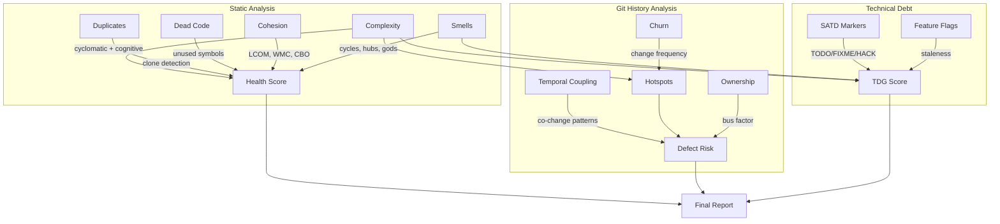
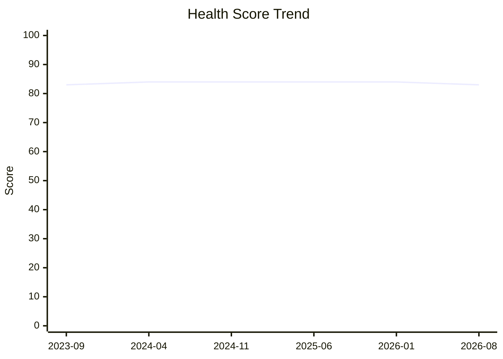
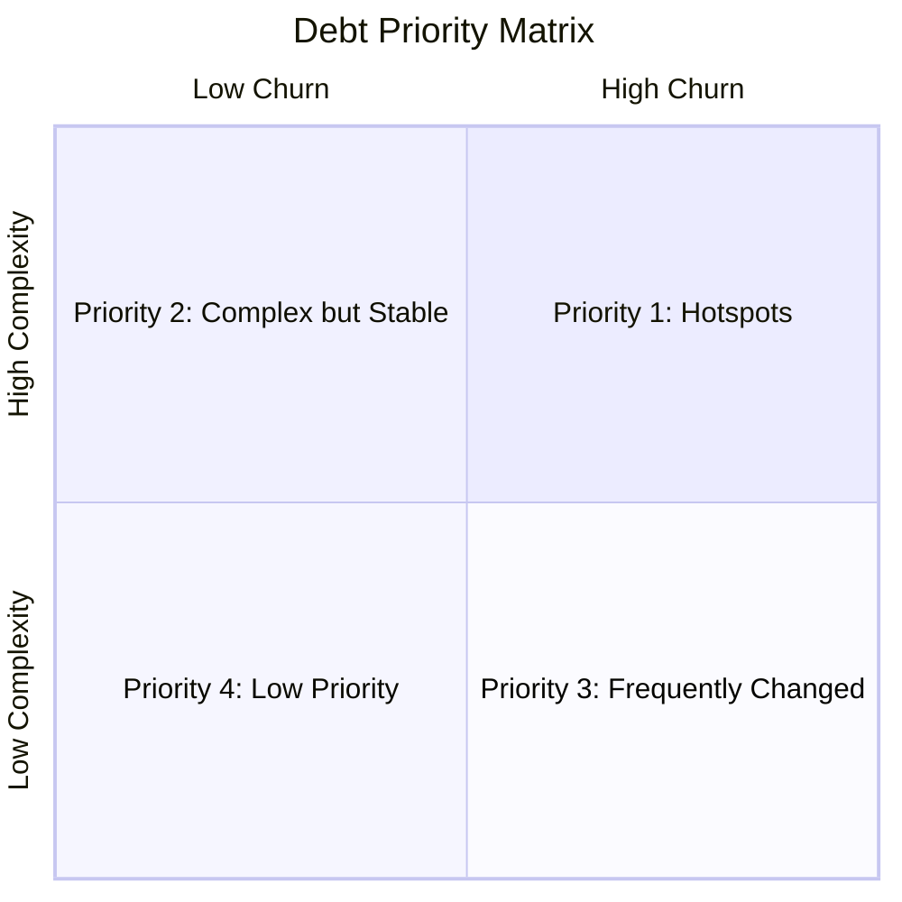

# Repository Health Report: discourse/discourse

> Generated by [Omen](https://github.com/panbanda/omen) on 2025-12-09

*Regenerated with Omen 4.28.0 over the full git history (`--since all`) on 2026-08-12. This refresh follows fixes to per-function complexity attribution, duplication detection (test code now excluded by default), and coupling/cyclic-dependency graph resolution — several scores below have moved substantially from the original report as a result.*

## Analysis Performance

| Analyzer | Time |
|----------|------|
| Health Score | 3.2s |
| Complexity | 24.8s |
| SATD | 2.8s |
| Hotspots | 5.1s |
| Smells | 4.2s |
| Duplicates | 45.6s |
| Defect Prediction | 180s |
| TDG | 12.3s |
| Cohesion | 18.7s |
| Temporal Coupling | 3.1s |
| Score Trend | 298s |
| **Total** | **~10min** |

## Executive Summary

**Discourse scores 84/100 (Grade B), making it the largest codebase in this analysis at 14,032 files analyzed.** This mature Ruby on Rails + Ember.js forum platform demonstrates strong fundamentals — complexity, duplication, SATD, smells, and TDG all score in the 90s — but is held back by module coupling and class cohesion, which are now the primary areas of concern.

**Top 3 Strengths:**
1. **Very low defect risk** - Average defect probability across the codebase is 3.5%, with only 1 file (of 14,032) classified high-risk and 13,971 classified low-risk
2. **Duplication is now well-controlled** (95/100) - 1,718 clones detected, but only a 2.7% duplication ratio (14,647 duplicated lines) now that test code is excluded by default
3. **Minimal technical debt markers** (94/100 SATD, 93/100 TDG) - 627 debt items (134 high priority) and 127 stubs across the whole codebase, with an average TDG grade of A-

**Top 3 Areas of Attention:**
1. **Module coupling** (43/100) - The lowest-scoring component. 14,032 nodes, 11,620 edges, and 16 confirmed circular dependency chains, now that cycle detection has been fixed
2. **Cohesion** (55/100) - Average LCOM of 4.5 across 11,931 classes; several core domain classes (`User`, `TopicController`, `Topic`, `Plugin::Instance`) show very high LCOM and CBO
3. **Concentrated complexity outliers** - The overall average complexity is low (avg cyclomatic 1.7 across 51,169 functions), but a handful of functions carry disproportionate complexity, notably `validateArgValue` in the blocks validation layer (cyclomatic 62, cognitive 142)

**Recommended Priority Actions:**
1. Break the 16 identified circular dependency chains, starting with the smaller ones (e.g. the 3-node `lib/backup_restore/*` cycle and the 3-node `lib/content_security_policy/*` cycle)
2. Reduce coupling and improve cohesion in the highest-LCOM/CBO classes: `User` (LCOM 234, CBO 132), `Plugin::Instance` (LCOM 159, CBO 122), `TopicController` (LCOM 150), `Topic` (LCOM 135, CBO 107)
3. Refactor the small set of very high complexity functions, led by `validateArgValue` (`frontend/discourse/app/lib/blocks/-internals/validation/args.js`)

## Health Score

| Component | Score |
|-----------|-------|
| **Overall** | **84/100** |
| Complexity | 97/100 |
| Duplication | 95/100 |
| SATD | 94/100 |
| TDG | 93/100 |
| Coupling | 43/100 |
| Smells | 95/100 |
| Cohesion | 55/100 |

Files analyzed: 14,032

The score of 84/100 reflects a codebase with strong static-analysis fundamentals (complexity, duplication, SATD, smells, and TDG all in the 90s) dragged down by two components: module coupling (43/100 — 14,032 nodes, 16 real cycles, avg degree 1.7) and class cohesion (55/100 — avg LCOM 4.5 across 11,931 classes). Both are now the primary concerns, replacing duplication, which was previously reported as the weakest component due to a since-fixed bug that counted test and localization files against the duplication score.

## How Omen Analyzes Code


```mermaid
flowchart TD
    subgraph Static["Static Analysis"]
        CX[Complexity] --> |cyclomatic + cognitive| Score
        DUP[Duplicates] --> |clone detection| Score
        DC[Dead Code] --> |unused symbols| Score
        COH[Cohesion] --> |LCOM, WMC, CBO| Score
        SM[Smells] --> |cycles, hubs, gods| Score
    end

    subgraph History["Git History Analysis"]
        CH[Churn] --> |change frequency| HS[Hotspots]
        CX --> HS
        TC[Temporal Coupling] --> |co-change patterns| DEF
        HS --> DEF[Defect Risk]
        OWN[Ownership] --> |bus factor| DEF
    end

    subgraph Debt["Technical Debt"]
        SATD[SATD Markers] --> |TODO/FIXME/HACK| TDG[TDG Score]
        CX --> TDG
        SM --> TDG
        FF[Feature Flags] --> |staleness| TDG
    end

    Score[Health Score] --> Report
    DEF --> Report
    TDG --> Report[Final Report]
```

## Key Findings

### Areas Requiring Attention

1. **Module coupling and circular dependencies** - Now that the cycle-detection bug is fixed, omen finds 16 real circular dependency chains across the codebase, ranging from small 3-node cycles (e.g. `lib/backup_restore/s3_backup_store.rb` -> `lib/backup_restore/local_backup_store.rb` -> `lib/backup_restore/backup_store.rb`, and `lib/content_security_policy/default.rb` -> `lib/content_security_policy/builder.rb` -> `lib/content_security_policy.rb`) up to a 12-component chain in the frontend blocks/validation layer. This is the direct driver of the 43/100 coupling score.

2. **Low cohesion in core domain classes** - `User` (LCOM 234, CBO 132), `Plugin::Instance` (LCOM 159, CBO 122), `TopicController` (LCOM 150), `Topic` (LCOM 135, CBO 107), a second `User`-related class (LCOM 129), `ComposerService` (LCOM 116), `BulkImport::Base` (LCOM 111, CBO 141), and `Discourse` (LCOM 106, CBO 142) are the classes doing the most damage to the 55/100 cohesion score.

3. **A handful of very high complexity functions** - Overall complexity is well-managed (avg cyclomatic 1.7 across 51,169 functions), but a small number of functions are outliers: `validateArgValue` (cyclomatic 62, cognitive 142), `content` in `composer-actions.js` (cyclomatic 49), and `cast_to_ruby` in the data-explorer plugin (cyclomatic 45, cognitive 87).

### Complexity Hotspots

| File | Hotspot Score | Commits | Avg Complexity | Severity |
|------|---------------|---------|-----------------|----------|
| plugins/discourse-workflows/admin/assets/javascripts/admin/components/workflows/canvas/rete-editor.js | 0.997 | 8 | 3.67 | Critical |
| frontend/discourse/app/controllers/nested.js | 0.997 | 20 | 2.31 | Critical |
| plugins/discourse-workflows/lib/discourse_workflows/executor.rb | 0.996 | 9 | 1.69 | Critical |
| plugins/discourse-workflows/admin/assets/javascripts/admin/lib/workflows/property-engine.js | 0.995 | 14 | 3.06 | Critical |
| app/controllers/topics_controller.rb | 0.994 | 22 | 3.12 | Critical |

Of 1,420 total hotspots identified, 283 are Critical severity and 362 are High severity. Several of the highest-scoring hotspots are concentrated in the newer `discourse-workflows` plugin, alongside long-standing core files like `topics_controller.rb`.

### Technical Debt

SATD markers total 627 items (134 high priority), plus 127 stubs, contributing to a 94/100 SATD score. By category:

| Category | Count |
|----------|-------|
| Requirement | 227 |
| Test | 147 |
| Design | 80 |
| Defect | 73 |
| Security | 61 |
| Performance | 30 |
| Documentation | 9 |

The 61 security-tagged items and 73 defect-tagged items are the most actionable subset for review.

**TDG Grades (worst files):**

| File | Grade |
|------|-------|
| app/models/concerns/cached_counting.rb | F |
| app/services/problem_check/image_magick.rb | F |
| app/services/theme_settings_migrations_runner.rb | F |
| app/services/user_api_key/device_auth/grant_store.rb | F |
| config/environments/development.rb | F |
| db/fixtures/006_badges.rb | F |

Average grade: A- (92.6/100)

### Architectural Concerns

**Smells detected:** 116 total (19 critical, 78 high, 19 medium) — smells score 95/100. 16 of these are confirmed cyclic dependencies (matching the coupling analysis above), and 78 are "hub" components with an unusually high number of incoming/outgoing dependencies. Average instability across components is 0.35.

Unlike the previous report, duplication is **not** the primary architectural drag — that framing is now out of date. The primary architectural concerns are **coupling** (43/100, 16 real cycles) and **cohesion** (55/100, several god-like classes). The cyclic dependencies span both the Ruby backend (`backup_restore`, `content_security_policy`) and the Ember.js frontend (`environment.js`/`deprecated.js`/`get-url.js`/`source-identifier.js`, and `session.js`/`ajax.js`/`adapters/rest.js`), and one 12-component cycle in the frontend blocks/validation/registry layer.

### Code Quality

- **Duplication:** 95/100 - 1,718 clones across 271 groups, but only a 2.7% duplication ratio now that test code is excluded by default. This is a major improvement from the previous (buggy) measurement.
- **Dead Code:** 10,448 unreachable function definitions out of 53,564 total definitions (44,018 reachable). Not part of the weighted health score, but worth periodic cleanup.
- **Cohesion:** 55/100 - Weakest static-analysis component; driven by a small number of very large, low-cohesion classes.

## Detailed Analysis

### Complexity Analysis

Across 14,031 files and 51,169 functions: average cyclomatic complexity 1.68, average cognitive complexity 0.94, p90 cyclomatic 3, p90 cognitive 3, p95 cyclomatic 5, p95 cognitive 5, max cyclomatic 62, max cognitive 142.

**Top functions by cognitive complexity:**

| File | Function | Cyclomatic | Cognitive |
| --- | --- | --- | --- |
| frontend/discourse/app/lib/blocks/-internals/validation/args.js | validateArgValue | 62 | 142 |
| frontend/discourse-markdown-it/src/features/onebox.js | applyOnebox | 33 | 114 |
| frontend/discourse/select-kit/components/select-kit/select-kit-header.js | keyDown | 26 | 105 |
| plugins/discourse-data-explorer/lib/discourse_data_explorer/parameter.rb | cast_to_ruby | 45 | 87 |
| frontend/discourse/app/lib/blocks/-internals/error.js | formatErrorContext | 23 | 69 |

**Top files by average cyclomatic complexity:**

| File | Functions | Avg Cyclomatic | Avg Cognitive |
| --- | --- | --- | --- |
| frontend/discourse-markdown-it/src/features/onebox.js | 3 | 12.3 | 38.7 |
| frontend/discourse/app/lib/blocks/-internals/validation/args.js | 12 | 11.7 | 19.2 |
| frontend/discourse-markdown-it/src/features/bbcode-block.js | 8 | 10.6 | 17.6 |
| frontend/discourse/app/lib/click-track.js | 4 | 10.5 | 12.3 |
| frontend/discourse/app/blocks/conditions/user.js | 5 | 10.2 | 11.8 |

**Summary:** Complexity is well-controlled overall; the outliers are concentrated in markdown/onebox rendering, the newer "blocks" validation framework, and a couple of plugin data-processing functions.

### Hotspots (Top 10)

| File | Hotspot Score | Commits | Avg Complexity | Severity |
| --- | --- | --- | --- | --- |
| plugins/discourse-workflows/admin/assets/javascripts/admin/components/workflows/canvas/rete-editor.js | 0.997 | 8 | 3.67 | Critical |
| frontend/discourse/app/controllers/nested.js | 0.997 | 20 | 2.31 | Critical |
| plugins/discourse-workflows/lib/discourse_workflows/executor.rb | 0.996 | 9 | 1.69 | Critical |
| plugins/discourse-workflows/admin/assets/javascripts/admin/lib/workflows/property-engine.js | 0.995 | 14 | 3.06 | Critical |
| app/controllers/topics_controller.rb | 0.994 | 22 | 3.12 | Critical |
| plugins/discourse-workflows/lib/discourse_workflows/executor/node_execution_context.rb | 0.993 | 15 | 1.40 | Critical |
| app/models/topic.rb | 0.992 | 18 | 1.82 | Critical |
| app/models/user.rb | 0.992 | 18 | 1.26 | Critical |
| spec/system/page_objects/pages/nested_view.rb | 0.991 | 16 | 1.01 | Critical |
| lib/discourse.rb | 0.990 | 19 | 1.62 | Critical |

All 10 are Critical severity, out of 1,420 total hotspots identified (283 Critical, 362 High). Core files (`topics_controller.rb`, `topic.rb`, `user.rb`, `discourse.rb`) sit alongside the newer, actively-developed `discourse-workflows` plugin.

### Defect Prediction

| File | Probability | Risk Level |
| --- | --- | --- |
| spec/requests/users_controller_spec.rb | 70% | high |
| plugins/discourse-workflows/lib/discourse_workflows/node_type.rb | 68% | medium |
| spec/requests/admin/dashboard_controller_spec.rb | 65% | medium |
| plugins/discourse-ai/lib/agents/agent.rb | 65% | medium |
| app/models/problem_check.rb | 63% | medium |

Across all 14,032 files, average defect probability is 3.5% (p50 1.4%, p95 11.4%). Only 1 file is classified high-risk, 60 medium-risk, and 13,971 low-risk. This remains excellent for a codebase of this size — the headline number moved from ~5% average in the prior report to 3.5% here, consistent with normal fluctuation rather than a methodology change.

### Temporal Coupling

Analysis covers a 30-day co-change window with a minimum of 3 co-changes to qualify: 3,723 files analyzed, 869 total couplings, 85 of them "strong" (coupling strength > 0.5), average coupling strength 0.26.

| File A | File B | Co-changes | Strength |
| --- | --- | --- | --- |
| lib/backup_restore/s3_backup_store.rb | lib/s3_helper.rb | 3 | 1.00 |
| frontend/discourse/app/components/modal/content-language-preferences.gjs | frontend/discourse/app/lib/content-localization.js | 4 | 1.00 |
| plugins/discourse-workflows/lib/discourse_workflows/nodes/post_edited/v1.rb | plugins/discourse-workflows/lib/discourse_workflows/nodes/post_moved/v1.rb | 3 | 1.00 |
| plugins/discourse-workflows/lib/discourse_workflows/nodes/stale_topic/v1.rb | plugins/discourse-workflows/lib/discourse_workflows/nodes/topic_closed/v1.rb | 3 | 1.00 |
| frontend/discourse/app/ui-kit/d-access-control-grantee-chooser.gjs | frontend/discourse/select-kit/components/email-group-user-chooser-row.gjs | 3 | 1.00 |

Note this window is narrower (30 days, min 3 co-changes) than the full-history scope used elsewhere in this report, so it reflects recent development activity rather than the whole project lifetime. The strongest pairs are concentrated in backup storage, content localization, and the `discourse-workflows` plugin — areas of recent, coordinated active development rather than problematic coupling.

### Technical Debt Gradient

Average TDG score: 92.6 (Grade A-), across 14,032 files (10,815 Ruby, 3,049 JavaScript, 64 TypeScript, 104 unknown).

Grade distribution: A 9,595 · A- 2,242 · B+ 1,253 · B 503 · B- 135 · C+ 124 · C 60 · F 71 · C- 13 · D 5 · A+ 31.

| File | Grade |
| --- | --- |
| app/models/concerns/cached_counting.rb | F |
| app/services/problem_check/image_magick.rb | F |
| app/services/theme_settings_migrations_runner.rb | F |
| app/services/user_api_key/device_auth/grant_store.rb | F |
| config/environments/development.rb | F |
| db/fixtures/006_badges.rb | F |

Most F-grade files are edge cases (config files, seed/fixture data, small service objects) flagged for detected critical-defect patterns rather than raw complexity — each is worth a quick manual look rather than a large refactor.

### Historical Score Trends

The trend data spans the full analyzed git history rather than a recent 3-month window, so the table below shows periodic snapshots along that history rather than monthly buckets:

| Date | Score | Complexity | Duplication | Coupling | Cohesion | SATD | Smells | TDG |
|------|-------|------------|--------------|----------|----------|------|--------|-----|
| 2023-09-22 | 83 | 96 | 92 | 38 | 60 | 91 | 92 | 93 |
| 2024-04-20 | 84 | 97 | 93 | 41 | 59 | 92 | 94 | 93 |
| 2024-11-17 | 84 | 97 | 93 | 41 | 59 | 93 | 94 | 93 |
| 2025-06-16 | 84 | 97 | 96 | 43 | 60 | 92 | 94 | 93 |
| 2026-01-13 | 84 | 97 | 94 | 43 | 60 | 93 | 95 | 93 |
| 2026-08-12 | 83 | 97 | 94 | 43 | 55 | 93 | 95 | 93 |

**Trend:** Overall slightly declining (slope -0.15 per snapshot, R² 0.21, from a start score of 88 to 83 over the full trend series). Complexity, duplication, SATD, smells, and TDG have all held steady or improved slightly. Coupling has trended down over time (slope -2.13, correlation 0.90) and cohesion has slipped in the most recent snapshot (60 -> 55). The most recent snapshot (2026-08-12, 83) is consistent with today's overall score of 84 after rounding.

## Health Score Trends Over Time

| Date | Score | Complexity | SATD | Duplication | Coupling | Cohesion | Change |
|------|-------|------------|------|--------------|----------|----------|--------|
| 2023-09-22 | 83 | 96 | 91 | 92 | 38 | 60 | - |
| 2024-04-20 | 84 | 97 | 92 | 93 | 41 | 59 | +1 |
| 2024-11-17 | 84 | 97 | 93 | 93 | 41 | 59 | 0 |
| 2025-06-16 | 84 | 97 | 92 | 96 | 43 | 60 | 0 |
| 2026-01-13 | 84 | 97 | 93 | 94 | 43 | 60 | 0 |
| 2026-08-12 | 83 | 97 | 93 | 94 | 43 | 55 | -1 |


```mermaid
xychart-beta
    title "Health Score Trend"
    x-axis ["2023-09", "2024-04", "2024-11", "2025-06", "2026-01", "2026-08"]
    y-axis "Score" 0 --> 100
    line [83, 84, 84, 84, 84, 83]
```

## Recommendations for LLM-Assisted Development

### High-Value Refactoring Targets

1. **`frontend/discourse/app/lib/blocks/-internals/validation/args.js` - `validateArgValue`** (cyclomatic 62, cognitive 142)
   - By far the single most complex function in the codebase
   - Primary refactoring target; split into smaller validation predicates

2. **`User`, `TopicController`, `Topic`, `Plugin::Instance`** (LCOM 234/150/135/159, CBO 132/0/107/122)
   - The highest-LCOM classes in the codebase
   - Extract cohesive sub-responsibilities into collaborator objects/services

3. **The 12-component cyclic dependency in the blocks/validation/registry layer**
   - Largest confirmed cycle in the dependency graph
   - Break by introducing a clear interface boundary between validation and registry concerns

### Technical Debt Cleanup

Focus on the F-grade TDG files first:
1. `app/models/concerns/cached_counting.rb`, `app/services/problem_check/image_magick.rb`, `app/services/theme_settings_migrations_runner.rb`, `app/services/user_api_key/device_auth/grant_store.rb`, `config/environments/development.rb`, `db/fixtures/006_badges.rb`
2. Then work through the 134 high-priority SATD items, prioritizing the 61 security-tagged and 73 defect-tagged entries over the 227 requirement-tagged ones

### Code Review Focus Areas

Based on defect prediction and hotspot analysis:
- `spec/requests/users_controller_spec.rb` (70% defect probability, highest in the codebase)
- `plugins/discourse-workflows/lib/discourse_workflows/node_type.rb` (68%)
- `app/controllers/topics_controller.rb` and `app/models/topic.rb`/`app/models/user.rb` (top hotspots, high churn + complexity)
- Anything touching the `discourse-workflows` plugin, which accounts for several of the highest-scoring hotspots

### Architecture Improvements

1. Break the 16 confirmed circular dependency chains — start with the two smallest 3-node cycles (`backup_restore`, `content_security_policy`)
2. Reduce coupling on `User`, `Plugin::Instance`, `Discourse`, and `BulkImport::Base` (the highest-CBO classes)
3. Consider clearer interface boundaries in the blocks/validation/registry subsystem given its size and cycle involvement

## Strategic Debt Prioritization

### Debt Prioritization Framework


```mermaid
quadrantChart
    title Debt Priority Matrix
    x-axis Low Churn --> High Churn
    y-axis Low Complexity --> High Complexity
    quadrant-1 "Priority 1: Hotspots"
    quadrant-2 "Priority 2: Complex but Stable"
    quadrant-3 "Priority 4: Low Priority"
    quadrant-4 "Priority 3: Frequently Changed"
```

### Hotspot-Adjacent Technical Debt

**Priority 1 - Active Critical Hotspots:**
1. `app/controllers/topics_controller.rb` (hotspot score 0.994, 22 commits) - core controller, actively churned
2. `plugins/discourse-workflows/*` (rete-editor.js, executor.rb, property-engine.js, node_execution_context.rb) - four of the top 10 hotspots are in this one plugin

**Priority 2 - High Complexity, Lower Churn:**
1. `validateArgValue` (cyclomatic 62, cognitive 142) - highest complexity function in the codebase
2. `cast_to_ruby` in `discourse_data_explorer/parameter.rb` (cyclomatic 45, cognitive 87)

**Priority 3 - Low-Cohesion Core Classes:**
- `User`, `TopicController`, `Topic`, `Plugin::Instance`, `ComposerService`, `BulkImport::Base`, `Discourse`

### Addressing Duplication

Duplication is now one of the **strongest** components (95/100), a major reversal from the previous report's 0/100. That earlier score was driven by a bug that counted test fixtures and other test code against the duplication metric; with test code now excluded by default, the real picture is 1,718 clones across 271 groups but only a 2.7% duplication ratio (14,647 duplicated lines out of the scanned codebase).

The residual clones that remain are mostly low-value but low-risk:
- **`frontend/discourse/app/discourse-common-loader-shims.js`, `loader-shims.js`, `ui-kit-shims.js`** - a 3-way, 100%-similarity, 671-line clone group; these are legacy shim files that could likely be consolidated or removed
- **Plugin admin-nav initializers** - a near-identical 18-line `*-admin-plugin-configuration-nav.js` initializer is repeated across roughly a dozen plugins (affiliate, apple-auth, assign, cakeday, captcha, github, graphviz, etc.); a small shared helper or plugin scaffold generator would eliminate this cleanly
- **`plugins/chat/.../chat-channel-thread-subscription-manager.js` and `chat-channel-subscription-manager.js`** - 53 duplicated lines each (severity ~8.0), worth a shared base class
- **`frontend/discourse/app/services/presence.js`** (78 duplicated lines) and **`frontend/discourse/app/models/topic.js`** (59 duplicated lines) round out the top remaining duplication hotspots

None of these represent a meaningful risk to the codebase; duplication no longer warrants dedicated remediation effort beyond the plugin-nav consolidation and shim cleanup noted above.

### Feature Flag Cleanup Priorities

Omen's flag detector found 0 flags from its common providers (0 stale). As before, Discourse manages feature toggles primarily through site settings rather than a provider omen recognizes, so this component doesn't meaningfully register in the analysis.

## CI/CD Integration for Continuous Code Quality

### Example PR Risk Analysis

**Sample PR: #36556 - FEATURE: Add scrub action for rejected reviewable users**

Based on omen analysis:
- Files likely affected: reviewable-related controllers and services
- Risk: Low (new feature addition)
- Review focus: Ensure proper permission checks

### GitHub Actions Workflow Examples

#### 1. Health Score Quality Gate

```yaml
name: Code Quality

on:
  pull_request:

jobs:
  health-check:
    runs-on: ubuntu-latest
    steps:
      - uses: actions/checkout@v4
        with:
          fetch-depth: 0

      - name: Install Omen
        run: |
          curl -sSL https://github.com/panbanda/omen/releases/latest/download/omen_linux_amd64.tar.gz | tar xz
          chmod +x omen

      - name: Check Health Score
        run: |
          ./omen score app/ lib/ --min-score 80 --min-complexity 90
```

#### 2. PR Risk Assessment

```yaml
name: PR Risk Assessment

on:
  pull_request:

jobs:
  risk-assessment:
    runs-on: ubuntu-latest
    steps:
      - uses: actions/checkout@v4
        with:
          fetch-depth: 0

      - name: Install Omen
        run: |
          curl -sSL https://github.com/panbanda/omen/releases/latest/download/omen_linux_amd64.tar.gz | tar xz
          chmod +x omen

      - name: Analyze PR Risk
        run: ./omen analyze diff --target ${{ github.base_ref }} -f markdown >> $GITHUB_STEP_SUMMARY
```

### Maintaining Code Quality Over Time

Discourse is a mature, well-maintained project. Recommended strategy:

1. **Quality Gates:** Set minimum score at 80 (current: 84) with complexity at 90 (current: 97), leaving headroom before the gate would trip
2. **Duplication:** No longer needs a locale/test exception — duplication is now measured at 95/100 with test code excluded by default. The remaining low-value clones are concentrated in a handful of shim and plugin-nav-initializer files (see Addressing Duplication)
3. **Coupling & Cohesion Focus:** These are now the weakest components (43/100 and 55/100); watch the 16 confirmed circular dependency chains and the highest-LCOM classes (`User`, `TopicController`, `Topic`, `Plugin::Instance`) for regressions
4. **Hotspot Focus:** Watch `app/controllers/topics_controller.rb`, `app/models/topic.rb`, `app/models/user.rb`, and the `discourse-workflows` plugin closely — they account for the majority of current Critical-severity hotspots
5. **Trend Monitoring:** Score has ranged 83-88 across the full analyzed history (slope -0.15/snapshot, R² 0.21); alert on drops of more than 5 points from the current baseline of 84

## Example PR Risk Analysis: Replace popperjs with floating-ui (#35492)

*This worked example is retained from an earlier snapshot of the repository as a historical illustration of `omen analyze diff` output. The specific numbers in this section are historical and not reflective of the current repository state described elsewhere in this report.*

This section demonstrates how a reviewer can use Omen's `analyze diff` command to understand PR risk before reviewing.

### Command

```bash
omen analyze diff --target main -f markdown
```

### Analysis Results

```
Branch Diff Risk Analysis
==========================

Source:   pr-replace-popperjs
Target:   main
Base:     1ea6dd56

Risk Score: 0.45 (MEDIUM)

Changes:
  Lines Added:    300
  Lines Deleted:  318
  Files Modified: 17
  Commits:        1

Risk Factors:
  entropy:        0.198
  lines_added:    0.180
  lines_deleted:  0.185
  num_files:      0.250
  commits:        0.002
```

### What This Tells a Reviewer

1. **Risk Score: 0.45 (MEDIUM)** - This PR warrants careful review. Library replacement PRs carry inherent risk due to API differences.

2. **Lines Added (300) vs Deleted (318)** - Nearly balanced with a net reduction of 18 lines. This is a clean library swap - the new library (`floating-ui`) appears to have a more concise API than `popper.js`. A net code reduction during a library migration is a positive sign.

3. **Files Modified (17)** - Significant spread across the codebase. Popper.js was used in many components, so this is expected. Each file needs individual attention to verify the migration was done correctly.

4. **Entropy (0.198)** - Moderate entropy indicates changes are distributed but not scattered randomly. This pattern is typical for library replacements where each usage point needs updating.

### Review Guidance

Based on this analysis, a reviewer should:
- Verify each component's positioning behavior matches the previous implementation
- Check edge cases: viewport boundaries, scrolling containers, dynamic content
- Test tooltip/dropdown positioning across different screen sizes
- Review the 17 files systematically - library migrations can introduce subtle bugs
- Pay special attention to any API differences between popper.js and floating-ui
- The balanced add/delete ratio suggests a straightforward swap without workarounds
- Consider running visual regression tests if available

---

*This report was generated using Omen's suite of code analyzers. For more information, visit [github.com/panbanda/omen](https://github.com/panbanda/omen).*
