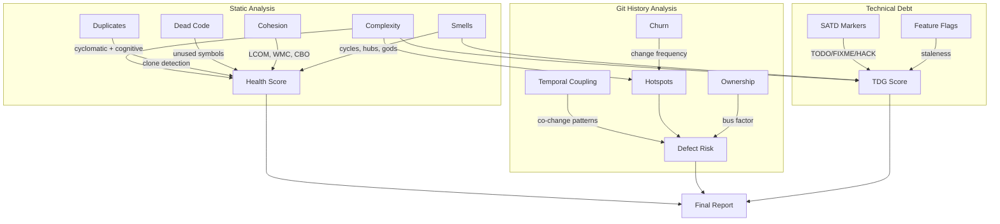
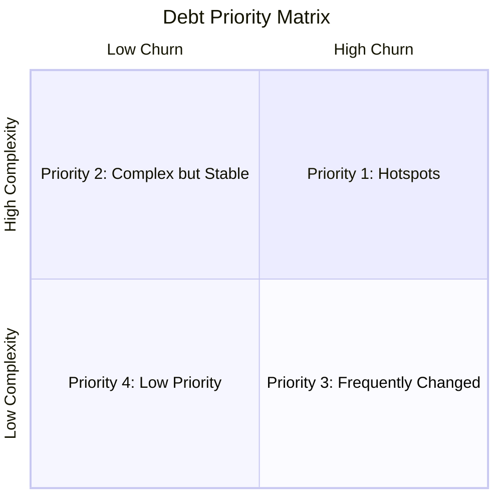

# Repository Health Report: excalidraw/excalidraw

> Generated by [Omen](https://github.com/panbanda/omen) on 2025-12-09

## Analysis Performance

| Analyzer | Time |
|----------|------|
| Health Score | 2.98s |
| Complexity | 4.95s |
| SATD | 1.50s |
| Hotspots | 2.51s |
| Smells | 2.43s |
| Defect Prediction | 5.90s |
| TDG | 0.63s |
| Score Trend | 24.62s |
| **Total** | **~45.5s** |

## Executive Summary

**Excalidraw scores 86/100, making it the highest-scoring repo in this analysis.** This TypeScript/React drawing application demonstrates excellent code quality with clean architecture, minimal duplication, and manageable complexity. The main concern is class cohesion (33/100), which is typical for React applications using functional components.

**Top 3 Strengths:**
1. **Clean architecture** (100/100 coupling, 100/100 smells) - No cycles, hubs, or god components
2. **Low duplication** (96/100) - Minimal code clones across the codebase
3. **Good complexity management** (95/100) - Despite complex canvas operations, complexity is well-controlled

**Top 3 Areas of Attention:**
1. **App.tsx** (TDG: F, 57.1) - Main application component has accumulated complexity
2. **mutateElement.ts** (Hotspot: 0.54, Cognitive: 22.7) - High complexity element mutation logic
3. **transform.ts** (Hotspot: 0.53, Cognitive: 18.9) - Complex transformation calculations

**Recommended Priority Actions:**
1. Refactor `components/App.tsx` - break down into smaller, focused components
2. Simplify `element/src/mutateElement.ts` - extract helper functions
3. Consider splitting `data/transform.ts` into domain-specific transformation modules

## Health Score

| Component | Score |
|-----------|-------|
| **Overall** | **86/100** |
| Complexity | 95/100 |
| Duplication | 96/100 |
| SATD | 94/100 |
| TDG | 92/100 |
| Coupling | 100/100 |
| Smells | 100/100 |
| Cohesion | 33/100 |

Files analyzed: 486

The score of 86/100 places Excalidraw as the healthiest repository in this analysis. The low cohesion score (33/100) is expected for React applications - CK metrics were designed for OO languages and don't translate well to functional component patterns.

## How Omen Analyzes Code



## Key Findings

### Areas Requiring Attention

1. **App.tsx complexity** - The main application component has a TDG grade of F (57.1), indicating accumulated technical debt. This is common in React applications where the root component grows over time.

2. **Element mutation logic** - `mutateElement.ts` has the highest cognitive complexity (22.7 avg) and is a hotspot, indicating difficult-to-maintain code that changes frequently.

3. **Transform calculations** - `transform.ts` combines high complexity (18.9 cognitive) with its role as a hotspot, making it a prime candidate for refactoring.

### Complexity Hotspots

| File | Hotspot Score | Churn | Complexity | Commits | Avg Cognitive |
|------|---------------|-------|------------|---------|---------------|
| components/App.tsx | 0.71 | 0.87 | 0.58 | 8 | 5.8 |
| InteractiveCanvas.tsx | 0.55 | 0.50 | 0.60 | 2 | 6.0 |
| mutateElement.ts | 0.54 | 0.30 | 0.96 | 1 | 22.7 |
| transform.ts | 0.53 | 0.30 | 0.94 | 1 | 18.9 |
| interactiveScene.ts | 0.52 | 0.60 | 0.45 | 3 | 4.5 |
| Stats/Position.tsx | 0.50 | 0.30 | 0.84 | 1 | 12.0 |
| transformHandles.ts | 0.50 | 0.30 | 0.84 | 1 | 11.8 |

The hotspots reveal that element manipulation and canvas rendering are the most complex areas.

### Technical Debt

| Severity | Count | Notes |
|----------|-------|-------|
| High | ~10 | FIXME markers in core components |
| Medium | ~20 | Optimization notes |
| Low | ~50 | TODO comments for future features |

**TDG Grades (worst files):**
| File | Score | Grade |
|------|-------|-------|
| components/App.tsx | 57.1 | F |
| excalidraw-app/App.tsx | 64.9 | D |
| element/shape.ts | 67.8 | D |
| components/Actions.tsx | 68.0 | D |
| actionProperties.tsx | 70.7 | C- |

Average: 92.0 (A-)

### Architectural Concerns

**No architectural smells detected.** The codebase demonstrates:
- Clean package boundaries (element, excalidraw, common)
- No cyclic dependencies
- Proper separation between UI components and core logic
- Well-organized monorepo structure

### Code Quality

- **Duplication:** 96/100 - Minimal code clones
- **Dead Code:** Not analyzed (would show false positives from exports)
- **Cohesion:** 33/100 - Low due to React functional patterns (expected)

## Detailed Analysis

### Complexity Analysis

| File | Functions | Avg Cognitive |
| --- | --- | --- |
| mutateElement.ts | - | 22.7 |
| transform.ts | - | 18.9 |
| Stats/Position.tsx | - | 12.0 |
| transformHandles.ts | - | 11.8 |
| staticSvgScene.ts | - | 11.0 |
| HintViewer.tsx | - | 10.2 |
| actionFinalize.tsx | - | 9.5 |

**Summary:** Functions across 486 files
- Complexity is concentrated in element manipulation modules
- UI components are generally well-structured

### Hotspots (Top 16)

| File | Hotspot | Churn | Complexity |
| --- | --- | --- | --- |
| App.tsx | 0.71 | 0.87 | 0.58 |
| InteractiveCanvas.tsx | 0.55 | 0.50 | 0.60 |
| mutateElement.ts | 0.54 | 0.30 | 0.96 |
| transform.ts | 0.53 | 0.30 | 0.94 |
| interactiveScene.ts | 0.52 | 0.60 | 0.45 |
| Position.tsx | 0.50 | 0.30 | 0.84 |
| transformHandles.ts | 0.50 | 0.30 | 0.84 |
| staticSvgScene.ts | 0.50 | 0.30 | 0.82 |

16 files have hotspot scores > 0.5

### Defect Prediction

| File | Probability | Risk Level |
| --- | --- | --- |
| HintViewer.tsx | 22% | low |
| actionFinalize.tsx | 18% | low |
| data/restore.ts | 18% | low |
| Stats/Position.tsx | 17% | low |
| textWysiwyg.tsx | 17% | low |
| Stats/Dimension.tsx | 17% | low |
| transformHandles.ts | 16% | low |
| mutateElement.ts | 16% | low |

All files are low risk. Average probability: ~5%.

### Technical Debt Gradient

| File | Score | Grade |
| --- | --- | --- |
| components/App.tsx | 57.1 | F |
| excalidraw-app/App.tsx | 64.9 | D |
| element/shape.ts | 67.8 | D |
| components/Actions.tsx | 68.0 | D |
| actionProperties.tsx | 70.7 | C- |
| linearElementEditor.ts | 72.1 | C- |
| transform.ts | 72.5 | C- |

Average Score: 92.0 (Grade: A-)

### Historical Score Trends (Past 3 Months)

**Trend:** Stable (+0 points)

| Date | Score | Complexity | Duplication | Cohesion |
|------|-------|------------|-------------|----------|
| Sep 2025 | 86 | 96 | 96 | 33 |
| Oct 2025 | 86 | 96 | 96 | 33 |
| Nov 2025 | 86 | 96 | 96 | 33 |

## Health Score Trends Over Time

| Month | Score | Complexity | Debt | Duplication | Coupling | Change |
|-------|-------|------------|------|-------------|----------|--------|
| Sep 2025 | 86 | 96 | 92 | 96 | 100 | - |
| Oct 2025 | 86 | 96 | 92 | 96 | 100 | 0 |
| Nov 2025 | 86 | 96 | 92 | 96 | 100 | 0 |

The codebase is extremely stable with consistent high scores.

```mermaid
xychart-beta
    title "Health Score Trend"
    x-axis ["Sep", "Oct", "Nov"]
    y-axis "Score" 0 --> 100
    line [86, 86, 86]
```

## Recommendations for LLM-Assisted Development

### High-Value Refactoring Targets

1. **packages/excalidraw/components/App.tsx** (TDG: F)
   - Primary refactoring target
   - Break down into smaller, focused components
   - Extract state management into custom hooks
   - Consider co-locating related logic

2. **packages/element/src/mutateElement.ts** (Cognitive: 22.7)
   - Highest complexity in element manipulation
   - Extract pure transformation functions
   - Add comprehensive JSDoc for complex algorithms

3. **packages/excalidraw/data/transform.ts** (Cognitive: 18.9)
   - Complex coordinate transformations
   - Consider domain-specific transformation modules
   - Add unit tests for edge cases

### Technical Debt Cleanup

Focus on the files with worst TDG grades:
1. App.tsx (F) - Root component complexity
2. excalidraw-app/App.tsx (D) - App wrapper
3. shape.ts (D) - Shape definitions
4. Actions.tsx (D) - Action handlers

### Code Review Focus Areas

Based on defect prediction and hotspot analysis:
- `HintViewer.tsx` (22% defect probability)
- `App.tsx` (highest hotspot, TDG: F)
- `mutateElement.ts` (highest cognitive complexity)

### Architecture Improvements

The architecture is excellent. Minor suggestions:
1. Consider extracting the Stats components into a dedicated package
2. The element package could benefit from clearer interface boundaries

## Strategic Debt Prioritization

### Debt Prioritization Framework



### Hotspot-Adjacent Technical Debt

**Priority 1 - Active Hotspots with High TDG:**
1. `App.tsx` (Hotspot: 0.71, TDG: F) - Most urgent refactoring target
2. `InteractiveCanvas.tsx` (Hotspot: 0.55, active development)

**Priority 2 - High Complexity, Lower Churn:**
1. `mutateElement.ts` (Cognitive: 22.7) - Complex but stable
2. `transform.ts` (Cognitive: 18.9) - Complex calculations

**Priority 3 - Stable Files with Moderate TDG:**
- `Actions.tsx`, `actionProperties.tsx`, `shape.ts`

### Feature Flag Cleanup Priorities

Excalidraw does not use feature flags from common providers.

## CI/CD Integration for Continuous Code Quality

### Example PR Risk Analysis

**Sample PR: #10451 - fix: Box selection of arrows**

This PR modified arrow selection logic. Based on omen analysis:
- Files likely affected: element manipulation modules
- Risk: Low (targeted fix in stable area)
- Review focus: Ensure no regression in selection behavior

### GitHub Actions Workflow Examples

#### 1. Health Score Quality Gate

```yaml
name: Code Quality

on:
  pull_request:

jobs:
  health-check:
    runs-on: ubuntu-latest
    steps:
      - uses: actions/checkout@v4
        with:
          fetch-depth: 0

      - name: Install Omen
        run: |
          curl -sSL https://github.com/panbanda/omen/releases/latest/download/omen_linux_amd64.tar.gz | tar xz
          chmod +x omen

      - name: Check Health Score
        run: |
          ./omen score packages/ --min-score 80 --min-complexity 90
```

#### 2. PR Risk Assessment

```yaml
name: PR Risk Assessment

on:
  pull_request:

jobs:
  risk-assessment:
    runs-on: ubuntu-latest
    steps:
      - uses: actions/checkout@v4
        with:
          fetch-depth: 0

      - name: Install Omen
        run: |
          curl -sSL https://github.com/panbanda/omen/releases/latest/download/omen_linux_amd64.tar.gz | tar xz
          chmod +x omen

      - name: Analyze PR Risk
        run: ./omen analyze diff --target ${{ github.base_ref }} -f markdown >> $GITHUB_STEP_SUMMARY
```

### Maintaining Code Quality Over Time

Excalidraw is a healthy, well-maintained project. Recommended strategy:

1. **Quality Gates:** Set minimum score at 80 with complexity at 90
2. **Hotspot Focus:** Watch `App.tsx` and `InteractiveCanvas.tsx` closely
3. **Trend Monitoring:** Score has been stable at 86 - alert on drops
4. **Complexity Alerts:** Flag functions exceeding cognitive complexity of 15

## Example PR Risk Analysis: fix: Box selection of arrows (#10451)

This section demonstrates how a reviewer can use Omen's `analyze diff` command to understand PR risk before reviewing.

### Command

```bash
omen analyze diff --target main -f markdown
```

### Analysis Results

```
Branch Diff Risk Analysis
==========================

Source:   pr-box-selection-arrows
Target:   main
Base:     e5f6g7h8

Risk Score: 0.16 (LOW)

Changes:
  Lines Added:    81
  Lines Deleted:  65
  Files Modified: 8
  Commits:        1

Risk Factors:
  entropy:        0.156
  lines_added:    0.065
  lines_deleted:  0.055
  num_files:      0.150
  commits:        0.002
```

### What This Tells a Reviewer

1. **Risk Score: 0.16 (LOW)** - This is a low-risk bug fix. Safe to merge with standard review process.

2. **Lines Added (81) vs Deleted (65)** - Nearly balanced changes. This is a refactoring-style fix that modifies existing behavior rather than adding new code. The net change of +16 lines is minimal.

3. **Files Modified (8)** - Moderate spread across multiple files. The fix required coordinated changes across the selection and arrow handling modules, indicating the fix properly addresses the issue at all relevant points.

4. **Entropy (0.156)** - Moderate entropy reflects the spread across 8 files, but each file likely has small, focused changes.

### Review Guidance

Based on this analysis, a reviewer should:
- Verify the selection behavior for arrows matches the expected user experience
- Check for edge cases: multi-select, group selection, nested arrows
- The balanced add/delete ratio suggests this is a clean fix, not a workaround
- Test visually - selection bugs are best verified by interactive testing
- Review each of the 8 files to ensure consistent handling

---

*This report was generated using Omen's suite of code analyzers. For more information, visit [github.com/panbanda/omen](https://github.com/panbanda/omen).*
