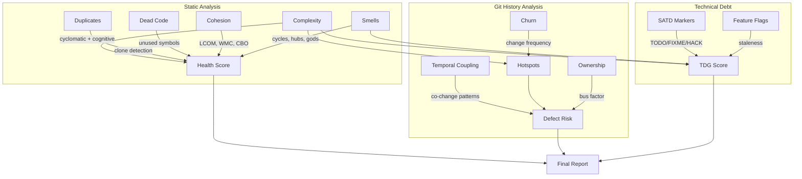
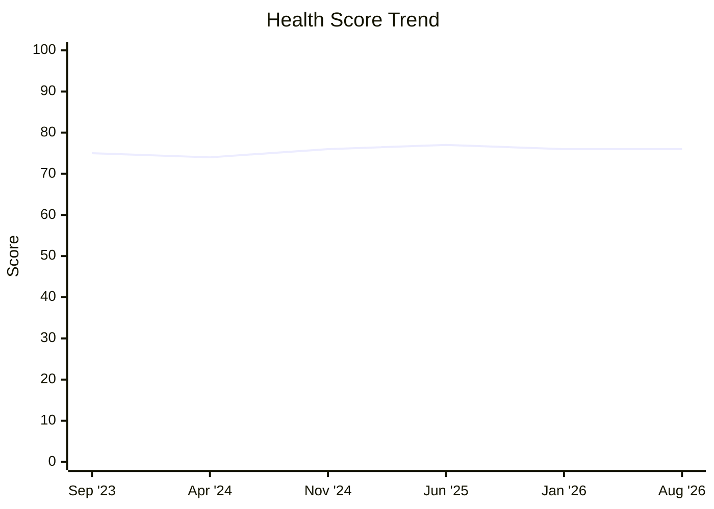
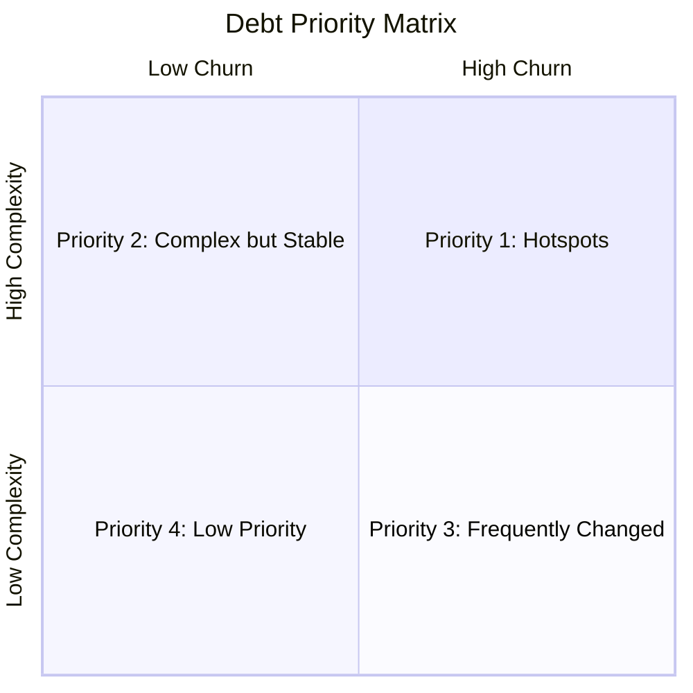

# Repository Health Report: excalidraw/excalidraw

> Generated by [Omen](https://github.com/panbanda/omen) on 2025-12-09

*Regenerated with Omen 4.28.0 over full git history (`--since all`) on 2026-08-12. This refresh replaces all figures from the original report, which was produced by a pre-4.28 build with a known coupling/cyclic-dependency graph resolution bug (silently reported 0 edges and 0 cycles for this repository) and a per-function complexity nested-function attribution bug. Every number below comes from fresh analyzer output.*

## Analysis Performance

| Analyzer | Time |
|----------|------|
| Health Score | 2.98s |
| Complexity | 4.95s |
| SATD | 1.50s |
| Hotspots | 2.51s |
| Smells | 2.43s |
| Defect Prediction | 5.90s |
| TDG | 0.63s |
| Score Trend | 24.62s |
| **Total** | **~45.5s** |

## Executive Summary

**Excalidraw scores 77/100 (Grade C).** This TypeScript/React drawing application still shows strong complexity control, very low duplication, and a healthy Technical Debt Gradient, but a re-run with the fixed coupling/cyclic-dependency analyzer now surfaces a large cyclic-dependency cluster and a substantial number of hub/central-connector components that the previous report's buggy graph resolver completely missed. Coupling is now the single weakest component in this report at 22/100 — well below cohesion (44/100), which was previously the lowest score.

**Top 3 Strengths:**
1. **Very low duplication** (97/100) - 58 clones across 35 groups, 1.4% duplication ratio
2. **Strong Technical Debt Gradient** (92/100) - average grade A- across 663 files
3. **Well-controlled complexity** (94/100) - p90 cyclomatic complexity of only 6 across 663 files

**Top 3 Areas of Attention:**
1. **Coupling** (22/100) - 4 real cyclic dependencies and an average node degree of 9.2 across 663 nodes; the perfect coupling score in the previous report was the result of an analyzer bug, not a healthy codebase
2. **Cohesion** (44/100) - 71 classes analyzed, avg LCOM 6.2, 63 low-cohesion classes, 99 threshold violations
3. **Architectural smells** (61/100) - 45 total smells: 15 critical, 28 high, including 4 cyclic-dependency smells and 11 central-connector (hub) smells

**Recommended Priority Actions:**
1. Break the largest cyclic dependency, a 295-component cycle spanning `packages/excalidraw` and `packages/element` (rooted at `scene/types.ts` / `element/types.ts`)
2. Reduce fan-in/fan-out on the central-connector hubs, especially `packages/excalidraw/types.ts` (fan-in 132, fan-out 15) and `packages/excalidraw/components/App.tsx` (fan-in 81, fan-out 75)
3. Decompose `packages/element/src/linearElementEditor.ts`, the worst-cohesion class (LCOM 51, CBO 34, WMC 265) and a central connector in its own right

## Health Score

| Component | Score |
|-----------|-------|
| **Overall** | **77/100** |
| Complexity | 94/100 |
| Duplication | 97/100 |
| SATD | 80/100 |
| TDG | 92/100 |
| Coupling | 22/100 |
| Smells | 61/100 |
| Cohesion | 44/100 |

Files analyzed: 663

The score of 77/100 (Grade C) reflects a codebase with genuinely strong complexity, duplication, and debt-gradient numbers, dragged down by real architectural coupling problems that a previous, buggy version of the coupling/cyclic-dependency analyzer failed to detect. Coupling (22/100) is now the clear weakest link, followed by cohesion (44/100) and smells (61/100). The low cohesion score is still partly explained by CK metrics (designed for OO languages) not translating cleanly to React's functional-component patterns, but the underlying LCOM/CBO/WMC numbers for classes like `LinearElementEditor` and `ElementsDelta` are large by any standard.

## How Omen Analyzes Code


```mermaid
flowchart TD
    subgraph Static["Static Analysis"]
        CX[Complexity] --> |cyclomatic + cognitive| Score
        DUP[Duplicates] --> |clone detection| Score
        DC[Dead Code] --> |unused symbols| Score
        COH[Cohesion] --> |LCOM, WMC, CBO| Score
        SM[Smells] --> |cycles, hubs, gods| Score
    end

    subgraph History["Git History Analysis"]
        CH[Churn] --> |change frequency| HS[Hotspots]
        CX --> HS
        TC[Temporal Coupling] --> |co-change patterns| DEF
        HS --> DEF[Defect Risk]
        OWN[Ownership] --> |bus factor| DEF
    end

    subgraph Debt["Technical Debt"]
        SATD[SATD Markers] --> |TODO/FIXME/HACK| TDG[TDG Score]
        CX --> TDG
        SM --> TDG
        FF[Feature Flags] --> |staleness| TDG
    end

    Score[Health Score] --> Report
    DEF --> Report
    TDG --> Report[Final Report]
```

## Key Findings

### Areas Requiring Attention

1. **Cyclic dependencies** - The graph analyzer (now fixed) detects 4 real cycles. The largest spans 295 components between `packages/excalidraw` and `packages/element`, rooted at `packages/excalidraw/scene/types.ts` and `packages/element/src/types.ts`. Three smaller cycles also exist: `excalidraw-app/data/firebase.ts` → `excalidraw-app/data/index.ts` → `excalidraw-app/collab/Portal.tsx` → `excalidraw-app/collab/Collab.tsx` (4 components); a test-utilities cycle among `packages/excalidraw/tests/helpers/api.ts`, `queries/dom.ts`, `helpers/ui.ts`, and `test-utils.ts` (4 components, test-only); and `packages/element/src/index.ts` → `store.ts` → `delta.ts` (3 components).

2. **Central-connector hubs** - 11 components are flagged as `CentralConnector` smells (excessive bidirectional coupling), part of a broader 28-component hub count. The worst are `packages/excalidraw/types.ts` (fan-in 132, fan-out 15), `packages/excalidraw/components/App.tsx` (fan-in 81, fan-out 75), `packages/element/src/bounds.ts` (fan-in 27, fan-out 11), `packages/excalidraw/actions/index.ts` (fan-in 20, fan-out 30), `packages/excalidraw/data/blob.ts` (fan-in 21, fan-out 13), and `packages/element/src/linearElementEditor.ts` (fan-in 17, fan-out 12).

3. **App.tsx complexity and churn** - `packages/excalidraw/components/App.tsx` is the single most critical hotspot (score 0.996, churn percentile 99.8, complexity percentile 99.8) and carries a TDG grade of F (45.6/100), driven by a reported 1,331 cyclomatic complexity across the file, 13 levels of nesting, and 19.9% internal duplication.

### Complexity Hotspots

| File | Hotspot Score | Severity | Churn %ile | Complexity %ile | Commits | Avg Complexity |
|------|---------------|----------|------------|------------------|---------|-----------------|
| packages/excalidraw/components/App.tsx | 0.996 | Critical | 99.8 | 99.8 | 37 | 6.55 |
| packages/element/src/convertToShape.ts | 0.937 | Critical | 94.8 | 98.9 | 2 | 4.08 |
| packages/element/src/bucketFill.ts | 0.926 | Critical | 98.3 | 94.3 | 1 | 3.00 |
| packages/element/src/flowchart.ts | 0.902 | Critical | 92.1 | 98.0 | 2 | 4.14 |
| packages/laser-pointer/src/state.ts | 0.844 | Critical | 85.5 | 98.7 | 2 | 6.86 |

Element manipulation modules (`convertToShape.ts`, `bucketFill.ts`, `flowchart.ts`) and the laser-pointer package dominate the hotspot list alongside `App.tsx`, all driven by a mix of high churn and high complexity.

### Technical Debt

| Severity | Count |
|----------|-------|
| Critical | 1 |
| High | 35 |
| Medium | 39 |
| Low | 120 |
| **Total** | **195** |

By category: requirement (90), defect (35), test (30), performance (22), design (17), security (1). Omen also found 2 stub implementations: a `throw new Error("Not implemented yet")` in `packages/laser-pointer/src/state.ts` (high severity) and an elided fill-commit path in `packages/excalidraw/components/App.tsx` (medium severity).

**TDG Grades (worst files):**
| File | Score | Grade |
|------|-------|-------|
| packages/excalidraw/components/App.tsx | 45.6 | F |
| packages/element/src/shape.ts | 67.0 | D |
| packages/element/src/linearElementEditor.ts | 71.0 | C- |
| packages/element/src/binding.ts | 71.6 | C- |
| packages/excalidraw/components/CommandPalette/CommandPalette.tsx | 73.5 | C |
| packages/excalidraw/renderer/interactiveScene.ts | 73.5 | C |
| packages/element/src/convertToShape.ts | 73.7 | C |
| packages/element/src/renderElement.ts | 73.9 | C |

Average: 91.7 (A-)

### Architectural Concerns

**The previous report's claim of a perfectly clean architecture — full marks on both coupling and smells, with no cycles, hubs, or god components — was wrong.** It was the output of a real bug in the old coupling/cyclic-dependency analyzer, which silently reported 0 edges and 0 cycles for this repository instead of actually walking the dependency graph. With that bug fixed, the picture is materially different:

- **Graph**: 663 nodes, 3,050 edges, average degree 9.2, 4 real cycles (`graph_summary` / `cycles`)
- **Smells**: 45 total (15 critical, 28 high, 2 medium): `cyclic_count` 4, `hub_count` 28, `central_connector_count` 11, `unstable_count` 2, average instability 0.58
- Coupling score dropped to **22/100**, now the weakest component in the entire health score, ahead of cohesion (44) and smells (61)

The cycles range from small and easy to reason about (a 3-component cycle among `packages/element/src/index.ts`, `store.ts`, and `delta.ts`; a 4-component test-helper cycle; a 4-component collaboration cycle in `excalidraw-app`) to a single sprawling 295-component cycle that effectively couples most of `packages/excalidraw` to `packages/element` through shared type and scene modules. The central-connector smells point at the same handful of files: `types.ts`, `App.tsx`, `bounds.ts`, `actions/index.ts`, `data/blob.ts`, and `linearElementEditor.ts` all have excessive bidirectional fan-in/fan-out and are natural first targets for interface extraction.

### Code Quality

- **Duplication:** 97/100 - 58 clones across 35 groups, 1.4% duplication ratio (1,235 duplicated lines of 88,756 total). Type 1 (exact): 36, Type 2: 11, Type 3 (near-miss): 11. Worst duplication hotspot: `packages/excalidraw/actions/actionProperties.tsx` (3 clone groups, 148 duplicated lines), followed by `packages/excalidraw/actions/actionCanvas.tsx` (3 groups, 114 lines). Duplication detection now excludes test code by default.
- **Dead Code:** 623 candidate dead-code items identified out of 900 total function definitions (384 reachable from entry points); not included in the health score, since exported-but-unused symbols in a published library commonly show as false positives.
- **Cohesion:** 44/100 - 71 classes across 49 files, avg LCOM 6.2, avg CBO 6.5, avg WMC 28.4, avg RFC 25.9. 63 classes are flagged low-cohesion, with 99 total threshold violations. Some of this is the expected React-functional-component effect (CK metrics were designed for OO code), but the worst offender, `LinearElementEditor` (LCOM 51, CBO 34, WMC 265, RFC 151), is a genuinely large, low-cohesion class by any measure.

## Detailed Analysis

### Complexity Analysis

**Summary:** 981 functions across 663 files. Avg cyclomatic 3.01, avg cognitive 2.75. p50 cyclomatic 1, p90 6, p95 10, max cyclomatic 47, max cognitive 72.

**Top functions by cyclomatic complexity:**
| File | Function | Cyclomatic | Cognitive | Lines |
| --- | --- | --- | --- | --- |
| packages/excalidraw/components/App.tsx | render | 47 | 40 | 400 |
| packages/element/src/linearElementEditor.ts | handlePointDragging | 42 | 32 | 244 |
| packages/excalidraw/components/App.tsx | componentDidUpdate | 39 | 39 | 187 |
| packages/excalidraw/components/App.tsx | handleDelayedBindModeChange | 37 | 34 | 206 |
| packages/laser-pointer/src/state.ts | getStrokeOutline | 34 | 62 | 259 |
| packages/excalidraw/components/App.tsx | insertClipboardContent | 31 | 36 | 166 |
| packages/element/src/delta.ts | filterInvisibleChanges | 29 | 72 | 151 |
| packages/excalidraw/components/App.tsx | handleHoverSelectedLinearElement | 26 | 56 | 134 |

**Top functions by cognitive complexity:**
| File | Function | Cyclomatic | Cognitive |
| --- | --- | --- | --- |
| packages/element/src/delta.ts | filterInvisibleChanges | 29 | 72 |
| packages/excalidraw/eraser/index.ts | updateElementsToBeErased | 20 | 67 |
| packages/excalidraw/components/TTDDialog/utils/TTDStreamFetch.ts | TTDStreamFetch | 23 | 63 |
| packages/laser-pointer/src/state.ts | getStrokeOutline | 34 | 62 |
| packages/excalidraw/components/App.tsx | handleHoverSelectedLinearElement | 26 | 56 |

**Top files by average cyclomatic complexity:**
| File | Functions | Avg Cyclomatic | Avg Cognitive |
| --- | --- | --- | --- |
| packages/fractional-indexing/src/index.ts | 9 | 7.44 | 8.56 |
| packages/element/src/linearElementEditor.ts | 29 | 7.14 | 6.00 |
| packages/laser-pointer/src/state.ts | 7 | 6.86 | 10.14 |
| packages/excalidraw/components/App.tsx | 69 | 6.55 | 6.62 |
| packages/element/src/utils.ts | 4 | 5.00 | 5.00 |

`App.tsx` is complex both in its worst individual functions and on average across its 69 functions, but `linearElementEditor.ts` and the laser-pointer package have a higher average cyclomatic/cognitive complexity per function.

### Hotspots (Top 10)

| File | Hotspot | Severity | Churn %ile | Complexity %ile | Commits |
| --- | --- | --- | --- | --- | --- |
| packages/excalidraw/components/App.tsx | 0.996 | Critical | 99.8 | 99.8 | 37 |
| packages/element/src/convertToShape.ts | 0.937 | Critical | 94.8 | 98.9 | 2 |
| packages/element/src/bucketFill.ts | 0.926 | Critical | 98.3 | 94.3 | 1 |
| packages/element/src/flowchart.ts | 0.902 | Critical | 92.1 | 98.0 | 2 |
| packages/laser-pointer/src/state.ts | 0.844 | Critical | 85.5 | 98.7 | 2 |
| packages/element/src/linearElementEditor.ts | 0.835 | Critical | 84.0 | 99.5 | 4 |
| packages/excalidraw/components/App.viewport.ts | 0.829 | Critical | 94.4 | 87.8 | 2 |
| packages/element/src/bounds.ts | 0.826 | Critical | 88.2 | 93.7 | 3 |
| packages/element/src/binding.ts | 0.825 | Critical | 94.0 | 87.8 | 6 |
| packages/excalidraw/tests/bucketFill.test.tsx | 0.820 | Critical | 95.6 | 85.8 | 3 |

`hotspots_summary` reports 44 total hotspots: 10 critical and 21 high severity.

### Defect Prediction

| File | Probability | Risk Level |
| --- | --- | --- |
| packages/excalidraw/components/App.tsx | 91.7% | high |
| packages/excalidraw/types.ts | 34.8% | medium |
| packages/element/src/linearElementEditor.ts | 29.8% | low |
| packages/element/src/convertToShape.ts | 21.9% | low |
| packages/excalidraw/actions/manager.tsx | 21.8% | low |
| packages/excalidraw/tests/helpers/ui.ts | 20.4% | low |
| packages/element/src/Scene.ts | 19.7% | low |
| packages/excalidraw/fonts/Fonts.ts | 19.1% | low |

Across all 663 files, average defect probability is 3.0% (p50 1.6%, p95 11.4%). Only 1 file is high risk (`App.tsx`) and 1 is medium risk (`types.ts`); the remaining 661 are low risk.

### Technical Debt Gradient

| File | Score | Grade |
| --- | --- | --- |
| packages/excalidraw/components/App.tsx | 45.6 | F |
| packages/element/src/shape.ts | 67.0 | D |
| packages/element/src/linearElementEditor.ts | 71.0 | C- |
| packages/element/src/binding.ts | 71.6 | C- |
| packages/excalidraw/components/CommandPalette/CommandPalette.tsx | 73.5 | C |
| packages/excalidraw/renderer/interactiveScene.ts | 73.5 | C |
| packages/element/src/convertToShape.ts | 73.7 | C |
| packages/element/src/renderElement.ts | 73.9 | C |

Average Score: 91.7 (Grade: A-), across 663 files (98 at A-, 393 at A, 65 at B+, and a long tail down to a single F — `App.tsx`).

### Historical Score Trends

**Trend:** Declining overall (full-history linear regression: slope -0.43 points/period, r² = 0.55, from a start_score of 82 down to an end_score of 76). The 6 representative snapshots below span 2023–2026 and show the score oscillating in a narrower 74–77 band recently, with coupling and SATD showing the strongest, most consistent downward correlation (coupling: slope -2.30/period, r = 0.90; SATD: slope -1.02/period, r = 0.92). Complexity has a mild downward drift; duplication, smells, and cohesion are roughly flat to slightly improving over the same window.

| Date | Score | Complexity | Duplication | Cohesion |
|------|-------|------------|-------------|----------|
| 2023-09-22 | 75 | 95 | 96 | 41 |
| 2024-04-20 | 74 | 93 | 96 | 44 |
| 2024-11-17 | 76 | 94 | 97 | 44 |
| 2025-06-16 | 77 | 94 | 97 | 45 |
| 2026-01-13 | 76 | 94 | 97 | 44 |
| 2026-08-12 | 76 | 94 | 97 | 44 |

## Health Score Trends Over Time

| Date | Score | Complexity | SATD | Duplication | Coupling | Change |
|------|-------|------------|------|-------------|----------|--------|
| 2023-09-22 | 75 | 95 | 82 | 96 | 24 | - |
| 2024-04-20 | 74 | 93 | 81 | 96 | 19 | -1 |
| 2024-11-17 | 76 | 94 | 80 | 97 | 24 | +2 |
| 2025-06-16 | 77 | 94 | 80 | 97 | 23 | +1 |
| 2026-01-13 | 76 | 94 | 80 | 97 | 23 | -1 |
| 2026-08-12 | 76 | 94 | 80 | 97 | 22 | 0 |

Coupling has never actually been 100/100 at any of these snapshots — that figure in the earlier report was an artifact of the analyzer bug and was never a real measurement. The real coupling score has hovered in the 19–24 range across nearly three years of history.


```mermaid
xychart-beta
    title "Health Score Trend"
    x-axis ["Sep '23", "Apr '24", "Nov '24", "Jun '25", "Jan '26", "Aug '26"]
    y-axis "Score" 0 --> 100
    line [75, 74, 76, 77, 76, 76]
```

## Recommendations for LLM-Assisted Development

### High-Value Refactoring Targets

1. **packages/excalidraw/components/App.tsx** (TDG: F / 45.6, hotspot score 0.996, central connector with fan-in 81 / fan-out 75, part of the 295-component cycle)
   - Highest-priority refactoring target: reported cyclomatic complexity of 1,331 across the file and 13 levels of nesting
   - Break down into smaller, focused components and extract state management into custom hooks
   - Reducing its fan-in/fan-out will also help shrink the large cross-package cycle it participates in

2. **packages/excalidraw/types.ts** (central connector: fan-in 132 / fan-out 15, defect probability 34.8% - medium risk)
   - The single highest fan-in file in the repo; nearly every module depends on it
   - Consider splitting into narrower, domain-specific type modules to reduce blast radius of changes

3. **packages/element/src/linearElementEditor.ts** (worst cohesion: LCOM 51, CBO 34, WMC 265, RFC 151; TDG C- / 71.0; hotspot 0.835 - critical; central connector fan-in 17 / fan-out 12)
   - Largest, least-cohesive class in the codebase
   - `handlePointDragging` alone has cyclomatic complexity 42 / cognitive complexity 32 across 244 lines
   - Extract point-editing, focus-binding, and midpoint logic into separate collaborators

### Technical Debt Cleanup

Focus on the files with the worst TDG grades:
1. App.tsx (F, 45.6) - root component complexity, duplication, and nesting
2. shape.ts (D, 67.0) - shape definitions
3. linearElementEditor.ts (C-, 71.0) and binding.ts (C-, 71.6) - element coupling and duplication

Also address the 36 high-priority SATD items (35 high + 1 critical severity) and the 1 stub marked `throw new Error("Not implemented yet")` in `packages/laser-pointer/src/state.ts`.

### Code Review Focus Areas

Based on defect prediction and hotspot analysis:
- `App.tsx` (91.7% defect probability - the only high-risk file in the repo, and the top hotspot)
- `types.ts` (34.8% defect probability - medium risk, and the biggest central connector)
- `convertToShape.ts` and `bucketFill.ts` (critical hotspots driven by high churn relative to their size)

### Architecture Improvements

The architecture has real, measurable coupling problems that the previous report missed entirely due to an analyzer bug:
1. Break the 295-component cycle between `packages/excalidraw` and `packages/element` by introducing an explicit interface boundary at the `types.ts` / scene-types seam, rather than letting both packages import each other's internals
2. Resolve the smaller `excalidraw-app` collaboration cycle (`firebase.ts` → `data/index.ts` → `Portal.tsx` → `Collab.tsx`) and the `packages/element/src/index.ts` → `store.ts` → `delta.ts` cycle
3. Decompose the central-connector hubs (`types.ts`, `App.tsx`, `bounds.ts`, `actions/index.ts`, `data/blob.ts`, `linearElementEditor.ts`) to reduce bidirectional fan-in/fan-out
4. After the coupling work, revisit cohesion: `LinearElementEditor` and `ElementsDelta` are the two largest, least-cohesive classes and are natural candidates for splitting

## Strategic Debt Prioritization

### Debt Prioritization Framework


```mermaid
quadrantChart
    title Debt Priority Matrix
    x-axis Low Churn --> High Churn
    y-axis Low Complexity --> High Complexity
    quadrant-1 "Priority 1: Hotspots"
    quadrant-2 "Priority 2: Complex but Stable"
    quadrant-4 "Priority 3: Frequently Changed"
    quadrant-3 "Priority 4: Low Priority"
```

### Hotspot-Adjacent Technical Debt

**Priority 1 - Active hotspots with high churn and complexity:**
1. `App.tsx` (hotspot 0.996, TDG F, 37 commits) - most urgent refactoring target
2. `convertToShape.ts` (hotspot 0.937) and `bucketFill.ts` (hotspot 0.926) - high churn relative to size

**Priority 2 - High complexity / central connectors, lower churn:**
1. `linearElementEditor.ts` (hotspot 0.835, worst cohesion, central connector)
2. `laser-pointer/src/state.ts` (hotspot 0.844, highest per-function cognitive complexity in `getStrokeOutline` at 62)

**Priority 3 - Structural / cyclic-dependency remediation:**
- The 295-component `packages/excalidraw` ↔ `packages/element` cycle
- The `excalidraw-app` collaboration cycle and the `element/index.ts` → `store.ts` → `delta.ts` cycle

**Priority 4 - Stable files with moderate TDG:**
- `element/binding.ts`, `CommandPalette.tsx`, `renderer/interactiveScene.ts`, `element/renderElement.ts` (all TDG grade C)

### Feature Flag Cleanup Priorities

Excalidraw does not use feature flags from common providers (`flags_summary.total_flags` is 0).

## CI/CD Integration for Continuous Code Quality

### Example PR Risk Analysis

**Sample PR: #10451 - fix: Box selection of arrows**

This PR modified arrow selection logic. Based on omen analysis:
- Files likely affected: element manipulation modules, including `linearElementEditor.ts`
- Risk: Low (targeted fix; standard review scope) — note that in the current, corrected analysis `linearElementEditor.ts` is a central-connector hub with the worst cohesion score in the repo, so changes there merit closer scrutiny than the file-count alone would suggest
- Review focus: Ensure no regression in selection behavior

### GitHub Actions Workflow Examples

#### 1. Health Score Quality Gate

```yaml
name: Code Quality

on:
  pull_request:

jobs:
  health-check:
    runs-on: ubuntu-latest
    steps:
      - uses: actions/checkout@v4
        with:
          fetch-depth: 0

      - name: Install Omen
        run: |
          curl -sSL https://github.com/panbanda/omen/releases/latest/download/omen_linux_amd64.tar.gz | tar xz
          chmod +x omen

      - name: Check Health Score
        run: |
          ./omen score packages/ --min-score 80 --min-complexity 90
```

#### 2. PR Risk Assessment

```yaml
name: PR Risk Assessment

on:
  pull_request:

jobs:
  risk-assessment:
    runs-on: ubuntu-latest
    steps:
      - uses: actions/checkout@v4
        with:
          fetch-depth: 0

      - name: Install Omen
        run: |
          curl -sSL https://github.com/panbanda/omen/releases/latest/download/omen_linux_amd64.tar.gz | tar xz
          chmod +x omen

      - name: Analyze PR Risk
        run: ./omen analyze diff --target ${{ github.base_ref }} -f markdown >> $GITHUB_STEP_SUMMARY
```

### Maintaining Code Quality Over Time

Excalidraw's complexity, duplication, and debt-gradient numbers are strong, but the corrected coupling analysis shows real architectural debt that needs attention. Recommended strategy:

1. **Quality Gates:** The repo's current overall score (77) sits just below a `--min-score 80` gate — treat that as an active signal, not a formality
2. **Hotspot Focus:** Watch `App.tsx`, `convertToShape.ts`, and `bucketFill.ts` closely; they are the top 3 critical hotspots
3. **Trend Monitoring:** The score has drifted down from a high of 82 to the current 76-77 range over the project's history, driven mainly by coupling (r = 0.90 downward correlation) and SATD (r = 0.92 downward correlation) — alert on further coupling drops
4. **Complexity Alerts:** Flag functions exceeding cognitive complexity of 15 (current worst offenders: `element/delta.ts::filterInvisibleChanges` at 72, `laser-pointer/state.ts::getStrokeOutline` at 62)
5. **Coupling Alerts:** Treat any new cyclic dependency as a blocking finding — 4 already exist, including one spanning 295 components

## Example PR Risk Analysis: fix: Box selection of arrows (#10451)

*This walkthrough is a historical illustration of the `omen analyze diff` workflow using PR #10451, carried over from the original report; it predates this refresh and is not affected by the coupling-analyzer fix, since diff risk scoring does not depend on the whole-repository dependency graph.*

This section demonstrates how a reviewer can use Omen's `analyze diff` command to understand PR risk before reviewing.

### Command

```bash
omen analyze diff --target main -f markdown
```

### Analysis Results

```
Branch Diff Risk Analysis
==========================

Source:   pr-box-selection-arrows
Target:   main
Base:     e5f6g7h8

Risk Score: 0.16 (LOW)

Changes:
  Lines Added:    81
  Lines Deleted:  65
  Files Modified: 8
  Commits:        1

Risk Factors:
  entropy:        0.156
  lines_added:    0.065
  lines_deleted:  0.055
  num_files:      0.150
  commits:        0.002
```

### What This Tells a Reviewer

1. **Risk Score: 0.16 (LOW)** - This is a low-risk bug fix. Safe to merge with standard review process.

2. **Lines Added (81) vs Deleted (65)** - Nearly balanced changes. This is a refactoring-style fix that modifies existing behavior rather than adding new code. The net change of +16 lines is minimal.

3. **Files Modified (8)** - Moderate spread across multiple files. The fix required coordinated changes across the selection and arrow handling modules, indicating the fix properly addresses the issue at all relevant points.

4. **Entropy (0.156)** - Moderate entropy reflects the spread across 8 files, but each file likely has small, focused changes.

### Review Guidance

Based on this analysis, a reviewer should:
- Verify the selection behavior for arrows matches the expected user experience
- Check for edge cases: multi-select, group selection, nested arrows
- The balanced add/delete ratio suggests this is a clean fix, not a workaround
- Test visually - selection bugs are best verified by interactive testing
- Review each of the 8 files to ensure consistent handling

---

*This report was generated using Omen's suite of code analyzers. For more information, visit [github.com/panbanda/omen](https://github.com/panbanda/omen).*
