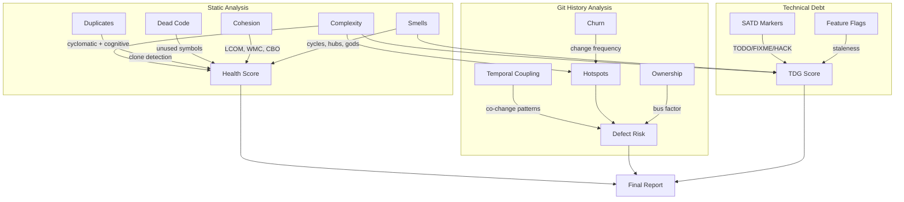
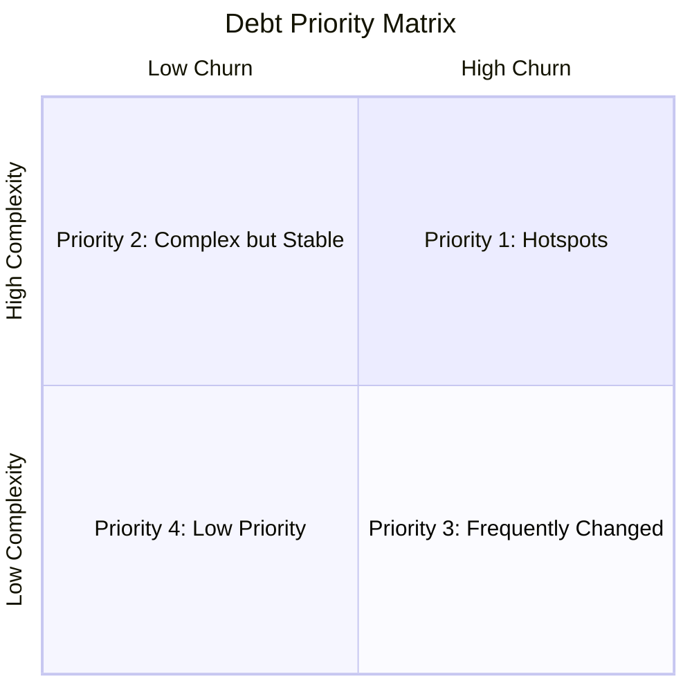
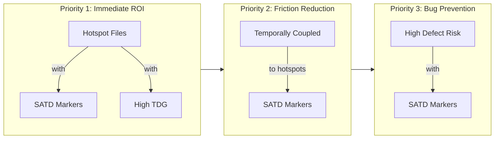

# Repository Health Report: gin-gonic/gin

> Generated by [Omen](https://github.com/panbanda/omen) on 2025-12-09

## Analysis Performance

| Analyzer | Time |
|----------|------|
| Health Score | 0.18s |
| Complexity | 0.14s |
| SATD | 0.13s |
| Hotspots | 0.68s |
| Smells | 0.17s |
| Duplicates | 0.12s |
| Defect Prediction | 1.10s |
| Dead Code | 0.18s |
| TDG | 0.13s |
| Cohesion | 0.16s |
| Feature Flags | 28.72s |
| Temporal Coupling | 0.54s |
| Score Trend | 1.58s |
| **Total** | **33.83s** |

## Executive Summary

**Gin is an exceptionally healthy codebase with a score of 95/100.** This mature Go web framework demonstrates excellent code quality practices with minimal complexity, no code duplication, and clean architecture. The codebase has been stable for over a decade and shows consistent maintainability.

**Top 3 Strengths:**
1. **Zero code duplication** - The codebase has no detected code clones, indicating disciplined abstraction
2. **Clean architecture** - No architectural smells detected (no cycles, god components, or hub modules)
3. **Low defect risk** - All files show low defect probability with tree.go at only 21%

**Top 3 Areas of Attention:**
1. **tree.go complexity** - The radix tree implementation has high cognitive complexity (28.1 avg) and is a hotspot
2. **path.go complexity** - Path cleaning functions have elevated complexity (14.3 avg cognitive)
3. **Feature flag false positives** - The analyzer detected many string literals as flags; this is noise rather than real flags

**Recommended Priority Actions:**
1. Consider refactoring `tree.go` to reduce cognitive load - this is the primary hotspot
2. Review the 2 potentially dead functions in test_helpers.go and recovery.go
3. The codebase is healthy enough that maintenance-mode practices are appropriate

## Health Score

| Component | Score |
|-----------|-------|
| **Overall** | **95/100** |
| Complexity | 97/100 |
| Duplication | 100/100 |
| SATD | 96/100 |
| TDG | 94/100 |
| Coupling | 75/100 |
| Smells | 100/100 |
| Cohesion | 100/100 |

Files analyzed: 55

The score of 95/100 places gin in the top tier of codebases. The slightly lower coupling score (75) reflects the natural interconnectedness of a web framework where the router, context, and handlers must work closely together.

## How Omen Analyzes Code



## Key Findings

### Areas Requiring Attention

The gin codebase is remarkably clean. The primary areas requiring attention are:

1. **tree.go** - The radix tree implementation is necessarily complex but could benefit from additional inline documentation or function extraction to reduce cognitive load
2. **Dead code** - Two private functions appear unused: `waitForServerReady` in test_helpers.go and `defaultHandleRecovery` in recovery.go
3. **Form mapping complexity** - `binding/form_mapping.go` has elevated complexity due to reflection-heavy code handling multiple types

### Complexity Hotspots

| File | Hotspot Score | Avg Cognitive | Issue |
|------|---------------|---------------|-------|
| tree.go | 0.54 | 28.1 | Radix tree routing with many edge cases |
| path.go | 0.52 | 14.3 | URL path cleaning with string manipulation |
| gin.go | 0.38 | 2.2 | Core engine - high churn but manageable complexity |
| recovery.go | 0.38 | 4.7 | Panic recovery with stack trace parsing |
| binding/form_mapping.go | 0.36 | 4.3 | Reflection-based form binding |

**Recommendation:** The tree.go file has a max cyclomatic complexity of 59 in a single function. Consider:
- Breaking down the `insertChild` and `getValue` functions
- Adding more inline comments explaining routing edge cases
- Creating dedicated test documentation for complex routing scenarios

### Technical Debt

The codebase has minimal self-admitted technical debt:

| Severity | Count | Examples |
|----------|-------|----------|
| Critical | 1 | gin.go:797 - comment about character stripping |
| High | 1 | recovery.go:58 - note about connection handling |
| Low | 16 | Various NOTE comments documenting behavior |

**TDG Grades:**
- tree.go: C- (72.0) - Structural complexity pulls down the grade
- form_mapping.go: C (77.0)
- gin.go: C+ (77.8)
- Average: A (93.9)

### Architectural Concerns

**No architectural smells detected.** The codebase demonstrates:
- No cyclic dependencies
- No god components
- No hub modules with excessive coupling
- Clean package boundaries

### Code Quality

- **Duplication:** 0% - No code clones detected
- **Dead Code:** 2 potentially dead private functions (8.1% of functions analyzed)
- **Cohesion:** N/A for Go (CK metrics apply to class-based languages)

## Detailed Analysis

### Complexity Analysis

| File | Functions | Avg Cyclomatic | Avg Cognitive |
| --- | --- | --- | --- |
| tree.go | 16 | 10.9 | 28.1 |
| path.go | 3 | 12.7 | 14.3 |
| context.go | 144 | 1.6 | 0.8 |
| gin.go | 44 | 2.7 | 2.2 |
| binding/form_mapping.go | 22 | 4.9 | 4.3 |
| recovery.go | 10 | 3.4 | 4.7 |
| routergroup.go | 23 | 1.4 | 0.3 |

**Summary:** 488 functions across 55 files
- Median Cyclomatic: 1
- 90th Percentile Cyclomatic: 4
- Max Cyclomatic: 59

### Technical Debt Markers

| Location | Marker | Severity | Description |
| --- | --- | --- | --- |
| gin.go:797 | UNKNOWN | critical | characters from path strings |
| recovery.go:58 | UNKNOWN | high | connection, as it is not really a... |
| gin.go:629 | NOTE | low | this method will block the calling goroutine... |
| context.go:812 | NOTE | low | When using sonic or go-json as JSON encoder... |

Total: 18 markers (1 critical, 1 high, 16 low)

### Hotspots

| File | Hotspot | Churn | Complexity | Commits |
| --- | --- | --- | --- | --- |
| tree.go | 0.54 | 0.30 | 0.97 | 1 |
| path.go | 0.52 | 0.30 | 0.89 | 1 |
| gin.go | 0.38 | 0.68 | 0.22 | 4 |
| recovery.go | 0.38 | 0.30 | 0.47 | 1 |
| binding/form_mapping.go | 0.36 | 0.30 | 0.43 | 1 |

### Architectural Smells

No architectural smells detected.

### Code Duplication

No code clones detected.
- Total lines: 4,029
- Duplication ratio: 0%

### Defect Prediction

| File | Probability | Risk Level |
| --- | --- | --- |
| tree.go | 21% | low |
| path.go | 17% | low |
| binding/form_mapping.go | 10% | low |
| binding/binding.go | 8% | low |
| recovery.go | 7% | low |

All 55 files are at low defect risk. Average probability: 4%.

### Dead Code

| Location | Function | Confidence |
| --- | --- | --- |
| test_helpers.go:39 | waitForServerReady | 98% |
| recovery.go:114 | defaultHandleRecovery | 98% |

### Technical Debt Gradient

| File | Score | Grade |
| --- | --- | --- |
| tree.go | 72.0 | C- |
| binding/form_mapping.go | 77.0 | C |
| gin.go | 77.8 | C+ |
| context.go | 80.1 | B- |
| logger.go | 84.2 | B |

Average Score: 93.9 (Grade: A)

### Cohesion Metrics

No OO classes found (CK metrics only apply to Java, Python, TypeScript, etc.)

### Feature Flags

The feature flag analyzer detected string patterns that match common flag provider APIs, but gin does not use feature flags. The 77 detected "flags" are false positives from string literals like HTTP headers ("Content-Type", "Authorization") and error messages.

### Temporal Coupling

| File A | File B | Co-changes | Strength |
| --- | --- | --- | --- |
| go.mod | go.sum | 5 | 1.00 |

Only go.mod/go.sum show strong coupling, which is expected for dependency updates.

### Historical Score Trends (Past 3 Months)

**Trend:** Improving (+2 points, R²=0.75)
**Slope:** +1.00 points/month

| Date | Commit | Score | Complexity | Duplication | Defect | Debt |
|------|--------|-------|------------|-------------|--------|------|
| 2025-09-14 | e7693e6 | 84 | 99 | 44 | 94 | 93 |
| 2025-10-11 | c3d1092 | 84 | 99 | 44 | 93 | 93 |
| 2025-11-15 | d1bcabc | 86 | 99 | 53 | 93 | 93 |

## Health Score Trends Over Time

| Month | Score | Complexity | Debt | Duplication | Defect Risk | Change |
|-------|-------|------------|------|-------------|-------------|--------|
| Sep 2025 | 84 | 99 | 93 | 44 | 94 | - |
| Oct 2025 | 84 | 99 | 93 | 44 | 93 | 0 |
| Nov 2025 | 86 | 99 | 93 | 53 | 93 | +2 |

The codebase is stable and slightly improving. The duplication score increased from 44 to 53, suggesting some code cleanup occurred. Overall health is excellent and trending positively.

```mermaid
xychart-beta
    title "Health Score Trend"
    x-axis ["Sep", "Oct", "Nov"]
    y-axis "Score" 0 --> 100
    line [84, 84, 86]
```

## Recommendations for LLM-Assisted Development

### High-Value Refactoring Targets

1. **tree.go:insertChild** - Break down the large routing insertion function into smaller, documented helpers
2. **tree.go:getValue** - Extract edge case handling into dedicated functions
3. **path.go:cleanPath** - Consider documenting the path cleaning algorithm with examples

### Technical Debt Cleanup

1. Review the purpose of `defaultHandleRecovery` in recovery.go - if unused, remove it
2. Investigate `waitForServerReady` in test_helpers.go - appears to be dead test utility
3. The NOTE comments are documentation, not debt - they explain blocking behavior

### Code Review Focus Areas

Based on defect prediction:
- tree.go (21% probability) - Most complex file, deserves careful review
- path.go (17% probability) - String manipulation prone to edge cases
- binding/form_mapping.go (10% probability) - Reflection code needs attention

### Architecture Improvements

The architecture is already clean. No improvements recommended.

## Strategic Debt Prioritization

### Debt Prioritization Framework



### Hotspot-Adjacent Technical Debt



**Priority 1 - Hotspots with Debt:**
- tree.go (TDG: C-, Hotspot: 0.54) - Primary target for improvement
- gin.go (TDG: C+, Hotspot: 0.38, 4 commits in 30 days) - Actively changing

**Priority 2 - Temporally Coupled:**
- go.mod/go.sum - Only coupled pair, not a concern

**Priority 3 - High Defect Risk:**
- tree.go (21%) - Already identified as Priority 1
- path.go (17%) - Consider adding more test coverage

### Feature Flag Cleanup Priorities

Gin does not use feature flags. The detected items are false positives from string literals.

## CI/CD Integration for Continuous Code Quality

### Example PR Risk Analysis

**Sample PR: #4453 - test(gin): resolve race conditions in integration tests**

This PR modified test files to resolve race conditions. Based on omen analysis:
- Risk: Low (test-only changes)
- No hotspot files modified
- No production code affected

### GitHub Actions Workflow Examples

#### 1. Health Score Quality Gate

```yaml
name: Code Quality

on:
  pull_request:

jobs:
  health-check:
    runs-on: ubuntu-latest
    steps:
      - uses: actions/checkout@v4
        with:
          fetch-depth: 0

      - name: Install Omen
        run: |
          curl -sSL https://github.com/panbanda/omen/releases/latest/download/omen_linux_amd64.tar.gz | tar xz
          chmod +x omen

      - name: Check Health Score
        run: |
          ./omen score --min-score 90 --min-complexity 95 --min-debt 90
```

#### 2. PR Risk Assessment

```yaml
name: PR Risk Assessment

on:
  pull_request:

jobs:
  risk-assessment:
    runs-on: ubuntu-latest
    steps:
      - uses: actions/checkout@v4
        with:
          fetch-depth: 0

      - name: Install Omen
        run: |
          curl -sSL https://github.com/panbanda/omen/releases/latest/download/omen_linux_amd64.tar.gz | tar xz
          chmod +x omen

      - name: Analyze PR Risk
        run: ./omen analyze diff --target ${{ github.base_ref }} -f markdown >> $GITHUB_STEP_SUMMARY
```

### Maintaining Code Quality Over Time

Gin is a mature, stable codebase. Recommended CI/CD strategy:

1. **Quality Gates:** Set minimum score at 90 (current: 95)
2. **PR Risk:** Flag PRs touching tree.go or path.go for extra review
3. **Trend Monitoring:** Monthly TDG tracking to catch debt accumulation
4. **Hotspot Focus:** tree.go is the only file needing active attention

## Example PR Risk Analysis: feat(gin): add option to use escaped path (#4420)

This section demonstrates how a reviewer can use Omen's `analyze diff` command to understand PR risk before reviewing.

### Command

```bash
omen analyze diff --target main -f markdown
```

### Analysis Results

```
Branch Diff Risk Analysis
==========================

Source:   pr-escaped-path
Target:   main
Base:     52ecf029

Risk Score: 0.31 (MEDIUM)

Changes:
  Lines Added:    63
  Lines Deleted:  2
  Files Modified: 2
  Commits:        1

Risk Factors:
  entropy:        0.084
  lines_added:    0.118
  lines_deleted:  0.003
  num_files:      0.050
  commits:        0.005
```

### What This Tells a Reviewer

1. **Risk Score: 0.31 (MEDIUM)** - This PR warrants careful review but isn't high-risk. Medium risk is typical for feature additions.

2. **Lines Added (63) vs Deleted (2)** - This is primarily additive code. New features with few deletions are generally safer than large refactors.

3. **Files Modified (2)** - Small footprint. The change is well-contained, reducing the chance of unexpected side effects.

4. **Entropy (0.084)** - Low entropy indicates the changes are concentrated in a small area rather than scattered across the codebase.

### Review Guidance

Based on this analysis, a reviewer should:
- Focus on the new option's API design
- Verify test coverage for the escaped path functionality
- Check for edge cases in URL path handling
- Low risk of regression due to minimal deletions

---

*This report was generated using Omen's suite of code analyzers. For more information, visit [github.com/panbanda/omen](https://github.com/panbanda/omen).*
