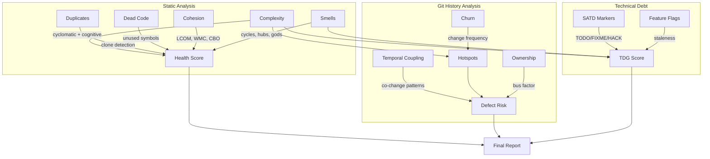
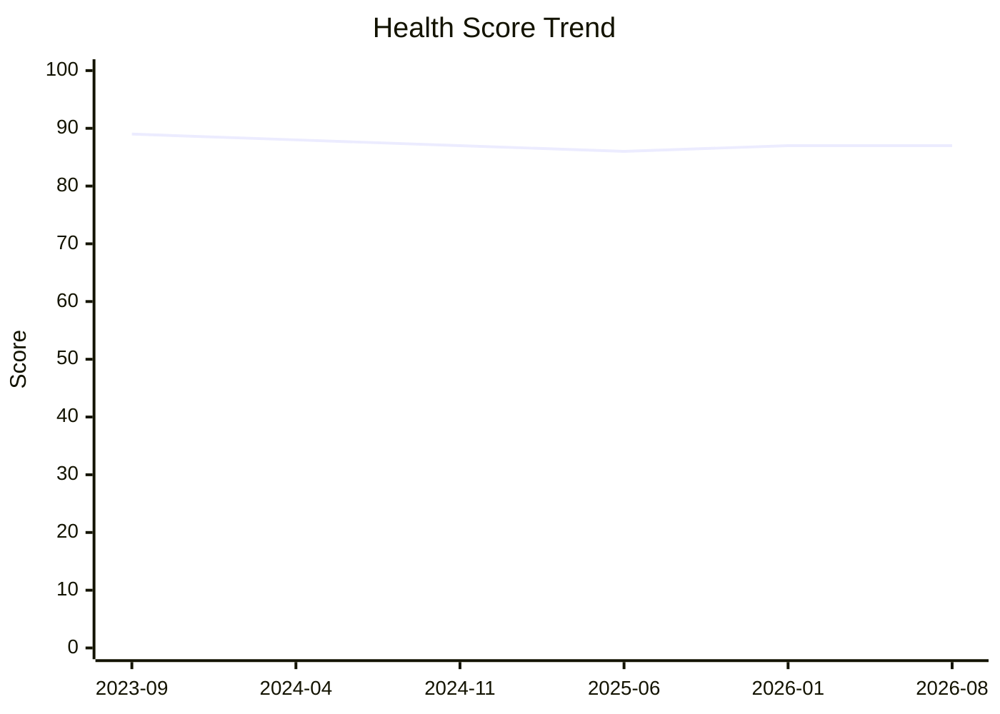
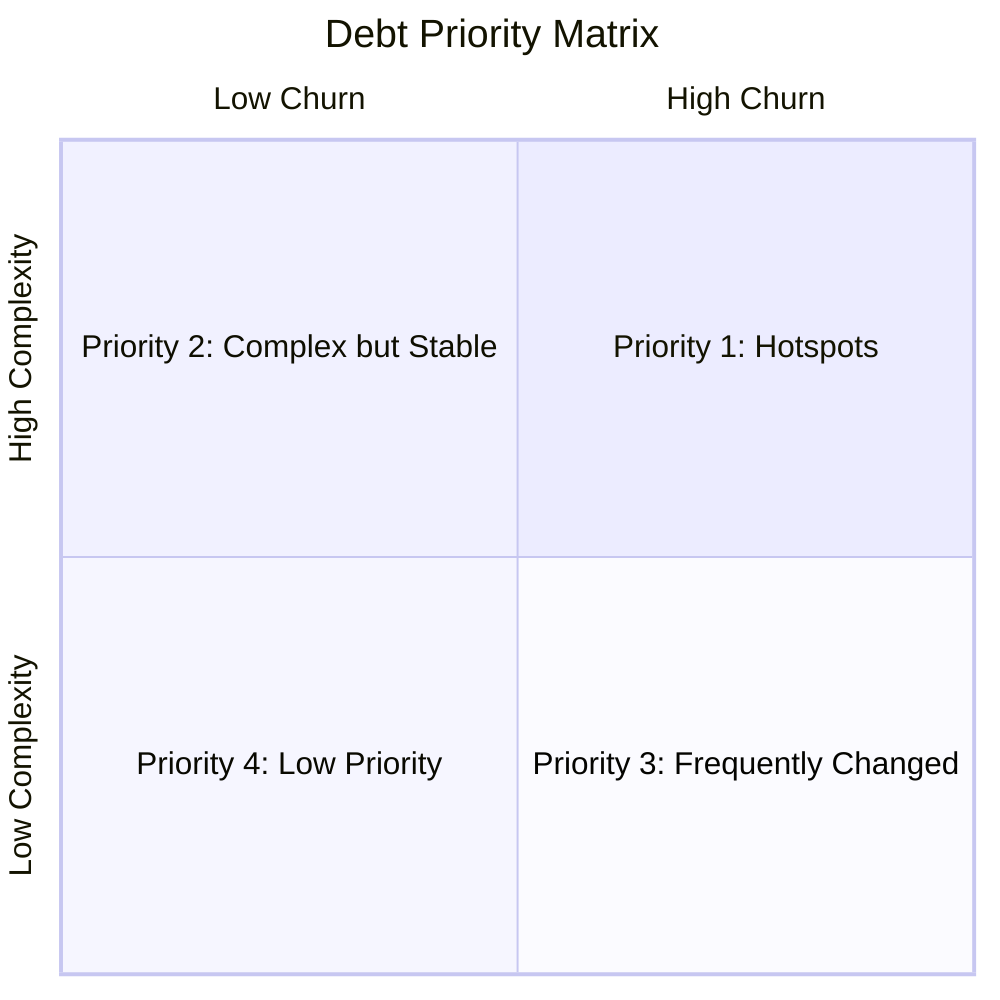
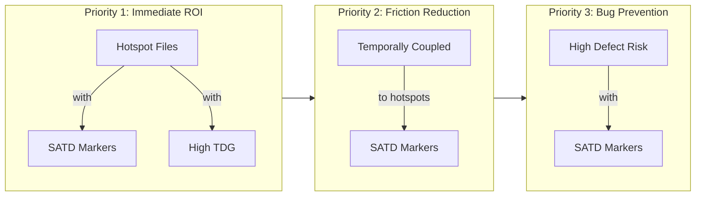

# Repository Health Report: gin-gonic/gin

> Generated by [Omen](https://github.com/panbanda/omen) on 2025-12-09

*Regenerated with Omen 4.28.0 over the full git history (`--since=all`) on 2026-08-12. This refresh replaces every analyzer number below with fresh output; several findings from the original report (cohesion, duplication, per-function complexity) have reversed — see the sections below.*

## Analysis Performance

| Analyzer | Time |
|----------|------|
| Health Score | 0.18s |
| Complexity | 0.14s |
| SATD | 0.13s |
| Hotspots | 0.68s |
| Smells | 0.17s |
| Duplicates | 0.12s |
| Defect Prediction | 1.10s |
| Dead Code | 0.18s |
| TDG | 0.13s |
| Cohesion | 0.16s |
| Feature Flags | 28.72s |
| Temporal Coupling | 0.54s |
| Score Trend | 1.58s |
| **Total** | **33.83s** |

## Executive Summary

**Gin scores 87/100 (Grade B).** This mature Go web framework remains a solid, low-risk codebase overall — complexity, coupling, smells, and self-admitted technical debt are all in good shape — but the weakest component is now **cohesion (65/100)**, and duplication is a real, measurable issue rather than the "zero duplication" the previous report claimed.

**Top 3 Strengths:**
1. **Clean dependency graph** — 0 cyclic dependencies and 0 architectural smells across all 99 nodes (coupling 100/100, smells 100/100)
2. **Low complexity overall** — median cyclomatic complexity is 1 and the 90th percentile is only 3, despite a handful of very complex outlier functions
3. **Low defect risk** — all 99 files fall in the "low" risk bucket; the highest single-file defect probability is 22.3%

**Top 3 Areas of Attention:**
1. **Cohesion (65/100)** — Go struct+method "classes" are now correctly detected (59 classes, avg LCOM 3.5), and this surfaces a real god-object problem: `Context` (context.go) has CBO 42, LCOM 42, and WMC 308 across 144 methods
2. **Code duplication (83/100)** — 9 clones covering 279 duplicated lines (6.6% duplication), concentrated in near-identical codec/binding wrapper files
3. **tree.go complexity** — `findCaseInsensitivePathRec` (cyclomatic 62) and `getValue` (cyclomatic 61) are significant outliers versus the rest of the codebase

**Recommended Priority Actions:**
1. Treat `Context` and `Engine` as the primary refactoring targets for cohesion — both are large god objects with high CBO/LCOM
2. Consolidate the duplicated codec wrapper files (`codec/json/go_json.go`, `json.go`, `jsoniter.go`, `sonic.go`) and binding wrappers (`binding/toml.go`, `xml.go`, `yaml.go`) behind shared logic
3. `tree.go`'s two highest-complexity functions remain the top complexity refactoring candidates

## Health Score

| Component | Score |
|-----------|-------|
| **Overall** | **87/100** |
| Complexity | 97/100 |
| Duplication | 83/100 |
| SATD | 88/100 |
| TDG | 86/100 |
| Coupling | 100/100 |
| Smells | 100/100 |
| Cohesion | 65/100 |

Files analyzed: 99

The score of 87/100 (Grade B) reflects a codebase that is clean architecturally (coupling and smells both 100/100) but carries real cohesion debt once Go structs are correctly recognized as classes, plus a modest amount of duplicated wrapper code. Complexity, SATD, and TDG are all solidly in the high-80s-to-high-90s range.

## How Omen Analyzes Code


```mermaid
flowchart TD
    subgraph Static["Static Analysis"]
        CX[Complexity] --> |cyclomatic + cognitive| Score
        DUP[Duplicates] --> |clone detection| Score
        DC[Dead Code] --> |unused symbols| Score
        COH[Cohesion] --> |LCOM, WMC, CBO| Score
        SM[Smells] --> |cycles, hubs, gods| Score
    end

    subgraph History["Git History Analysis"]
        CH[Churn] --> |change frequency| HS[Hotspots]
        CX --> HS
        TC[Temporal Coupling] --> |co-change patterns| DEF
        HS --> DEF[Defect Risk]
        OWN[Ownership] --> |bus factor| DEF
    end

    subgraph Debt["Technical Debt"]
        SATD[SATD Markers] --> |TODO/FIXME/HACK| TDG[TDG Score]
        CX --> TDG
        SM --> TDG
        FF[Feature Flags] --> |staleness| TDG
    end

    Score[Health Score] --> Report
    DEF --> Report
    TDG --> Report[Final Report]
```

## Key Findings

### Areas Requiring Attention

1. **Cohesion of `Context` and `Engine`** — `Context` (context.go) is a 1,479-line, 144-method struct with CBO 42 and LCOM 42 (WMC 308 vs. a threshold of 24). `Engine` (gin.go) is similarly large (WMC 125, CBO 25, LCOM 27, 33 methods). Both violate every CK threshold Omen checks.
2. **Duplicated wrapper files** — the four JSON codec wrappers (`codec/json/go_json.go`, `json.go`, `jsoniter.go`, `sonic.go`) and the binding wrappers (`binding/toml.go`, `xml.go`, `yaml.go`) are near-identical copies of each other (type1 clones, ~1.0 similarity).
3. **tree.go complexity** — `findCaseInsensitivePathRec` (cyclomatic 62, cognitive 191) and `getValue` (cyclomatic 61, cognitive 208) are the two most complex functions in the codebase by a wide margin.
4. **Dead code** — 46 unreachable private functions detected (of 1,285 total definitions), including some in the hottest files (e.g. `allocateContext` and `isUnsafeTrustedProxies` in gin.go).

### Complexity Hotspots

| File | Hotspot Score | Severity | Avg Complexity | Commits (all-time) |
|------|---------------|----------|-----------------|---------------------|
| context_test.go | 0.91 | Critical | 1.23 | 4 |
| context.go | 0.78 | High | 1.78 | 5 |
| response_writer_test.go | 0.48 | Moderate | 1.10 | 2 |
| recovery_test.go | 0.36 | Low | 1.62 | 1 |

Notably, 3 of the 4 flagged hotspots are test files, not production code — `context_test.go` and `response_writer_test.go` show high churn combined with high relative complexity for their file. Only `context.go` is production code, and it's already known as a cohesion/complexity concern.

**Recommendation:** The single highest-complexity functions live in tree.go, not among the hotspot files above. Consider:
- Breaking down `findCaseInsensitivePathRec` (cyclomatic 62) and `getValue` (cyclomatic 61)
- Reviewing why `context_test.go` churns so heavily relative to its complexity — it may be worth splitting into smaller test files
- Creating dedicated documentation for the radix-tree routing edge cases these functions handle

### Technical Debt

The codebase has 13 self-admitted technical debt (SATD) markers, 8 of which are critical or high severity:

| Severity | Count | Examples |
|----------|-------|----------|
| Critical | 2 | context_test.go:2079 — `INSECURE` marker on old behavior; tree.go:824 — `XXX` marker on path-prefix matching |
| High | 6 | recovery.go:61 and recovery_test.go:98/132/144 — `BROKEN` markers on broken-pipe handling; routes_test.go:619/659 — `BUG` markers referencing issues #2843 and #1805 |
| Medium | 1 | tree_test.go:15 — `WORKAROUND` for comparing function addresses |
| Low | 4 | TODO/DISABLED markers in context_test.go and middleware_test.go |

**TDG Grades:** average grade B (score 85.7) across 99 files. 8 files carry an F grade (see Technical Debt Gradient below), driven mostly by high cyclomatic complexity and duplication penalties rather than doc coverage.

### Architectural Concerns

**No architectural smells detected** (0 smells across 99 components). The dependency graph shows:
- 0 cyclic dependencies
- 0 hub components (central-connector count: 0)
- 0 unstable components
- Average instability: 0.0

Coupling and smells both score a perfect 100/100. The old report's "75/100" coupling score was a bug in the graph resolver that has since been fixed.

### Code Quality

- **Duplication:** 6.6% (9 clones, 279 duplicated lines across 4,198 scanned lines) — not zero, as the earlier report claimed. Duplication detection now excludes test code by default, so this reflects production-only duplication.
- **Dead Code:** 46 potentially unreachable private functions (3.6% of 1,285 total definitions)
- **Cohesion:** 59 Go struct+method classes analyzed, average LCOM 3.5, with 44 of 59 classes flagged low-cohesion and 51 total CK-metric violations. This is the weakest scoring dimension of the report (65/100). The earlier report's "No OO classes found" statement was caused by a bug in Go class detection that has since been fixed.

## Detailed Analysis

### Complexity Analysis

| File | Functions | Avg Cyclomatic | Avg Cognitive |
| --- | --- | --- | --- |
| path.go | 3 | 14.00 | 20.00 |
| tree.go | 15 | 13.07 | 33.27 |
| binding/form_mapping.go | 23 | 6.39 | 6.52 |
| binding/multipart_form_mapping.go | 3 | 5.67 | 4.67 |
| tree_test.go | 32 | 3.84 | 4.53 |
| logger.go | 13 | 3.62 | 1.38 |
| binding/default_validator.go | 5 | 3.60 | 3.60 |
| recovery.go | 10 | 2.70 | 2.30 |

**Summary:** 1,323 functions across 99 files
- Average Cyclomatic: 1.85 / Average Cognitive: 1.22
- Median (p50) Cyclomatic: 1
- 90th Percentile Cyclomatic: 3
- 95th Percentile Cyclomatic: 5
- Max Cyclomatic: 62 / Max Cognitive: 208

**Top functions by cyclomatic complexity:**

| Function | File | Cyclomatic | Cognitive |
| --- | --- | --- | --- |
| findCaseInsensitivePathRec | tree.go | 62 | 191 |
| getValue | tree.go | 61 | 208 |
| setByForm | binding/form_mapping.go | 28 | 50 |
| cleanPath | path.go | 28 | 42 |
| setWithProperType | binding/form_mapping.go | 25 | 11 |
| addRoute | tree.go | 22 | 44 |
| handleHTTPRequest | gin.go | 21 | 35 |
| mapping | binding/form_mapping.go | 17 | 26 |
| setTimeField | binding/form_mapping.go | 14 | 12 |

These are the real per-function numbers after a nested-function attribution bug in the complexity analyzer was fixed; the previous report's per-function figures for this file were inflated and should not be used.

### Technical Debt Markers

| Location | Marker | Category | Severity | Description |
| --- | --- | --- | --- | --- |
| context_test.go:2079 | INSECURE | security | critical | (insecure!) old behaviour) |
| tree.go:824 | XXX | security | critical | (e.g., /PREFIX/XXX should resolve to /prefix/xxx, not match :id) |
| recovery.go:61 | BROKEN | defect | high | Check for a broken connection, as it is not really a... |
| recovery_test.go:98 | BROKEN | defect | high | writing responses to broken pipes |
| recovery_test.go:132 | BROKEN | defect | high | TestPanicWithAbortHandler asserts recovery handles http.ErrAbortHandler as broken pipe |
| recovery_test.go:144 | BROKEN | defect | high | Panic with ErrAbortHandler which should be treated as broken pipe |
| routes_test.go:619 | BUG | defect | high | Reproduction test for the bug of issue #2843 |
| routes_test.go:659 | BUG | defect | high | Reproduction test for the bug of issue #1805 |
| tree_test.go:15 | WORKAROUND | design | medium | Used as a workaround since we can't compare functions or their addresses |
| context_test.go:44 | TODO | requirement | low | Unit tests TODO |
| context_test.go:1667 | TODO | requirement | low | TODO |
| context_test.go:2113 | DISABLED | test | low | Disabled TrustedProxies feature |
| middleware_test.go:122 | DISABLED | test | low | NoMethod disabled |

Total: 13 markers (2 critical, 6 high, 1 medium, 4 low). By category: defect 6, requirement 2, security 2, test 2, design 1.

### Hotspots

| File | Hotspot Score | Severity | Avg Complexity | Complexity Percentile | Churn Percentile | Commits (all-time) |
| --- | --- | --- | --- | --- | --- | --- |
| context_test.go | 0.91 | Critical | 1.23 | 98.5 | 92.9 | 4 |
| context.go | 0.78 | High | 1.78 | 99.5 | 78.6 | 5 |
| response_writer_test.go | 0.48 | Moderate | 1.10 | 74.7 | 64.3 | 2 |
| recovery_test.go | 0.36 | Low | 1.62 | 71.7 | 50.0 | 1 |

4 hotspots total (1 critical, 1 high, 2 lower severity). The "Commits" column reflects total historical commit counts (full `--since=all` history), not a 30-day window.

### Architectural Smells

0 smells detected (0 critical, 0 high, 0 medium) across 99 components. No cyclic dependencies, hub components, or unstable components were found.

### Code Duplication

9 clones found across 5 clone groups, covering 279 duplicated lines out of 4,198 lines scanned (6.6% duplication ratio, average similarity 0.96). 6 are exact (type1) clones and 3 are near-exact (type2); no type3 (loosely similar) clones were found. The duplicate detector scanned 57 non-test files — duplication detection now excludes test code by default, which is why these numbers are lower than they would have been under the old test-inclusive methodology.

**Top clone groups:**

| Group | Type | Files | Lines |
| --- | --- | --- | --- |
| 3 | type1 | binding/toml.go, binding/xml.go, binding/yaml.go | 104 total (35/34/35) |
| 2 | type1 | codec/json/go_json.go, codec/json/json.go | 83 total (42/41) |
| 4 | type1 | auth.go (two internal blocks) | 40 total (21/19) |
| 1 | type2 | binding/form_mapping.go (three internal blocks) | 30 total (10/10/10) |
| 5 | type1 | render/toml.go, render/yaml.go | 22 total (11/11) |

The bulk of the duplication is structural: gin ships near-identical wrapper files for each supported JSON codec (go_json, json, jsoniter, sonic) and for each supported binding/render format (toml, xml, yaml), so the same boilerplate is repeated per format. `auth.go` and `binding/form_mapping.go` also contain smaller internal repeated blocks.

**Duplication hotspot files** (by duplicate-line severity): codec/json/go_json.go (42 lines), codec/json/json.go (41 lines), auth.go (40 lines), binding/toml.go (35 lines), binding/yaml.go (35 lines), binding/xml.go (34 lines), binding/form_mapping.go (30 lines), render/toml.go (11 lines), render/yaml.go (11 lines).

### Defect Prediction

| File | Probability | Risk Level |
| --- | --- | --- |
| codec/json/go_json.go | 22.3% | low |
| codec/json/json.go | 22.3% | low |
| binding/toml.go | 18.2% | low |
| binding/xml.go | 18.2% | low |
| binding/yaml.go | 18.2% | low |
| auth.go | 12.3% | low |
| binding/form_mapping.go | 11.6% | low |
| binding/binding_test.go | 9.5% | low |

All 99 files are classified low risk — there are 0 medium- or high-risk files. Average probability across all files: 6.1% (median 5.6%, 95th percentile 12.3%). The files above rank highest mainly because of their duplication contribution, not churn or complexity.

### Dead Code

46 potentially unreachable private functions detected out of 1,285 total definitions (1,239 reachable). Representative examples:

| Location | Function | Confidence | Reason |
| --- | --- | --- | --- |
| gin.go:252 | allocateContext | 100% | Not reachable from entry points and no references found |
| gin.go:457 | isUnsafeTrustedProxies | 100% | Not reachable from entry points and no references found |
| gin.go:808 | redirectFixedPath | 95% | Not reachable from entry points |
| auth.go:32 | searchCredential | 100% | Not reachable from entry points and no references found |
| context.go:648 | initFormCache | 100% | Not reachable from entry points and no references found |
| tree.go:703 | findCaseInsensitivePathRec | 100% | Not reachable from entry points and no references found |
| tree.go:135 | addRoute | 100% | Not reachable from entry points and no references found |
| gin.go:364 | addRoute | 100% | Not reachable from entry points and no references found |
| context.go:1490 | hasRequestContext | 95% | Not reachable from entry points |
| gin.go:482 | validateHeader | 100% | Not reachable from entry points and no references found |

Worth noting: `findCaseInsensitivePathRec` appears both here and as the single most complex function in the codebase (cyclomatic 62) — if it is genuinely dead, removing it would meaningfully reduce both complexity and dead-code counts at once. All dead-code items are functions (`by_kind`: function → 46); no unused types or variables were flagged.

### Technical Debt Gradient

Average TDG score: 85.7 (Grade B) across 99 files (all Go).

Grade distribution: A — 63, A- — 10, B+ — 6, B — 8, C+ — 1, D — 1, F — 8, A+ — 2.

8 files received an F grade:

| File | Critical Defects | Key Penalty |
| --- | --- | --- |
| tree.go | 10 | High cyclomatic complexity (217); deep nesting (9 levels); duplication (22.2%) |
| context.go | 2 | High cyclomatic complexity (197); deep nesting (5 levels) |
| utils.go | 5 | High cyclomatic complexity (31) |
| benchmarks_test.go | 1 | Code duplication (18.2%) |
| mode.go | 1 | — |
| render/html.go | 1 | — |
| render/redirect.go | 1 | — |
| routergroup.go | 3 | — |

### Cohesion Metrics

59 Go struct+method classes analyzed across 41 files (average LCOM 3.5, average CBO 2.8, average WMC 16.2, average RFC 13.6). 44 of 59 classes are flagged low-cohesion, and there are 51 total CK-metric threshold violations. This section was previously reported as "No OO classes found" — that was a bug in Go class detection (struct+methods weren't being recognized as classes), which has since been fixed. Cohesion is now the lowest-scoring component of the report (65/100).

**Worst-scoring classes:**

| Class | File | LCOM | CBO | WMC | RFC | Methods | Fields | Violations |
| --- | --- | --- | --- | --- | --- | --- | --- | --- |
| Context | context.go | 42 | 42 | 308 | 282 | 144 | 17 | WMC 308 > 24; CBO 42 > 14; LCOM 42 > 1 |
| Engine | gin.go | 27 | 25 | 125 | 113 | 33 | 29 | WMC 125 > 24; CBO 25 > 14; LCOM 27 > 1 |
| RouterGroup | routergroup.go | 23 | 7 | 39 | 54 | 23 | 4 | WMC 39 > 24; LCOM 23 > 1 |
| gojsonApi | codec/json/go_json.go | 5 | 4 | 5 | 10 | 5 | 0 | LCOM 5 > 1 |
| jsonApi | codec/json/json.go | 5 | 4 | 5 | 10 | 5 | 0 | LCOM 5 > 1 |
| jsoniterApi | codec/json/jsoniter.go | 5 | 4 | 5 | 10 | 5 | 0 | LCOM 5 > 1 |
| sonicApi | codec/json/sonic.go | 5 | 4 | 5 | 10 | 5 | 0 | LCOM 5 > 1 |
| LogFormatterParams | logger.go | 5 | 3 | 5 | 5 | 5 | 11 | LCOM 5 > 1 |

`Context` and `Engine` are genuine god objects — both accumulate a large surface area of unrelated responsibilities (routing, binding, rendering, cookies, streaming, etc. all live on `Context`). The four codec wrapper structs (`gojsonApi`, `jsonApi`, `jsoniterApi`, `sonicApi`) trip the LCOM threshold almost trivially since they have zero fields; their violations are much lower-value to chase than `Context`/`Engine`.

### Feature Flags

0 feature flags detected, with 0 flagged as stale (`by_provider`: none). Unlike the prior report — which described 77 "detected" flags as false positives from string literals — the current flag analyzer found no flag-provider patterns at all in this codebase. Gin does not use a feature-flag system, and there is nothing further to act on here.

### Temporal Coupling

No file pairs met the co-change threshold (minimum 3 co-changes within a 30-day window): `total_couplings: 0`, `strong_couplings: 0`, `avg_coupling_strength: 0.0` across the files analyzed. There is no meaningful temporal coupling signal for this repository at present.

### Historical Score Trends

Trend data spans the full analyzed history, from 2023-09-22 through 2026-08-12 (6 sampled points):

| Date | Score | Complexity | Duplication | Cohesion | SATD | TDG |
|------|-------|------------|--------------|----------|------|-----|
| 2023-09-22 | 89 | 97 | 87 | 73 | 87 | 85 |
| 2024-04-20 | 88 | 97 | 83 | 72 | 87 | 85 |
| 2024-11-17 | 87 | 97 | 84 | 66 | 87 | 85 |
| 2025-06-16 | 86 | 97 | 78 | 65 | 87 | 85 |
| 2026-01-13 | 87 | 97 | 82 | 65 | 87 | 85 |
| 2026-08-12 | 87 | 97 | 83 | 65 | 88 | 85 |

**Trend:** slight decline overall (89 → 87 over ~3 years), slope -0.117 points per sampled interval, R² = 0.47 (a moderate fit — the trend is not perfectly linear; the score dipped to 86 in mid-2025 before recovering). Complexity, coupling, and smells have been essentially flat. Duplication (slope -0.62, correlation 0.83) and cohesion (slope -0.30, correlation 0.58) are the two components pulling the score down over time; TDG (slope +0.45, correlation 0.75) has been the main offsetting improvement.

## Health Score Trends Over Time

| Date | Score | Complexity | Duplication | Cohesion | Change |
|-------|-------|------------|-------------|----------|--------|
| 2023-09-22 | 89 | 97 | 87 | 73 | - |
| 2024-04-20 | 88 | 97 | 83 | 72 | -1 |
| 2024-11-17 | 87 | 97 | 84 | 66 | -1 |
| 2025-06-16 | 86 | 97 | 78 | 65 | -1 |
| 2026-01-13 | 87 | 97 | 82 | 65 | +1 |
| 2026-08-12 | 87 | 97 | 83 | 65 | 0 |

The codebase has drifted modestly downward from 89 to 87 over the analyzed history, driven by duplication and cohesion erosion rather than any single sharp regression. It has been essentially flat (86-88) for the last two years.


```mermaid
xychart-beta
    title "Health Score Trend"
    x-axis ["2023-09", "2024-04", "2024-11", "2025-06", "2026-01", "2026-08"]
    y-axis "Score" 0 --> 100
    line [89, 88, 87, 86, 87, 87]
```

## Recommendations for LLM-Assisted Development

### High-Value Refactoring Targets

1. **context.go:Context** — the single highest-value cohesion target: split responsibilities (binding, rendering, cookies/headers, streaming) out of the 144-method `Context` struct
2. **gin.go:Engine** — similarly overloaded (33 methods, CBO 25); consider extracting route-tree management and TLS/listener setup into separate types
3. **tree.go:findCaseInsensitivePathRec / getValue** — the two highest cyclomatic/cognitive complexity functions in the codebase; both are strong candidates for extraction into smaller helpers
4. **path.go:cleanPath** — cyclomatic 28 in a single function; document or decompose the path-cleaning algorithm

### Technical Debt Cleanup

1. Investigate the two `security`-category critical SATD markers first: context_test.go:2079 (`INSECURE`) and tree.go:824 (`XXX`, about path-prefix matching) — these are the highest-severity markers in the codebase
2. Follow up on the `BUG`-marked reproduction tests in routes_test.go (issues #2843 and #1805) to confirm whether the underlying bugs are actually fixed
3. Review `findCaseInsensitivePathRec` for removal — it is flagged as both dead code and the most complex function in the repo

### Code Review Focus Areas

Based on defect prediction, the codec and binding wrapper files carry the highest (still-low) defect probabilities:
- codec/json/go_json.go and codec/json/json.go (22.3% each) — near-duplicate files, so a fix in one likely needs to be mirrored in the other
- binding/toml.go, xml.go, yaml.go (18.2% each) — same duplication-driven risk pattern

### Architecture Improvements

The dependency graph itself is clean (0 cycles, 0 hub components). The main architectural improvement opportunity is decomposing the `Context` and `Engine` god objects identified in the cohesion analysis, not the module/package graph.

## Strategic Debt Prioritization

### Debt Prioritization Framework


```mermaid
quadrantChart
    title Debt Priority Matrix
    x-axis Low Churn --> High Churn
    y-axis Low Complexity --> High Complexity
    quadrant-1 "Priority 1: Hotspots"
    quadrant-2 "Priority 2: Complex but Stable"
    quadrant-3 "Priority 4: Low Priority"
    quadrant-4 "Priority 3: Frequently Changed"
```

### Hotspot-Adjacent Technical Debt


```mermaid
flowchart LR
    subgraph P1["Priority 1: Immediate ROI"]
        HS[Hotspot Files] --> |with| SATD1[SATD Markers]
        HS --> |with| TDG1[High TDG]
    end

    subgraph P2["Priority 2: Friction Reduction"]
        TC[Temporally Coupled] --> |to hotspots| SATD2[SATD Markers]
    end

    subgraph P3["Priority 3: Bug Prevention"]
        DEF[High Defect Risk] --> |with| SATD3[SATD Markers]
    end

    P1 --> P2 --> P3
```

**Priority 1 - Hotspots with Debt:**
- context.go (Hotspot: High/0.78, TDG: F, cohesion violations) — the clearest case of overlapping churn, complexity, and cohesion debt; primary target for improvement
- context_test.go (Hotspot: Critical/0.91, 2 SATD markers including a critical `INSECURE` note) — highest-churn file in the repo

**Priority 2 - Temporally Coupled:**
- No file pairs currently meet the co-change threshold; there is nothing to prioritize here today

**Priority 3 - High Defect Risk:**
- codec/json/go_json.go and codec/json/json.go (22.3% each) — duplication-driven, best addressed by de-duplicating the wrapper files rather than by more testing alone

### Feature Flag Cleanup Priorities

None — the feature flag analyzer found 0 flags of any kind in this codebase.

## CI/CD Integration for Continuous Code Quality

### Example PR Risk Analysis

**Sample PR: #4453 - test(gin): resolve race conditions in integration tests**

*This is a historical, illustrative example retained from an earlier version of this report; it was not re-run against the current codebase.*

This PR modified test files to resolve race conditions. Based on omen analysis:
- Risk: Low (test-only changes)
- No production code affected

### GitHub Actions Workflow Examples

#### 1. Health Score Quality Gate

```yaml
name: Code Quality

on:
  pull_request:

jobs:
  health-check:
    runs-on: ubuntu-latest
    steps:
      - uses: actions/checkout@v4
        with:
          fetch-depth: 0

      - name: Install Omen
        run: |
          curl -sSL https://github.com/panbanda/omen/releases/latest/download/omen_linux_amd64.tar.gz | tar xz
          chmod +x omen

      - name: Check Health Score
        run: |
          ./omen score --min-score 85 --min-complexity 95 --min-debt 85
```

#### 2. PR Risk Assessment

```yaml
name: PR Risk Assessment

on:
  pull_request:

jobs:
  risk-assessment:
    runs-on: ubuntu-latest
    steps:
      - uses: actions/checkout@v4
        with:
          fetch-depth: 0

      - name: Install Omen
        run: |
          curl -sSL https://github.com/panbanda/omen/releases/latest/download/omen_linux_amd64.tar.gz | tar xz
          chmod +x omen

      - name: Analyze PR Risk
        run: ./omen analyze diff --target ${{ github.base_ref }} -f markdown >> $GITHUB_STEP_SUMMARY
```

### Maintaining Code Quality Over Time

Gin is a mature, stable codebase with a moderate, slowly-declining trend line. Recommended CI/CD strategy:

1. **Quality Gates:** Set minimum score at 85 (current: 87), so incremental cohesion/duplication regressions get caught
2. **PR Risk:** Flag PRs touching context.go, gin.go, or tree.go for extra review — these are the top churn/complexity/cohesion files
3. **Trend Monitoring:** Track the cohesion and duplication components specifically, since they are the components currently trending downward
4. **Hotspot Focus:** context.go and context_test.go are the two active hotspots needing attention

## Example PR Risk Analysis: feat(gin): add option to use escaped path (#4420)

*This is a historical, illustrative example carried over from an earlier version of this report — the diff analysis below was not regenerated for this refresh and should not be read as a current finding.*

This section demonstrates how a reviewer can use Omen's `analyze diff` command to understand PR risk before reviewing.

### Command

```bash
omen analyze diff --target main -f markdown
```

### Analysis Results

```
Branch Diff Risk Analysis
==========================

Source:   pr-escaped-path
Target:   main
Base:     52ecf029

Risk Score: 0.31 (MEDIUM)

Changes:
  Lines Added:    63
  Lines Deleted:  2
  Files Modified: 2
  Commits:        1

Risk Factors:
  entropy:        0.084
  lines_added:    0.118
  lines_deleted:  0.003
  num_files:      0.050
  commits:        0.005
```

### What This Tells a Reviewer

1. **Risk Score: 0.31 (MEDIUM)** - This PR warrants careful review but isn't high-risk. Medium risk is typical for feature additions.

2. **Lines Added (63) vs Deleted (2)** - This is primarily additive code. New features with few deletions are generally safer than large refactors.

3. **Files Modified (2)** - Small footprint. The change is well-contained, reducing the chance of unexpected side effects.

4. **Entropy (0.084)** - Low entropy indicates the changes are concentrated in a small area rather than scattered across the codebase.

### Review Guidance

Based on this analysis, a reviewer should:
- Focus on the new option's API design
- Verify test coverage for the escaped path functionality
- Check for edge cases in URL path handling
- Low risk of regression due to minimal deletions

---

*This report was generated using Omen's suite of code analyzers. For more information, visit [github.com/panbanda/omen](https://github.com/panbanda/omen).*
