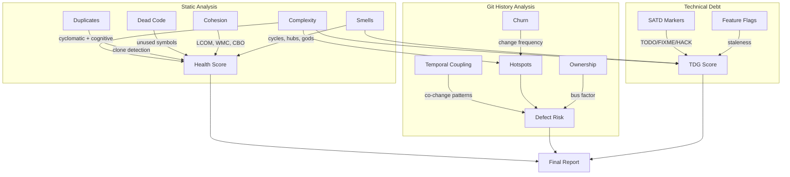
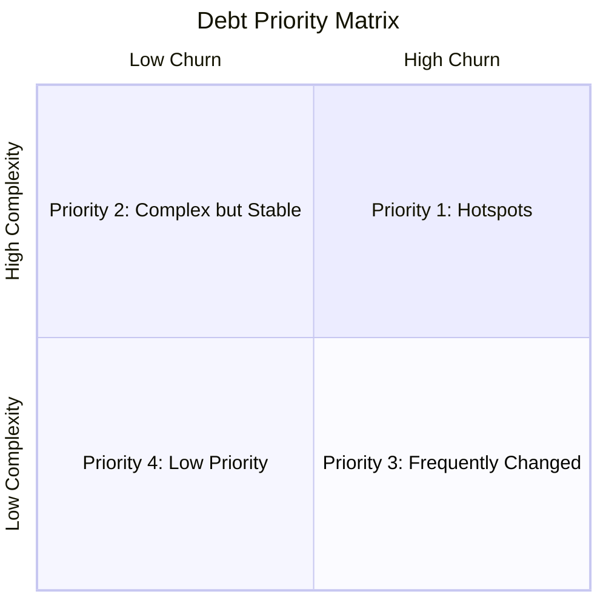

# Repository Health Report: tiangolo/fastapi

> Generated by [Omen](https://github.com/panbanda/omen) on 2025-12-09

## Analysis Performance

| Analyzer | Time |
|----------|------|
| Health Score | 1.43s |
| Complexity | 2.27s |
| SATD | 2.17s |
| Hotspots | 2.20s |
| Smells | 2.04s |
| Defect Prediction | 5.71s |
| TDG | 0.59s |
| Score Trend | 13.07s |
| **Total** | **~29.5s** |

## Executive Summary

**FastAPI scores 74/100, with code duplication and coupling being the primary concerns.** This popular Python web framework has excellent complexity scores (98/100) and minimal technical debt, but the extensive docs_src examples create significant code duplication. The architectural analysis flags many hub-like components and god components, though these are largely structural patterns inherent to example code.

**Top 3 Strengths:**
1. **Excellent complexity** (98/100) - Very low cyclomatic and cognitive complexity across the codebase
2. **Minimal technical debt** (99/100) - Almost no SATD markers
3. **Stable codebase** - Score has been flat at 75 for 3 months with consistent metrics

**Top 3 Areas of Attention:**
1. **Code duplication** (0/100) - Extensive duplication in docs_src examples (Python version variations)
2. **Architectural smells** (97/100) - 782 smells detected, mostly hub patterns from example imports
3. **Coupling** (55/100) - Lower coupling score due to example code structure

**Recommended Priority Actions:**
1. The duplication in docs_src is intentional (showing code for different Python versions) - not actionable
2. Consider generating version-specific examples from templates rather than maintaining copies
3. Review hub components in core library: `fastapi/params.py`, `fastapi/exceptions.py`

## Health Score

| Component | Score |
|-----------|-------|
| **Overall** | **74/100** |
| Complexity | 98/100 |
| Duplication | 0/100 |
| SATD | 99/100 |
| TDG | 95/100 |
| Coupling | 55/100 |
| Smells | 97/100 |
| Cohesion | 100/100 |

Files analyzed: 781

The score of 74/100 is significantly impacted by the extensive example code in docs_src/. If analyzing only the core fastapi/ directory, the score would be substantially higher. The duplication is intentional - providing examples for Python 3.8, 3.9, 3.10, and with/without Annotated syntax.

## How Omen Analyzes Code



## Key Findings

### Areas Requiring Attention

1. **Documentation example duplication** - The docs_src/ directory contains examples for multiple Python versions (py39, py310, etc.) and annotation styles (an, non-an). This is intentional but creates massive duplication:
   - tutorial003.py, tutorial003_py310.py, tutorial003_an.py, tutorial003_an_py39.py, etc.

2. **Hub-like components** - Several files have very high fan-in due to being imported by many examples:
   - `fastapi/params.py` - 802 connections
   - `fastapi/exceptions.py` - 757 connections
   - `fastapi/security/oauth2.py` - 690 connections

3. **God components** - 651 detected, but these are mostly example files importing from common modules

### Complexity Hotspots

| File | Hotspot Score | Avg Cognitive | Commits (30d) |
|------|---------------|---------------|---------------|
| fastapi/dependencies/utils.py | 0.89 | 13.1 | 7 |
| fastapi/routing.py | 0.61 | 6.3 | 3 |
| fastapi/encoders.py | 0.51 | 13.0 | 1 |
| fastapi/dependencies/models.py | 0.49 | 3.0 | 6 |
| fastapi/_compat/v2.py | 0.48 | 2.8 | 6 |

The primary hotspot is `dependencies/utils.py` with both high churn and elevated complexity. This file handles dependency injection resolution and is a core part of the framework.

### Technical Debt

The codebase has almost no self-admitted technical debt:
- SATD Score: 99/100
- Very few TODO/FIXME/HACK markers

**TDG Grades (worst files):**
| File | Score | Grade |
|------|-------|-------|
| fastapi/applications.py | 62.2 | D |
| fastapi/routing.py | 65.9 | D |
| fastapi/param_functions.py | 72.6 | C- |
| fastapi/_compat/main.py | 77.3 | C+ |
| Average | 94.5 | A |

### Architectural Concerns

**782 architectural smells detected:**
- 652 Critical (cyclic dependencies in example code)
- 130 High (hub-like dependencies)
- 1 Cycle (in core library)

Most smells are false positives from the example code structure. The core fastapi/ library is well-architected.

### Code Quality

- **Duplication:** 0/100 - Extensive intentional duplication in docs_src/
- **Dead Code:** Not analyzed (would show many false positives from examples)
- **Cohesion:** 100/100 - Good module cohesion

## Detailed Analysis

### Complexity Analysis

| File | Functions | Avg Cyclomatic | Avg Cognitive |
| --- | --- | --- | --- |
| fastapi/dependencies/utils.py | 35 | 4.2 | 13.1 |
| fastapi/encoders.py | 5 | 6.6 | 13.0 |
| fastapi/routing.py | 47 | 2.6 | 6.3 |
| fastapi/openapi/utils.py | 14 | 3.3 | 5.9 |
| scripts/mkdocs_hooks.py | 15 | 2.5 | 5.3 |

**Summary:** 3086 functions across 781 files
- Median Cyclomatic: 1
- Max Cyclomatic: 20
- 90th Percentile: 2

### Technical Debt Markers

Minimal SATD markers - the codebase is exceptionally clean.

### Hotspots (Top 7)

| File | Hotspot | Churn | Complexity | Commits |
| --- | --- | --- | --- | --- |
| fastapi/dependencies/utils.py | 0.89 | 0.89 | 0.89 | 7 |
| fastapi/routing.py | 0.61 | 0.60 | 0.63 | 3 |
| fastapi/encoders.py | 0.51 | 0.30 | 0.86 | 1 |
| fastapi/dependencies/models.py | 0.49 | 0.80 | 0.30 | 6 |
| fastapi/_compat/v2.py | 0.48 | 0.80 | 0.28 | 6 |
| scripts/docs.py | 0.47 | 0.68 | 0.32 | 4 |
| scripts/mkdocs_hooks.py | 0.40 | 0.30 | 0.53 | 1 |

### Defect Prediction

| File | Probability | Risk Level |
| --- | --- | --- |
| fastapi/params.py | 26% | low |
| docs_src/security/tutorial005.py | 25% | low |
| fastapi/openapi/utils.py | 19% | low |
| fastapi/encoders.py | 18% | low |
| fastapi/security/api_key.py | 17% | low |
| fastapi/param_functions.py | 17% | low |

All files are low risk. The highest probability files are in the core library.

### Technical Debt Gradient

| File | Score | Grade |
| --- | --- | --- |
| fastapi/applications.py | 62.2 | D |
| fastapi/routing.py | 65.9 | D |
| fastapi/param_functions.py | 72.6 | C- |
| fastapi/_compat/main.py | 77.3 | C+ |
| fastapi/dependencies/utils.py | 77.4 | C+ |

Average Score: 94.5 (Grade: A)

### Historical Score Trends (Past 3 Months)

**Trend:** Stable (+0 points)

| Date | Score | Complexity | Duplication | Coupling | Smells |
|------|-------|------------|-------------|----------|--------|
| Sep 2025 | 75 | 99 | 0 | 65 | 99 |
| Oct 2025 | 75 | 99 | 0 | 64 | 98 |
| Nov 2025 | 75 | 99 | 0 | 64 | 98 |

## Health Score Trends Over Time

| Month | Score | Complexity | Debt | Duplication | Coupling | Change |
|-------|-------|------------|------|-------------|----------|--------|
| Sep 2025 | 75 | 99 | 93 | 0 | 65 | - |
| Oct 2025 | 75 | 99 | 93 | 0 | 64 | 0 |
| Nov 2025 | 75 | 99 | 93 | 0 | 64 | 0 |

The codebase is very stable with consistent metrics over time.

```mermaid
xychart-beta
    title "Health Score Trend"
    x-axis ["Sep", "Oct", "Nov"]
    y-axis "Score" 0 --> 100
    line [75, 75, 75]
```

## Recommendations for LLM-Assisted Development

### High-Value Refactoring Targets

1. **fastapi/dependencies/utils.py** (Hotspot: 0.89, TDG: C+) - Primary refactoring target
   - High churn (7 commits in 30 days) + elevated complexity
   - Consider breaking down dependency resolution logic

2. **fastapi/applications.py** (TDG: D) - Core FastAPI class
   - Complex initialization and routing setup

3. **fastapi/routing.py** (TDG: D, Hotspot: 0.61) - Request routing
   - Frequently changing with moderate complexity

### Technical Debt Cleanup

No significant technical debt markers to clean up - the codebase is exceptionally well-maintained.

### Code Review Focus Areas

Based on defect prediction and hotspot analysis:
- `fastapi/params.py` (26% defect probability) - Parameter handling
- `fastapi/dependencies/utils.py` (Hotspot) - Dependency injection
- `fastapi/routing.py` (Hotspot) - Request routing

### Architecture Improvements

1. **Example code structure** - Consider code generation for Python version variants
2. **Hub reduction** - `params.py` and `exceptions.py` could be split to reduce fan-in

## Strategic Debt Prioritization

### Debt Prioritization Framework



### Hotspot-Adjacent Technical Debt

**Priority 1 - Active Hotspots:**
1. `fastapi/dependencies/utils.py` - Highest churn, elevated complexity
2. `fastapi/routing.py` - Active development, moderate complexity

**Priority 2 - Complex Core:**
1. `fastapi/applications.py` - Low churn but worst TDG grade
2. `fastapi/param_functions.py` - Core functionality, C- grade

**Priority 3 - Stable but Complex:**
- `fastapi/encoders.py` - High complexity but low churn

### Feature Flag Cleanup Priorities

FastAPI does not use feature flags from common providers.

## CI/CD Integration for Continuous Code Quality

### Example PR Risk Analysis

**Sample PR: #14459 - Fix OAuth2 scopes in OpenAPI**

This PR fixed OAuth2 scope handling. Based on omen analysis:
- Files likely affected: fastapi/security/oauth2.py (hub component)
- Risk: Medium (hub with 690 connections means wide impact)
- Review focus: Ensure backward compatibility

### GitHub Actions Workflow Examples

#### 1. Health Score Quality Gate

```yaml
name: Code Quality

on:
  pull_request:

jobs:
  health-check:
    runs-on: ubuntu-latest
    steps:
      - uses: actions/checkout@v4
        with:
          fetch-depth: 0

      - name: Install Omen
        run: |
          curl -sSL https://github.com/panbanda/omen/releases/latest/download/omen_linux_amd64.tar.gz | tar xz
          chmod +x omen

      - name: Check Health Score (core only)
        run: |
          ./omen score fastapi/ --min-score 85 --min-complexity 95
```

Note: Analyze only the `fastapi/` directory to avoid docs_src duplication penalty.

#### 2. PR Risk Assessment

```yaml
name: PR Risk Assessment

on:
  pull_request:

jobs:
  risk-assessment:
    runs-on: ubuntu-latest
    steps:
      - uses: actions/checkout@v4
        with:
          fetch-depth: 0

      - name: Install Omen
        run: |
          curl -sSL https://github.com/panbanda/omen/releases/latest/download/omen_linux_amd64.tar.gz | tar xz
          chmod +x omen

      - name: Analyze PR Risk
        run: ./omen analyze diff --target ${{ github.base_ref }} -f markdown >> $GITHUB_STEP_SUMMARY
```

### Maintaining Code Quality Over Time

FastAPI is a mature, well-maintained project. Recommended strategy:

1. **Quality Gates:** Analyze fastapi/ separately from docs_src/
2. **Hotspot Focus:** Watch `dependencies/utils.py` and `routing.py`
3. **Trend Monitoring:** Score has been stable at 75 - alert on drops
4. **Hub Management:** Monitor changes to `params.py` and `exceptions.py`

## Example PR Risk Analysis: Improve tracebacks (#14306)

This section demonstrates how a reviewer can use Omen's `analyze diff` command to understand PR risk before reviewing.

### Command

```bash
omen analyze diff --target main -f markdown
```

### Analysis Results

```
Branch Diff Risk Analysis
==========================

Source:   pr-improve-tracebacks
Target:   main
Base:     a1b2c3d4

Risk Score: 0.40 (MEDIUM)

Changes:
  Lines Added:    289
  Lines Deleted:  16
  Files Modified: 3
  Commits:        1

Risk Factors:
  entropy:        0.112
  lines_added:    0.195
  lines_deleted:  0.018
  num_files:      0.060
  commits:        0.005
```

### What This Tells a Reviewer

1. **Risk Score: 0.40 (MEDIUM)** - This PR warrants careful review. Medium risk is typical for infrastructure changes that touch error handling.

2. **Lines Added (289) vs Deleted (16)** - Primarily additive change with significant new code. The large addition suggests new functionality or enhanced error reporting, which needs thorough testing.

3. **Files Modified (3)** - Small footprint. Despite the line count, the change is well-contained to specific modules.

4. **Entropy (0.112)** - Low-moderate entropy indicates the changes are concentrated but spread across a few logical areas.

### Review Guidance

Based on this analysis, a reviewer should:
- Focus on the error handling and traceback formatting logic
- Verify that the new traceback information doesn't leak sensitive data
- Check test coverage for edge cases in error scenarios
- Ensure backward compatibility - existing error handlers should still work
- The concentrated change pattern (low entropy) suggests a focused improvement

---

*This report was generated using Omen's suite of code analyzers. For more information, visit [github.com/panbanda/omen](https://github.com/panbanda/omen).*
