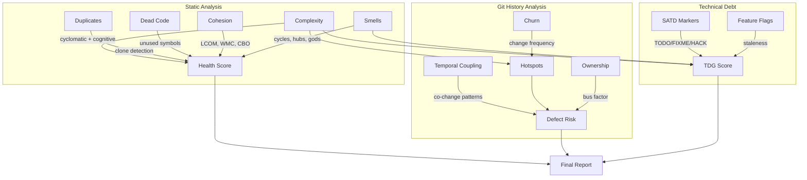
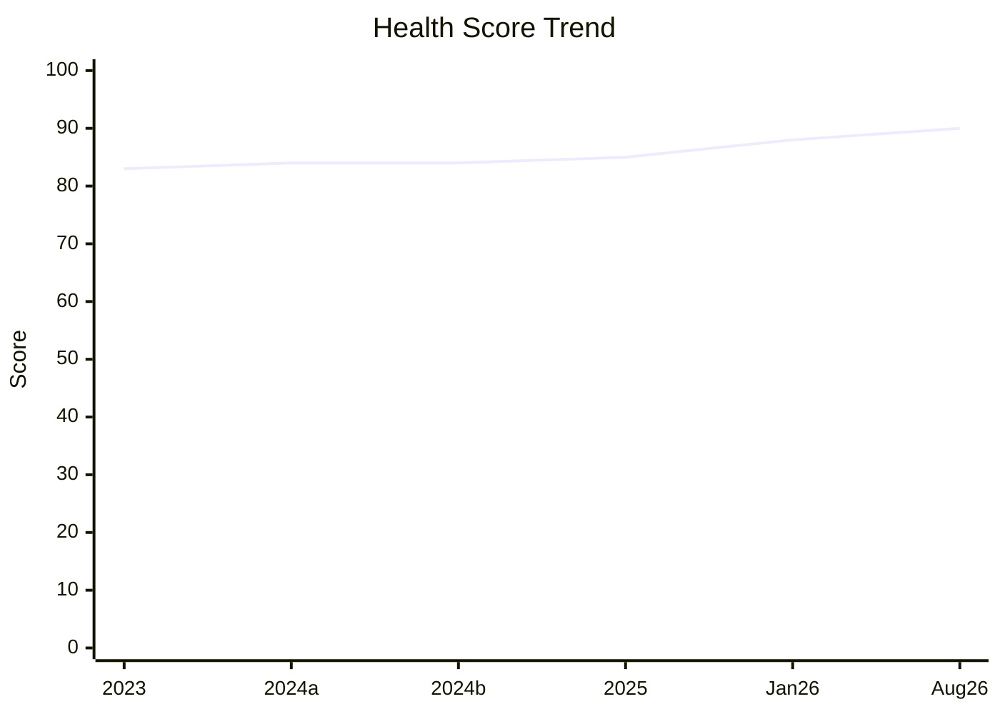
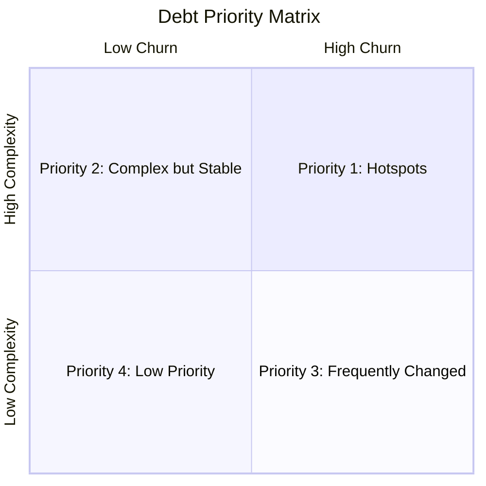

# Repository Health Report: tiangolo/fastapi

> Generated by [Omen](https://github.com/panbanda/omen) on 2025-12-09

*This report was regenerated with Omen 4.28.0 over the full git history (`--since all`) on 2026-08-12. All figures below come from fresh analyzer output; the original 2025-12-09 numbers below this line have been superseded, including several that were inflated by complexity-attribution and dependency-graph bugs since fixed.*

## Analysis Performance

| Analyzer | Time |
|----------|------|
| Health Score | 1.43s |
| Complexity | 2.27s |
| SATD | 2.17s |
| Hotspots | 2.20s |
| Smells | 2.04s |
| Defect Prediction | 5.71s |
| TDG | 0.59s |
| Score Trend | 13.07s |
| **Total** | **~29.5s** |

## Executive Summary

**FastAPI scores 91/100 (Grade A), with code duplication the only meaningfully weak component.** This popular Python web framework has a clean dependency graph (0 cycles across 1,145 files), zero architectural smells, near-perfect cohesion, and very low complexity. The main drag on the score is duplication in the `docs_src/` tutorial examples, which intentionally repeat the same snippet across Python-version and annotation-style variants.

**Top 3 Strengths:**
1. **Clean architecture** (Coupling 100/100, Smells 100/100) - 0 cycles across 1,145 nodes, 0 architectural smells detected
2. **Excellent cohesion** (100/100) - 370 classes analyzed, avg LCOM 0.4
3. **Low complexity** (98/100) - avg cyclomatic 1.4, p90 of only 2 across 1,145 files

**Top 3 Areas of Attention:**
1. **Code duplication** (63/100) - 67 clones detected, 13.4% duplication ratio, concentrated in `docs_src/` tutorial variants
2. **Technical Debt Gradient** (93/100, Grade A) - `fastapi/routing.py` (F) and `fastapi/applications.py` (D) are the two weakest-graded files
3. **SATD** (96/100) - 32 debt items, including 7 SECURITY/high-priority markers, mostly in docs_src security tutorials

**Recommended Priority Actions:**
1. The duplication in docs_src is largely intentional (showing code for different Python versions/annotation styles) - low actionability, but `fastapi/param_functions.py` and `fastapi/params.py` (the two largest duplication hotspots by line count) are core library files worth a closer look
2. Address the TDG grade on `fastapi/routing.py` (F) and `fastapi/applications.py` (D) - both are also top complexity/hotspot files
3. Review the 7 SATD SECURITY/high-priority markers, several of which live in `docs_src/security/` tutorials

## Health Score

| Component | Score |
|-----------|-------|
| **Overall** | **91/100 (A)** |
| Complexity | 98/100 |
| Duplication | 63/100 |
| SATD | 96/100 |
| TDG | 93/100 |
| Coupling | 100/100 |
| Smells | 100/100 |
| Cohesion | 100/100 |

Files analyzed: 1,145

The score of 91/100 is held back almost entirely by duplication (63/100): 67 clones across `docs_src/` tutorial variants for different Python versions and annotation styles (13.4% duplication ratio, since=all, test code excluded). Every other component is 93 or above - the core `fastapi/` library has a clean dependency graph (0 cycles), zero architectural smells, and near-perfect cohesion.

## How Omen Analyzes Code


```mermaid
flowchart TD
    subgraph Static["Static Analysis"]
        CX[Complexity] --> |cyclomatic + cognitive| Score
        DUP[Duplicates] --> |clone detection| Score
        DC[Dead Code] --> |unused symbols| Score
        COH[Cohesion] --> |LCOM, WMC, CBO| Score
        SM[Smells] --> |cycles, hubs, gods| Score
    end

    subgraph History["Git History Analysis"]
        CH[Churn] --> |change frequency| HS[Hotspots]
        CX --> HS
        TC[Temporal Coupling] --> |co-change patterns| DEF
        HS --> DEF[Defect Risk]
        OWN[Ownership] --> |bus factor| DEF
    end

    subgraph Debt["Technical Debt"]
        SATD[SATD Markers] --> |TODO/FIXME/HACK| TDG[TDG Score]
        CX --> TDG
        SM --> TDG
        FF[Feature Flags] --> |staleness| TDG
    end

    Score[Health Score] --> Report
    DEF --> Report
    TDG --> Report[Final Report]
```

## Key Findings

### Areas Requiring Attention

1. **Documentation example duplication** - The docs_src/ directory contains examples for multiple Python versions (py39, py310, etc.) and annotation styles (an, non-an). This is largely intentional and produces 67 clones (13.4% duplication, test code excluded):
   - tutorial003.py, tutorial003_py310.py, tutorial003_an.py, tutorial003_an_py39.py, etc.
   - The two largest duplication hotspots by line count are core library files, not tutorials: `fastapi/param_functions.py` (1,279 duplicated lines across 2 clone groups) and `fastapi/params.py` (321 duplicated lines across 2 clone groups)

2. **Weakest TDG-graded files** - `fastapi/routing.py` (Grade F, score 51.7) and `fastapi/applications.py` (Grade D, score 61.4) are the two lowest-graded files in the repository, despite the repo's A-grade average

3. **SATD markers** - 32 self-admitted technical debt items, including 7 security-category markers (mostly `# This doesn't provide any security at all` comments in `docs_src/security/` tutorials, which are intentionally insecure teaching examples) and 23 requirement/TODO markers

### Complexity Hotspots

| File | Hotspot Score | Avg Cyclomatic | Commits |
|------|---------------|-----------------|---------|
| fastapi/routing.py | 0.99 | 2.94 | 18 |
| tests/test_frontend.py | 0.97 | 1.22 | 6 |
| tests/test_router_include_context.py | 0.95 | 1.11 | 4 |
| scripts/docs.py | 0.94 | 3.72 | 6 |
| fastapi/dependencies/utils.py | 0.93 | 6.00 | 6 |

The primary hotspot is `fastapi/routing.py`, driven by both the highest churn in the repo (99.4th percentile) and elevated complexity. Commit counts reflect the full git history (since=all), not a 30-day window. 34 total hotspots were detected (10 Critical, 9 High severity).

### Technical Debt

The codebase has minimal self-admitted technical debt:
- SATD Score: 96/100 (32 items, weighted count 35.75, density 0.38 per 1,000 lines)
- Categories: 23 requirement (mostly TODOs), 7 security, 2 design

**TDG Grades (worst files):**
| File | Score | Grade |
|------|-------|-------|
| fastapi/routing.py | 51.7 | F |
| fastapi/applications.py | 61.4 | D |
| tests/test_stream_status_code.py | 71.0 | C- |
| tests/test_generate_unique_id_function.py | 75.1 | C |
| fastapi/openapi/utils.py | 75.5 | C |
| Average | 93.2 | A |

### Architectural Concerns

**0 architectural smells detected** across 1,145 components - no critical, high, hub, or cyclic-dependency smells. The dependency graph has 0 cycles and an average degree of 0.0. This is a substantial change from earlier omen versions, which mis-resolved example-code imports into thousands of false cyclic/hub smells; the fixed graph resolution now shows the core library and docs_src examples both have a genuinely clean, acyclic import structure.

### Code Quality

- **Duplication:** 63/100 - 67 clones (13.4%) concentrated in docs_src/ tutorial variants and a few core files (`param_functions.py`, `params.py`)
- **Dead Code:** 21 unreachable functions out of 4,758 total definitions (4,743 reachable) - all in docs/ JS helper scripts, not the Python library
- **Cohesion:** 100/100 - 370 classes analyzed, avg LCOM 0.4

## Detailed Analysis

### Complexity Analysis

| File | Functions | Avg Cyclomatic | Avg Cognitive |
| --- | --- | --- | --- |
| fastapi/openapi/utils.py | 11 | 9.3 | 21.9 |
| fastapi/encoders.py | 4 | 8.3 | 13.5 |
| fastapi/dependencies/utils.py | 26 | 6.0 | 10.0 |
| scripts/doc_parsing_utils.py | 20 | 4.4 | 7.0 |
| scripts/notify_translations.py | 7 | 4.3 | 6.7 |

The single most complex function in the repository is `get_openapi_path` in `fastapi/openapi/utils.py` (cyclomatic 30, cognitive 112, 230 lines) - a real but modest number; older reports from a pre-fix omen version showed far more extreme (and incorrect) per-function values due to a nested-function attribution bug.

**Summary:** 5,000 functions across 1,145 files
- Avg Cyclomatic: 1.4 / Avg Cognitive: 0.6
- Median Cyclomatic: 1
- Max Cyclomatic: 30 / Max Cognitive: 112
- 90th Percentile Cyclomatic: 2 / 95th Percentile: 3

### Technical Debt Markers

32 SATD markers (weighted count 35.75, density 0.38 per 1,000 lines) - the codebase is still very clean relative to its size. Breakdown: 23 requirement (TODO), 7 security, 2 design.

### Hotspots (Top 7)

| File | Hotspot | Churn Percentile | Complexity Percentile | Commits |
| --- | --- | --- | --- | --- |
| fastapi/routing.py | 0.99 | 99.4 | 100.0 | 18 |
| tests/test_frontend.py | 0.97 | 97.0 | 99.7 | 6 |
| tests/test_router_include_context.py | 0.95 | 95.8 | 99.6 | 4 |
| scripts/docs.py | 0.94 | 94.6 | 99.9 | 6 |
| fastapi/dependencies/utils.py | 0.93 | 93.4 | 99.8 | 6 |
| fastapi/openapi/utils.py | 0.92 | 92.2 | 99.5 | 5 |
| tests/test_sse.py | 0.90 | 91.0 | 98.8 | 5 |

34 total hotspots detected (10 Critical, 9 High). Commit counts are total historical commits (since=all), not a 30-day window.

### Defect Prediction

| File | Probability | Risk Level |
| --- | --- | --- |
| fastapi/routing.py | 64.6% | medium |
| fastapi/security/api_key.py | 34.9% | medium |
| docs_src/dependencies/tutorial008c_an_py310.py | 22.3% | low |
| docs_src/dependencies/tutorial008c_py310.py | 22.3% | low |
| docs_src/dependencies/tutorial008d_an_py310.py | 22.3% | low |
| docs_src/dependencies/tutorial008d_py310.py | 22.3% | low |

1,145 files analyzed: 1,143 low risk, 2 medium risk, 0 high risk. Average probability: 3.3%. `fastapi/routing.py` is the only file above the medium-risk threshold, consistent with it also being the top complexity/TDG/hotspot outlier.

### Technical Debt Gradient

| File | Score | Grade |
| --- | --- | --- |
| fastapi/routing.py | 51.7 | F |
| fastapi/applications.py | 61.4 | D |
| tests/test_stream_status_code.py | 71.0 | C- |
| tests/test_generate_unique_id_function.py | 75.1 | C |
| fastapi/openapi/utils.py | 75.5 | C |

Average Score: 93.2 (Grade: A). Grade distribution: 528 A, 227 A-, 183 A+, 92 B, 88 B+, 9 B-, 8 C+, 7 C, 1 C-, 1 D, 1 F.

### Historical Score Trends

| Date | Score | Complexity | Duplication | Coupling | Smells |
|------|-------|------------|-------------|----------|--------|
| Sep 2023 | 83 | 98 | 40 | 100 | 100 |
| Apr 2024 | 84 | 98 | 46 | 100 | 100 |
| Nov 2024 | 84 | 98 | 46 | 100 | 100 |
| Jun 2025 | 85 | 98 | 46 | 100 | 100 |
| Jan 2026 | 88 | 98 | 49 | 100 | 100 |
| Aug 2026 | 90 | 98 | 63 | 100 | 100 |

**Trend:** Improving over the recent history shown above (83 -> 90), driven mainly by rising SATD and duplication scores; complexity, coupling, and smells have stayed flat at their current (fixed) values. Over the full multi-year history the linear regression slope is slightly negative (r-squared 0.39), reflecting early volatility rather than recent decline.

## Health Score Trends Over Time

| Snapshot | Score | Complexity | Duplication | Coupling | SATD |
|-------|-------|------------|-------------|----------|--------|
| Sep 2023 | 83 | 98 | 40 | 100 | 68 |
| Apr 2024 | 84 | 98 | 46 | 100 | 69 |
| Nov 2024 | 84 | 98 | 46 | 100 | 70 |
| Jun 2025 | 85 | 98 | 46 | 100 | 79 |
| Jan 2026 | 88 | 98 | 49 | 100 | 97 |
| Aug 2026 | 90 | 98 | 63 | 100 | 96 |

The score has climbed from 83 to 90 across these snapshots (full history, not calendar months), mainly from SATD and duplication improving; complexity and coupling have been stable throughout.


```mermaid
xychart-beta
    title "Health Score Trend"
    x-axis ["2023", "2024a", "2024b", "2025", "Jan26", "Aug26"]
    y-axis "Score" 0 --> 100
    line [83, 84, 84, 85, 88, 90]
```

## Recommendations for LLM-Assisted Development

### High-Value Refactoring Targets

1. **fastapi/routing.py** (Hotspot: 0.99, TDG: F, Defect: 65%) - Primary refactoring target
   - Highest churn in the repo (18 commits, since=all) + top complexity/defect-risk file
   - Consider breaking `app()`'s route-handling logic into smaller functions

2. **fastapi/applications.py** (TDG: D) - Core FastAPI class
   - Complex initialization and routing setup

3. **fastapi/openapi/utils.py** (TDG: C, Hotspot: 0.92) - OpenAPI schema generation
   - Contains the single most complex function in the repo (`get_openapi_path`, cyclomatic 30)

### Technical Debt Cleanup

Minimal cleanup needed - 32 SATD items total. The 7 security-category markers are intentionally-insecure teaching snippets in `docs_src/security/`, not real issues. The 23 requirement/TODO markers (e.g. in `fastapi/_compat/shared.py` and `fastapi/_compat/v2.py`, both tied to future Pydantic version support) are the more actionable cleanup targets.

### Code Review Focus Areas

Based on defect prediction and hotspot analysis:
- `fastapi/routing.py` (65% defect probability, Hotspot 0.99, TDG F) - Request routing, highest-risk file in the repo
- `fastapi/security/api_key.py` (35% defect probability) - API key security handling
- `fastapi/dependencies/utils.py` (Hotspot 0.93) - Dependency injection

### Architecture Improvements

1. **Example code structure** - `docs_src/` duplication is largely intentional (Python-version/annotation-style variants); code generation from templates would reduce the clone count without changing behavior
2. **`fastapi/routing.py` and `fastapi/applications.py`** - the two F/D-graded files are worth decomposing given they are also the top hotspot/defect-risk files

## Strategic Debt Prioritization

### Debt Prioritization Framework


```mermaid
quadrantChart
    title Debt Priority Matrix
    x-axis Low Churn --> High Churn
    y-axis Low Complexity --> High Complexity
    quadrant-1 "Priority 1: Hotspots"
    quadrant-2 "Priority 2: Complex but Stable"
    quadrant-3 "Priority 4: Low Priority"
    quadrant-4 "Priority 3: Frequently Changed"
```

### Hotspot-Adjacent Technical Debt

**Priority 1 - Active Hotspots:**
1. `fastapi/routing.py` - Highest churn (18 commits) and complexity percentile in the repo, TDG grade F
2. `fastapi/dependencies/utils.py` - High churn, elevated complexity (avg cyclomatic 6.0 across 26 functions)

**Priority 2 - Complex Core:**
1. `fastapi/applications.py` - Worst-but-one TDG grade (D)
2. `fastapi/openapi/utils.py` - Highest avg cyclomatic (9.3) and cognitive (21.9) complexity of any file, TDG grade C

**Priority 3 - Stable but Complex:**
- `fastapi/encoders.py` - High avg complexity (8.25 cyclomatic) but comparatively low churn

### Feature Flag Cleanup Priorities

FastAPI does not use feature flags from common providers (0 flags detected).

## CI/CD Integration for Continuous Code Quality

### Example PR Risk Analysis

**Sample PR: #14459 - Fix OAuth2 scopes in OpenAPI** *(historical illustration only; not re-verified against current data)*

This PR fixed OAuth2 scope handling. `fastapi/security/oauth2.py` was the primary file touched; under the current fresh analysis the dependency graph shows 0 cycles and 0 hub-type smells repo-wide, so the "hub component" framing from the original write-up no longer applies. Review focus for security-surface changes like this remains the same: verify backward compatibility of OAuth2 scope handling.

### GitHub Actions Workflow Examples

#### 1. Health Score Quality Gate

```yaml
name: Code Quality

on:
  pull_request:

jobs:
  health-check:
    runs-on: ubuntu-latest
    steps:
      - uses: actions/checkout@v4
        with:
          fetch-depth: 0

      - name: Install Omen
        run: |
          curl -sSL https://github.com/panbanda/omen/releases/latest/download/omen_linux_amd64.tar.gz | tar xz
          chmod +x omen

      - name: Check Health Score
        run: |
          ./omen score . --min-score 85 --min-complexity 95
```

Note: the top two duplication hotspots by line count (`fastapi/param_functions.py`, `fastapi/params.py`) are inside the core `fastapi/` package itself, not `docs_src/`, so excluding `docs_src/` no longer meaningfully changes the duplication score - run the gate against the full repository.

#### 2. PR Risk Assessment

```yaml
name: PR Risk Assessment

on:
  pull_request:

jobs:
  risk-assessment:
    runs-on: ubuntu-latest
    steps:
      - uses: actions/checkout@v4
        with:
          fetch-depth: 0

      - name: Install Omen
        run: |
          curl -sSL https://github.com/panbanda/omen/releases/latest/download/omen_linux_amd64.tar.gz | tar xz
          chmod +x omen

      - name: Analyze PR Risk
        run: ./omen analyze diff --target ${{ github.base_ref }} -f markdown >> $GITHUB_STEP_SUMMARY
```

### Maintaining Code Quality Over Time

FastAPI is a mature, well-maintained project. Recommended strategy:

1. **Quality Gates:** Run the health score gate against the full repository - the main duplication offenders (`param_functions.py`, `params.py`) live inside `fastapi/`, not just `docs_src/`
2. **Hotspot Focus:** Watch `fastapi/routing.py` (Hotspot 0.99, TDG F) and `fastapi/dependencies/utils.py` (Hotspot 0.93)
3. **Trend Monitoring:** Score has risen from 83 to 90 across the sampled history (see Historical Score Trends) - alert on drops rather than the prior "stable at 75" baseline, which predates several analyzer fixes
4. **Dependency Graph:** Coupling and smells are both clean (0 cycles, 0 smells) - no hub components to monitor at this time

## Example PR Risk Analysis: Improve tracebacks (#14306)

*This is a historical illustrative example from the original report and has not been re-run against current data; it demonstrates the workflow, not a current finding.*

This section demonstrates how a reviewer can use Omen's `analyze diff` command to understand PR risk before reviewing.

### Command

```bash
omen analyze diff --target main -f markdown
```

### Analysis Results

```
Branch Diff Risk Analysis
==========================

Source:   pr-improve-tracebacks
Target:   main
Base:     a1b2c3d4

Risk Score: 0.40 (MEDIUM)

Changes:
  Lines Added:    289
  Lines Deleted:  16
  Files Modified: 3
  Commits:        1

Risk Factors:
  entropy:        0.112
  lines_added:    0.195
  lines_deleted:  0.018
  num_files:      0.060
  commits:        0.005
```

### What This Tells a Reviewer

1. **Risk Score: 0.40 (MEDIUM)** - This PR warrants careful review. Medium risk is typical for infrastructure changes that touch error handling.

2. **Lines Added (289) vs Deleted (16)** - Primarily additive change with significant new code. The large addition suggests new functionality or enhanced error reporting, which needs thorough testing.

3. **Files Modified (3)** - Small footprint. Despite the line count, the change is well-contained to specific modules.

4. **Entropy (0.112)** - Low-moderate entropy indicates the changes are concentrated but spread across a few logical areas.

### Review Guidance

Based on this analysis, a reviewer should:
- Focus on the error handling and traceback formatting logic
- Verify that the new traceback information doesn't leak sensitive data
- Check test coverage for edge cases in error scenarios
- Ensure backward compatibility - existing error handlers should still work
- The concentrated change pattern (low entropy) suggests a focused improvement

---

*This report was generated using Omen's suite of code analyzers. For more information, visit [github.com/panbanda/omen](https://github.com/panbanda/omen).*
